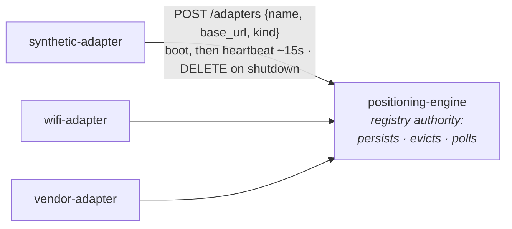

# Adapter registry: self-registration, the engine as authority

The set of positioning adapters the engine fuses is **dynamic**. Adapters
announce themselves to the engine at boot and heartbeat; the engine evicts the
ones that stop. This mirrors the blueprint model (engine = network authority)
and is what lets adapters run on edge nodes - an edge adapter registers over
the data network, exactly like the WiFi scanner already posts scans.

## The model

- **Self-registration**: each adapter POSTs `{name, base_url, kind}` to
  `POSITIONING_ENGINE_URL/adapters` at startup and re-POSTs on a heartbeat
  (`ADAPTER_HEARTBEAT_S`, default 15s). The POST is idempotent (upsert).
- **Eviction**: the engine drops a self-registered adapter after
  `ADAPTER_TTL_S` (default 45s, i.e. three missed beats) without a heartbeat.
- **Deregister**: best-effort `DELETE /adapters/{name}` on graceful shutdown;
  if it is missed, the TTL cleans up.
- **`ADAPTER_URLS` is a cold-start seed only**: applied once to an empty
  registry (like the blueprint seed), then the live/persisted registry is
  authoritative. A re-applied `ADAPTER_URLS` never clobbers live registrations.

## Two provenance classes, different lifecycles

| `registered_via` | Source                          | Persisted? | TTL-evicted? | Liveness from        |
|------------------|---------------------------------|-----------|--------------|----------------------|
| `self`           | adapter POSTs itself            | no        | yes          | heartbeat            |
| `seed`           | `ADAPTER_URLS` cold-start       | yes       | **no**       | polling (cooldown)   |
| `manual`         | operator-declared (future)      | yes       | **no**       | polling (cooldown)   |

`self` entries are ephemeral: they are not persisted because they repopulate
within one heartbeat after an engine restart. `seed`/`manual` entries are
intentional declarations - persisted on the engine's volume and never removed
for lack of a heartbeat (they would not heartbeat). Their health comes from
whether the engine's polls succeed.

## Membership vs reachability are orthogonal

Two independent health signals, both on `GET /adapters`:

- **heartbeat / TTL** (adapter → engine): is the adapter process alive and able
  to reach the engine?
- **poll cooldown** (engine → adapter): do the engine's `GET /measurement`
  polls succeed?

They differ. A vendor adapter can heartbeat fine while its upstream cloud is
down, so its `/measurement` returns 5xx and it enters cooldown: alive but its
data source is gone. The derived `state` keeps these distinct:

| `state`       | Meaning                                                                 |
|---------------|-------------------------------------------------------------------------|
| `live`        | heartbeat fresh (or seed/manual) AND polls succeeding                   |
| `unreachable` | present, but the engine's polls fail (in cooldown) - data source down   |
| `stale`       | a `self` entry that has not re-announced within one heartbeat interval (still within TTL) |
| (evicted)     | past TTL - removed from the registry, no longer listed                  |

`GET /adapters` returns, per adapter: `name`, `base_url`, `kind`,
`registered_via`, `last_seen_s_ago`, `fail_count`, `in_cooldown`,
`cooldown_seconds_remaining`, `state`. The gateway proxies this unchanged so
the demo renders OK / degraded; it never reshapes the contract.

## API

| Method | Path               | Who    | Notes                                            |
|--------|--------------------|--------|--------------------------------------------------|
| GET    | `/adapters`        | engine | membership + reachability snapshot (also proxied by the gateway) |
| POST   | `/adapters`        | engine | `{name, base_url, kind}` register / heartbeat (upsert) |
| DELETE | `/adapters/{name}` | engine | deregister                                       |

No auth: the engine is `ClusterIP` and never externally exposed, consistent
with its internal-trust model (it already serves positions and PUTs the
blueprint unauthenticated in-cluster).

## Wiring

Each adapter sets `POSITIONING_ENGINE_URL`, `ADAPTER_NAME` (the routing key, see
below), `ADAPTER_BASE_URL` (its own in-cluster Service URL the engine polls), and
optionally `ADAPTER_KIND`. With those set the adapter self-registers; unset, it
runs standalone and the engine only knows it via an `ADAPTER_URLS` seed.

The engine persists the registry on the same writable volume as the blueprint
(`ADAPTER_REGISTRY_PATH`, default `/app/data/adapters.json`). No extra PVC.

## Routing: which adapter serves a device

Capability-driven, no manual map needed. When the gateway asks for a position it
passes the asset's `source` (`GET /position/{positioning_id}?source=<source>`),
and the engine polls the adapter whose **`ADAPTER_NAME` equals that source**. So
the one convention is `asset.source` == `ADAPTER_NAME` (e.g. both `wittra`).

Fallback order in the engine (`position_service._select_adapters`): `source`
hint → `DEVICE_MAP` → fan out to all registered adapters and fuse. `DEVICE_MAP`
(engine env, `positioning_id=adapter_name` CSV) is an **optional cold-start
override**, normally unset; a device it does not list is polled against every
adapter, and each adapter 404s for devices it does not serve. The full
identifier chain (assetId → positioning_id → adapter → vendor) is in
[integrating-a-vendor-rest-api.md](integrating-a-vendor-rest-api.md).

## Relationship to the blueprint

Same authority pattern, same volume, different data: the **blueprint** is the
venue geometry (`GET/PUT /blueprint`), the **registry** is the set of live
adapters (`GET/POST/DELETE /adapters`). See
[`blueprint-vs-bindings.md`](blueprint-vs-bindings.md).
