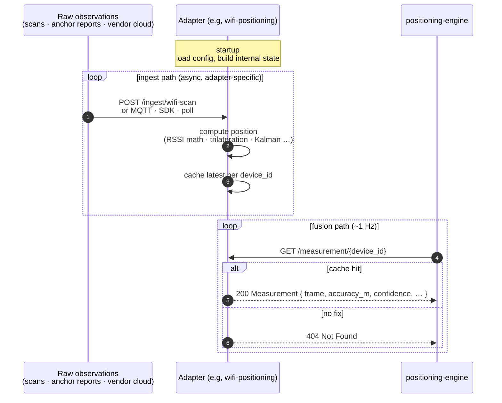

# Writing a Positioning Adapter

A *positioning adapter* is any service that produces a position estimate for a device and exposes it over a small HTTP contract. The positioning engine fuses one or more adapters listed in `ADAPTER_URLS` (a comma-separated list of `name=url` entries, evaluated at startup); it never assumes anything else about a source. To add a new technology (UWB anchors, BLE beacons, a vendor RTLS, a GPS receiver), you implement this contract in a separate service and add its URL to the engine's configuration. No engine, gateway, or demo code changes.

This repository ships two open adapter implementations + one schema-driven translator as reference:

- [`services/wifi-positioning/`](../services/wifi-positioning/): open WiFi RSSI multilateration over a fixed AP map. The right model for any source that ingests raw observations and computes a position itself.
- [`mocks/mock-positioning/`](../mocks/mock-positioning/): synthetic waypoint walker inside floor bounds. Used by the local demo (and useful in CI) to produce continuous position movement without any real measurement source.
- [`services/rest-adapter/`](../services/rest-adapter/): schema-driven translator that maps an arbitrary vendor REST API onto the engine's adapter contract. Reference integration: Wittra UWB cloud (via `mocks/mock-wittra/` in dev).

## Status by technology

| Technology | Adapter | Notes |
|-----------|---------|-------|
| **WiFi**  | [`services/wifi-positioning/`](../services/wifi-positioning/) | Production-ready. Reads positions from the placement-editor blueprint, BSSIDs from a per-venue bindings file. See [`blueprint-vs-bindings.md`](./blueprint-vs-bindings.md). |
| **UWB (Wittra)** | [`services/rest-adapter/`](../services/rest-adapter/) configured with [`rest-adapter/examples/wittra-schema.json`](../services/rest-adapter/examples/wittra-schema.json) | Production-ready. Point `WITTRA_BASE_URL` at the real Wittra cloud + set `ADAPTER_WITTRA_API_KEY`; no image rebuild needed. |
| **Mock**  | [`mocks/mock-positioning/`](../mocks/mock-positioning/) | Demo only. Waypoint walker with wall/opening collision against the blueprint. Never deploy this on the testbed for a real device. |
| **5G**    | *no adapter yet* | The placement editor + 3D scene render `technology: "fiveg"` anchors (visual only). No measurement source is wired. Devices configured to use a `fiveg` adapter would return `404 NOT_FOUND` from the engine, safe but useless. Write an adapter implementing the contract above when a 5G positioning source becomes available. |
| **GNSS**  | *no adapter yet* | Same as 5G. Indoor GNSS is generally too coarse to be useful, so this is intentionally deferred. Outdoor / hybrid deployments would need a dedicated adapter. |

The 5G / GNSS gap is **safe by construction**: the engine never assumes an adapter for a technology exists. If a device is routed (via `DEVICE_MAP`) to a non-configured adapter, the engine simply returns no fix. The demo shows the device as `offline`. Nothing crashes, no half-baked positions enter the fusion pipeline.

## HTTP contract

The adapter MUST expose two endpoints:

```
GET  /measurement/{device_id}
GET  /health
```

Optionally it MAY expose `POST /ingest/...` (or any other transport) for sources that push data into the adapter; the engine never calls them.

### `GET /measurement/{device_id}`

Returns the latest position estimate for the device. Two coordinate frames are supported; the response declares which it uses.

**Response (200 OK, local frame, default):**

```json
{
  "source":      "wifi",
  "frame":       "local",
  "x":           11.5,
  "y":           0.0,
  "z":           10.3,
  "accuracy_m":  6.6,
  "confidence":  0.85,
  "timestamp":   1700000000.0
}
```

**Response (200 OK, WGS84 frame):**

```json
{
  "source":      "wittra-uwb",
  "frame":       "wgs84",
  "latitude":    45.064412,
  "longitude":   7.659254,
  "accuracy_m":  0.3,
  "confidence":  0.95,
  "timestamp":   1700000000.0
}
```

| Field                  | Type             | Notes |
|------------------------|------------------|-------|
| `source`               | string           | Short tag identifying the technology (`wifi`, `uwb`, `fiveg`, …). Surfaces in the engine response under `sources[]` |
| `frame`                | `"local"`/`"wgs84"` | Defaults to `"local"` when omitted. The engine projects WGS84 replies into the local frame using the floor plan's `gps_origin` before fusion |
| `x`, `y`, `z`          | float, metres    | Used when `frame = local`. Right-handed local frame: `x` = east, `y` = vertical (height), `z` = north. Origin is the floor-plan lower-left corner |
| `latitude`, `longitude`| float, degrees   | Used when `frame = wgs84`. Absolute position. The adapter does not need to know the room's GPS origin; the engine does |
| `accuracy_m`           | float, metres    | One-sigma error radius. Used as `1 / variance` weight in fusion (smaller is better) |
| `confidence`           | float, 0.0–1.0   | Adapter's self-reported reliability. Used as a multiplicative weight in fusion |
| `timestamp`            | float, optional  | Unix epoch seconds when the underlying measurement was taken. Omit for "now". The engine uses this to decide staleness |

Pick `local` for adapters that compute their own position from observations gathered inside the room (RSSI, UWB anchors). Pick `wgs84` for adapters whose backend is map-anchored and already reports global coordinates, typically commercial RTLS platforms whose operator places anchors on a real-world map. The engine treats the two paths uniformly downstream.

**Response (404 Not Found):**

The adapter has no measurement for this device (yet, or any more). The engine silently ignores this source for this device on this fusion cycle; no retry, no error propagation.

**Response (anything else):**

Treated as a transient adapter failure. The engine logs it and ignores this source for this cycle. The adapter should not raise 5xx unless something is actually broken.

After three consecutive network errors or `5xx` responses the engine puts the adapter into a short cooldown (2 s, doubling on continued failure up to 60 s) during which `GET /measurement/...` is skipped without a request. A successful response resets the counter. `404` and other non-5xx errors do *not* count toward this threshold. `404` is a normal "no fix" reply, and a misconfigured API key surfacing as `401`/`403` should fail loudly in logs rather than back off. See [`services/positioning-engine/app/adapters/http.py`](../services/positioning-engine/app/adapters/http.py) for the constants.

### `GET /health`

Returns `200 {"status": "ok"}` when the adapter is ready to serve measurements. Used as Kubernetes `readinessProbe` and `livenessProbe`. No authentication.

## Lifecycle

1. **Startup.** Adapter loads its configuration (AP map, anchor positions, vendor credentials, …) from environment variables and/or mounted files. It does *not* register with the engine, the engine pulls from a static URL list.
2. **Data ingestion.** Adapter receives raw observations through whatever mechanism is appropriate for the technology: HTTP push from edge devices, MQTT subscription, vendor SDK, polling. This is entirely the adapter's concern; the engine never sees raw observations.
3. **Position computation.** Adapter converts raw observations into a position estimate in its local frame. It may smooth, fuse multiple antennas, drop outliers, all internal.
4. **Caching.** Adapter keeps the latest position per device. `GET /measurement/{id}` is a cache lookup. The engine polls at its own cadence (default ~1 Hz); the adapter does not push.
5. **Staleness.** Adapter SHOULD return the last known position with its real `timestamp` regardless of age, and let the consumer decide what is too old. Returning 404 on a stale entry forces the engine to drop the source from fusion; usually the better behaviour is to return the old fix with its old timestamp so the engine can grey it out gradually.



The two paths are decoupled: the ingest side moves at whatever rate observations arrive (push, poll, SDK callback), the fusion side runs at the engine's poll cadence. The cache between them is the only contract the engine cares about, adapter implementers are free to pick whatever ingest mechanism fits their technology.

## Engine wiring

The engine reads `ADAPTER_URLS` at startup. Each entry is a `name=url` pair; the name is what appears as the source tag if the adapter does not set its own, and what the optional `DEVICE_MAP` routes against:

```yaml
env:
  - name: ADAPTER_URLS
    value: "wifi=http://wifi-positioning:8080,uwb=http://uwb-adapter:8080"
  - name: DEVICE_MAP                              # optional, per-device routing
    value: "static-tag-07=uwb"                    # only the named adapter is polled for this device
  - name: FUSION_STRATEGY                         # see fusion-strategies.md
    value: "weighted_avg"
```

Each entry becomes one [`HttpAdapter`](../services/positioning-engine/app/adapters/http.py) instance. On every position request the engine selects the relevant adapters for the device (all adapters unless `DEVICE_MAP` overrides), concurrently calls `GET /measurement/{device_id}` on each, normalises WGS84 measurements into the local frame, runs the configured fusion strategy (see [`fusion-strategies.md`](fusion-strategies.md) for the catalogue), and converts the result back to WGS84 using the floor-plan `gps_origin` before returning it on the northbound contract.

A bare URL is also accepted for back-compatibility (`ADAPTER_URLS="http://wifi-positioning:8080"`); the engine assigns it a default name `adapter-N`.

To add an adapter to a running cluster: deploy the new Service, append its `name=url` entry to `ADAPTER_URLS`, restart the engine. An empty `ADAPTER_URLS` produces no measurements; deploy the [`mocks/mock-positioning/`](../mocks/mock-positioning/) adapter (or your own) before pointing the engine at it.

## Coordinate frame

All adapters report positions in the same room-local frame as the floor plan:

- **Origin:** lower-left corner of the room, as defined in `dev/floor-plan.json` (or the production ConfigMap).
- **x:** east, metres (along `width_m`).
- **z:** north, metres (along `depth_m`).
- **y:** vertical, metres (height). Adapters that cannot estimate height SHOULD return `y = 0.0`.

The engine converts `(x, z)` to WGS84 latitude/longitude using the floor plan's `gps_origin` before exposing the position northbound. Adapters do not need GPS knowledge.

## Authentication

The engine talks to adapters over the internal Kubernetes ClusterIP network; in-cluster adapters are not exposed externally and do not need to authenticate engine calls. If your deployment routes adapter traffic over an untrusted network, terminate TLS at an ingress and authenticate engine→adapter calls there; the contract itself is HTTP-only.

If an adapter accepts data pushes from devices on the public 5G data network (the wifi-positioning ingest path is one example), it MUST authenticate or rate-limit those calls itself, the engine cannot help.

### Outbound API key (engine → external adapter)

Vendor adapters that proxy a cloud RTLS backend (e.g. Wittra) typically require the engine to send an API key on every request. The `HttpAdapter` reads per-adapter credentials from the environment so secrets stay out of `ADAPTER_URLS` (which lives in a `ConfigMap`) and can be mounted from a Kubernetes `Secret`:

| Variable                              | Default        | Purpose                                                                 |
|---------------------------------------|----------------|-------------------------------------------------------------------------|
| `ADAPTER_<NAME>_API_KEY`              | _unset_        | Token value. When set, the engine sends it on every request.            |
| `ADAPTER_<NAME>_API_KEY_HEADER`       | `X-API-Key`    | Header name carrying the token. Set to `Authorization` for bearer-style auth (in which case the value should include the `Bearer ` prefix). |
| `ADAPTER_<NAME>_TIMEOUT`              | `1.0`          | HTTPX request timeout in seconds. Raise for high-latency cloud backends. |

`<NAME>` is the adapter name from `ADAPTER_URLS` uppercased, with non-alphanumerics replaced by underscores (`wittra` → `WITTRA`, `wifi-backend` → `WIFI_BACKEND`).

Example wiring for a Wittra cloud adapter:

```yaml
env:
  - name: ADAPTER_URLS
    value: "wittra=https://api.wittra.example.com"
  - name: ADAPTER_WITTRA_TIMEOUT
    value: "5.0"
  - name: ADAPTER_WITTRA_API_KEY            # mount the actual value from a Secret
    valueFrom:
      secretKeyRef:
        name: wittra-credentials
        key: api-key
  - name: ADAPTER_WITTRA_API_KEY_HEADER
    value: "X-API-Key"
```

In-cluster adapters (`wifi-positioning`, `mock-positioning`) do not set these variables and keep talking to the engine over plain HTTP on the cluster network.

## Packaging

| | |
|---|---|
| **Runtime** | any language or framework; the contract is HTTP+JSON |
| **Image** | published to a container registry the cluster can pull from (private registries need an `imagePullSecret`) |
| **Health** | `GET /health` returning `200 {"status": "ok"}` |
| **Port** | conventionally `8080` inside the container; the Service publishes whichever ClusterIP port the engine URL references |
| **Configuration** | environment variables and/or files mounted from a `ConfigMap` (raw data) plus a `Secret` (credentials) |
| **State** | per-device in-memory cache is fine; the engine tolerates restarts (a missing measurement is just a 404 for one cycle) |

## Reference implementation walk-through

```mermaid
flowchart LR
  subgraph adp[wifi-positioning service]
    CFG[/wifi-config.json<br/>AP map · RSSI calibration/] --> MAIN[app/main.py<br/>lifespan loads config<br/>builds WifiAdapter]
    MAIN --> ST[(app.state<br/>{adapter, cfg})]

    INGR[/POST /ingest/wifi-scan<br/>app/routers/ingest.py/] --> ALGO
    ALGO[app/wifi.py<br/>RSSI → distance<br/>multilateration · Kalman] --> CACHE[(per-device cache<br/>latest Measurement)]
    ST --- ALGO
    ST --- CACHE

    MEAS[/GET /measurement/device_id<br/>app/routers/measurement.py/] --> CACHE
    HEALTH[/GET /health/app/routers/health.py/]
  end

  EDGE([edge scanner<br/>edge/wifi-scanner/]) -- 5G data network --> INGR
  ENG([positioning-engine]) --> MEAS
  K8S([kubelet]) --> HEALTH
```

[`services/wifi-positioning/`](../services/wifi-positioning/) is roughly 250 lines of Python + FastAPI:

- [`app/main.py`](../services/wifi-positioning/app/main.py): loads `wifi-config.json` (AP map, room dimensions, RSSI calibration) into application state, mounts the routers.
- [`app/wifi.py`](../services/wifi-positioning/app/wifi.py): `compute_position(scan, cfg)`: RSSI → distance via log-distance path loss, least-squares multilateration with weighted-centroid fallback. `WifiAdapter.ingest(...)` smooths through a per-device Kalman tracker and caches a `Measurement`.
- [`app/routers/ingest.py`](../services/wifi-positioning/app/routers/ingest.py): `POST /ingest/wifi-scan` receives `{device_id, scan: {bssid: rssi_dbm}, timestamp?}` from edge clients (for example, the Raspberry Pi scanner; deploy flow in [`edge/wifi-scanner/README.md`](../edge/wifi-scanner/README.md)) over the 5G data network. Adapter-specific endpoint, not part of the engine contract.
- [`app/routers/measurement.py`](../services/wifi-positioning/app/routers/measurement.py): implements `GET /measurement/{device_id}` against the cache.

Reading it end-to-end is the fastest way to understand the shape; replicate the structure in your own technology stack.

### Trying it locally

With the compose stack running, the `wifi-positioning` cache starts empty (its `GET /measurement/wifi-asset-01` returns `404` until a scan arrives). Push one synthetic scan to populate it:

```bash
curl -s -X POST http://localhost:8089/ingest/wifi-scan \
  -H "Content-Type: application/json" \
  -d '{"device_id":"wifi-asset-01","scan":{
        "AA:BB:CC:00:01:01":-50,
        "AA:BB:CC:00:02:01":-55,
        "AA:BB:CC:00:03:01":-60,
        "AA:BB:CC:00:04:01":-65
      }}'
```

Subsequent calls to `GET /measurement/wifi-asset-01` (and the northbound CAMARA call for `+390111234567`) will return the computed position. The BSSIDs above are the placeholders shipped in [`dev/wifi-config.json`](../dev/wifi-config.json); replace them with real ones in a gitignored `dev/wifi-config.local.json` for a real venue (see [Configuration provisioning](#configuration-provisioning) below).

## Minimal Python skeleton

```python
from fastapi import FastAPI, HTTPException
from pydantic import BaseModel
from typing import Optional

class Measurement(BaseModel):
    source: str = "my-source"
    x: float; y: float = 0.0; z: float
    accuracy_m: float
    confidence: float
    timestamp: Optional[float] = None

app = FastAPI()
_cache: dict[str, Measurement] = {}

@app.get("/health")
async def health():
    return {"status": "ok"}

@app.get("/measurement/{device_id}", response_model=Measurement)
async def get_measurement(device_id: str):
    m = _cache.get(device_id)
    if m is None:
        raise HTTPException(404)
    return m

# … your own ingestion / polling logic populates `_cache`.
```

Ship it as a container, deploy a `Deployment` + `ClusterIP Service`, append the Service URL to the engine's `ADAPTER_URLS`, restart the engine. The new source is now part of every fused position.

## Configuration provisioning

Adapter configuration splits into two distinct files that travel separately:

1. **Blueprint** (placement-editor JSON), room geometry, anchor positions, georef. Portable, no secrets. The committed template is [`services/positioning-demo/public/layout.example.json`](../services/positioning-demo/public/layout.example.json); `make demo` bootstraps the gitignored working copy `layout.json` from it on first run. Real venue blueprints never enter the repo.
2. **Bindings** ([`dev/wifi-config.json`](../dev/wifi-config.json)), propagation tunables (`tx_power`, `path_loss_n`, smoothing) plus the per-AP `id → BSSIDs` mapping. Venue-sensitive; the committed file is a placeholder, real values live in `dev/wifi-config.local.json` (gitignored) or a Kubernetes Secret.

The wifi-positioning service joins the two files on anchor `id` at startup. See [`blueprint-vs-bindings.md`](./blueprint-vs-bindings.md) for the full architecture rationale and authoring flow.

| Environment           | Blueprint source                                                                  | Bindings source                                                                 |
|-----------------------|-----------------------------------------------------------------------------------|--------------------------------------------------------------------------------|
| Local docker compose  | `services/positioning-demo/public/layout.json` (gitignored working copy, bootstrapped from [`layout.example.json`](../services/positioning-demo/public/layout.example.json) by `make demo`), overwritten by the editor's auto-save | [`dev/wifi-config.json`](../dev/wifi-config.json) (placeholder, committed). Drop your real values into `dev/wifi-config.local.json` (gitignored) and `make demo` auto-mounts it. |
| CI / unit tests       | Inline fixtures in the test files; no JSON loaded                                 | Inline fixtures; no JSON loaded                                                |
| Cluster runtime       | PVC mounted at `LAYOUT_PATH`. Authored by the operator in the placement editor and exported, or written back by the editor service. | PVC mounted at `WIFI_CONFIG_PATH`. **Must be a PVC, not a ConfigMap or Secret**: the calibration tool writes back samples + per-AP overrides at runtime. See [`blueprint-vs-bindings.md`](blueprint-vs-bindings.md#deploying-to-kubernetes) for the full Deployment manifest. |

The cluster artefacts are intentionally not produced by the testbed's Ansible phases, phase 11 ships only the engine backbone with `ADAPTER_URLS=""`. Adapters, blueprints, and bindings are runtime artefacts, installed when an operator (or the dashboard catalog, planned) provisions a positioning source.

Manual cluster provisioning, until the dashboard lands:

```bash
# PVCs are created from your environment's storage class. Once bound:
POD=$(kubectl -n positioning get pod -l app=wifi-positioning -o name | head -1)
kubectl -n positioning cp ./wifi-config.local.json $POD:/app/config/wifi-config.json
kubectl -n positioning cp ./exported-blueprint.json $POD:/app/config/layout.json
kubectl -n positioning rollout restart deployment wifi-positioning
```

The full Deployment manifest (with `fsGroup: 1001` so the container can
write the PVC) is in [`blueprint-vs-bindings.md`](blueprint-vs-bindings.md#deploying-to-kubernetes).

The same pattern applies to any other adapter: ship a placeholder in the repository so the stack runs from a fresh clone; keep real configuration on the operator's machine and inject it into the cluster as a ConfigMap (for geometry) or Secret (for credentials / BSSIDs / MACs) at provisioning time.

## Vendor adapters and private images

Adapters that wrap a proprietary RTLS or contain vendor SDKs / NDA material belong in **separate, private repositories** and ship as private container images. They implement the same contract; deployment differs only in needing an `imagePullSecret`. The public engine and the public gateway never see vendor code or vendor secrets, the boundary is the HTTP contract documented above.
