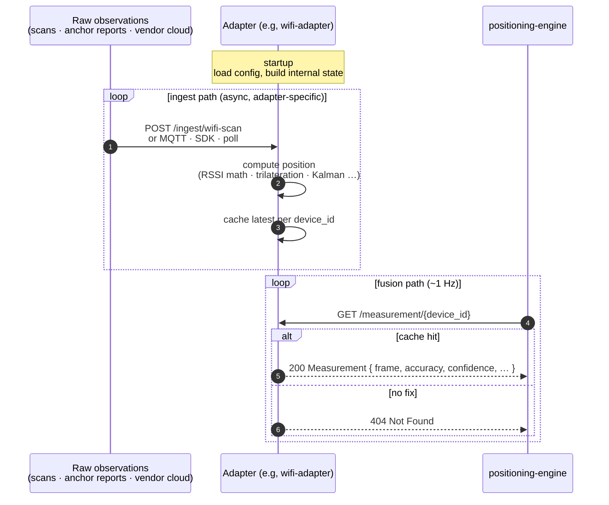
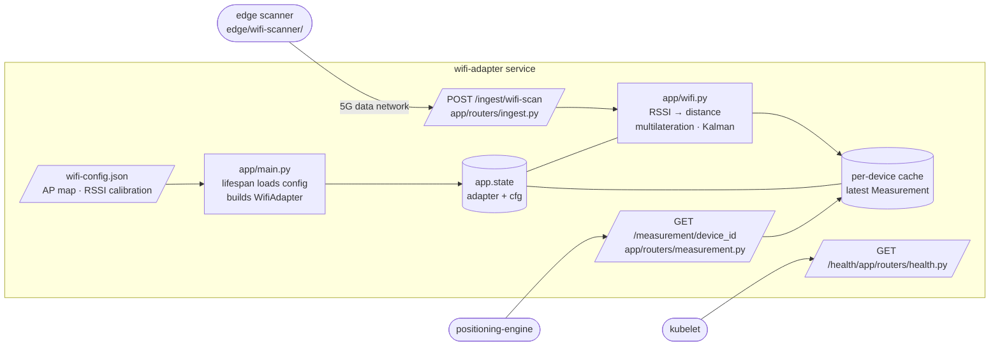

# Writing a Positioning Adapter

A *positioning adapter* is any service that produces a position estimate for a device and exposes it over a small HTTP contract. The positioning engine fuses one or more adapters listed in `ADAPTER_URLS` (a comma-separated list of `name=url` entries, evaluated at startup); it never assumes anything else about a source. For a vendor that speaks REST, adding a technology means writing a schema document and loading it into the generic `vendor-adapter`; no service is written and no code changes. See [integrating a vendor REST API](integrating-a-vendor-rest-api.md). Implementing this contract in a separate service is the path for what a schema cannot express: a proprietary SDK, a binary or push transport, an on-device computation. Either way, no engine, gateway, or demo code changes.

This repository ships two open adapter implementations + one schema-driven translator as reference:

- [`services/wifi-adapter/`](https://github.com/Jacobbista/5g-northbound/tree/main/services/wifi-adapter/): open WiFi RSSI multilateration over a fixed AP map. The right model for any source that ingests raw observations and computes a position itself.
- [`services/synthetic-adapter/`](https://github.com/Jacobbista/5g-northbound/tree/main/services/synthetic-adapter/): synthetic waypoint walker inside floor bounds. Used by the local demo (and useful in CI) to produce continuous position movement without any real measurement source.
- [`services/vendor-adapter/`](https://github.com/Jacobbista/5g-northbound/tree/main/services/vendor-adapter/): schema-driven translator that maps an arbitrary vendor REST API onto the engine's adapter contract. Reference integration: Wittra UWB cloud (via `mocks/mock-vendor/` in dev).

## Status by technology

| Technology | Adapter | Notes |
|-----------|---------|-------|
| **WiFi**  | [`services/wifi-adapter/`](https://github.com/Jacobbista/5g-northbound/tree/main/services/wifi-adapter/) | Production-ready. Reads positions from the placement-editor blueprint, BSSIDs from a per-venue bindings file. See [`blueprint-vs-bindings.md`](./blueprint-vs-bindings.md). |
| **UWB (Wittra)** | [`services/vendor-adapter/`](https://github.com/Jacobbista/5g-northbound/tree/main/services/vendor-adapter/) configured with [`vendor-adapter/examples/wittra-schema.json`](https://github.com/Jacobbista/5g-northbound/blob/main/services/vendor-adapter/examples/wittra-schema.json) | Production-ready. The image is generic: the schema names the variables, `GET /contract` lists them. For this one, point `WITTRA_BASE_URL` at the real Wittra cloud and set `WITTRA_ORG_ID`, `WITTRA_PROJECT_ID`, `WITTRA_API_KEY`; no image rebuild needed. |
| **Synthetic** | [`services/synthetic-adapter/`](https://github.com/Jacobbista/5g-northbound/tree/main/services/synthetic-adapter/) | Demo only. Waypoint walker with wall/opening collision against the blueprint. Never deploy this on the testbed for a real device. |
| **5G**    | *no adapter yet* | The placement editor + 3D scene render `technology: "fiveg"` anchors (visual only). No measurement source is wired. Devices configured to use a `fiveg` adapter would return `404 NOT_FOUND` from the engine, safe but useless. Write an adapter implementing the contract above when a 5G positioning source becomes available. |
| **GNSS**  | *no adapter yet* | Same as 5G. Indoor GNSS is generally too coarse to be useful, so this is intentionally deferred. Outdoor / hybrid deployments would need a dedicated adapter. |

The 5G / GNSS gap is **safe by construction**: the engine never assumes an adapter for a technology exists. If a device is routed (via `DEVICE_MAP`) to a non-configured adapter, the engine returns no fix. The demo shows the device as `offline`. Nothing crashes, no half-baked positions enter the fusion pipeline.

## HTTP contract

The adapter MUST expose two endpoints:

```
GET  /measurement/{device_id}
GET  /health
GET  /ready
```

Optionally it MAY expose `POST /ingest/...` (or any other transport) for sources that push data into the adapter; the engine never calls them. It MAY also expose `GET /devices` (below) to feed asset onboarding.

### `GET /measurement/{device_id}`

Returns the latest position estimate for the device. Two coordinate frames are supported; the response declares which it uses.

**Response (200 OK, local frame, default):**

```json
{
  "source":      "wifi",
  "frame":       "local",
  "x":           11.5,
  "y":           0.0,
  "z":           10.3,
  "accuracy":  6.6,
  "confidence":  0.85,
  "timestamp":   1700000000.0
}
```

**Response (200 OK, WGS84 frame):**

```json
{
  "source":      "wittra",
  "frame":       "wgs84",
  "latitude":    45.064412,
  "longitude":   7.659254,
  "accuracy":  0.3,
  "confidence":  0.95,
  "timestamp":   1700000000.0
}
```

| Field                  | Type             | Notes |
|------------------------|------------------|-------|
| `source`               | string           | Short tag identifying the technology (`wifi`, `uwb`, `fiveg`, …). Surfaces in the engine response under `sources[]` |
| `frame`                | `"local"`/`"wgs84"` | Defaults to `"local"` when omitted. The engine projects WGS84 replies into the local frame using the floor plan's `gps_origin` before fusion |
| `x`, `y`, `z`          | float, metres    | Used when `frame = local`. Right-handed local frame: `x` = east, `y` = vertical (height), `z` = north. Origin is the floor-plan lower-left corner |
| `latitude`, `longitude`| float, degrees   | Used when `frame = wgs84`. Absolute position. The adapter does not need to know the room's GPS origin; the engine does |
| `accuracy`           | float, metres    | One-sigma error radius. Fusion weights a measurement by `confidence / accuracy`, and combines the accuracies in quadrature |
| `confidence`           | float, 0.0–1.0   | Adapter's self-reported reliability. Used as a multiplicative weight in fusion |
| `timestamp`            | float, optional  | Unix epoch seconds when the underlying measurement was taken. Omit for "now". The engine uses this to decide staleness |
| `lastSeen`            | float, optional  | Unix epoch seconds when the DEVICE last communicated with the source. Distinct from `timestamp`, which freezes for a still asset that keeps reporting. The gateway publishes it as `lastCommunicationTime` |

Pick `local` for adapters that compute their own position from observations gathered inside the room (RSSI, UWB anchors). Pick `wgs84` for adapters whose backend is map-anchored and already reports global coordinates, typically commercial RTLS platforms whose operator places anchors on a real-world map. The engine treats the two paths uniformly downstream.

**Response (404 Not Found):**

The adapter has no measurement for this device (yet, or any more). The engine silently ignores this source for this device on this fusion cycle; no retry, no error propagation.

**Response (anything else):**

Treated as a transient adapter failure. The engine logs it and ignores this source for this cycle. The adapter should not raise 5xx unless something is actually broken.

After three consecutive network errors or `5xx` responses the engine puts the adapter into a short cooldown (2 s, doubling on continued failure up to 60 s) during which `GET /measurement/...` is skipped without a request. A successful response resets the counter. `404` and other non-5xx errors do *not* count toward this threshold. `404` is a normal "no fix" reply, and a misconfigured API key surfacing as `401`/`403` should fail loudly in logs rather than back off. See [`services/positioning-engine/app/adapters/http.py`](https://github.com/Jacobbista/5g-northbound/blob/main/services/positioning-engine/app/adapters/http.py) for the constants.

### `GET /health` and `GET /ready`

No authentication on either. **`/health` is liveness**: `200 {"status": "ok"}` whenever the process is up, independent of business config, so a misconfigured pod stays alive (and keeps answering `/contract`) instead of crash-looping. **`/ready` is readiness**: `200 {"status": "ready"}` once startup config has loaded, else `503 {"status": "not-ready", "error": "<why>"}`.

Point the Kubernetes `livenessProbe` at `/health` and the `readinessProbe` at `/ready`. Probing readiness on `/health` is a trap: a pod that came up but failed to load its config (unseeded volume, unreachable authority) would still report ready and take traffic. The `error` field on `/ready` surfaces exactly why a pod is degraded without needing pod logs.

### `GET /devices` (optional)

Enumerate the devices this source knows, so the management layer can onboard them from a list instead of hand entry. Adapters that implement it advertise the `devices` capability; the engine aggregates them at `GET /devices` and the gateway serves the un-onboarded ones at `GET /assets/discoverable`. See [asset registry](asset-registry.md#discovering-devices-to-onboard).

```
GET /devices  ->  { "origin": "inventory" | "observed",
                    "devices": [ { "id": "…",
                                   "role"?: "asset" | "infrastructure",
                                   "sourceClass"?: "uwb"|"ble"|"wifi"|"gnss"|"cellular"|"other",
                                   "deviceType"?: "…", "label"?: "…",
                                   "lastSeen"?: <epoch>, "position"?: {…} } ] }
```

`origin` says what the list *is*: `inventory` when the source keeps a stable, pre-named registry (a vendor cloud - bulk-onboardable), `observed` when ids appear only by activity (wifi sees an id once a scan tagged with it is ingested - a human claims + names it). `id` is the value the engine routes on, so it becomes a capability's `positioningId`. Return an empty list rather than erroring when there is nothing to enumerate.

`role` and `sourceClass` are the two classification axes from the [private-asset paper](https://github.com/Jacobbista/5g-northbound):

- **`role`** - `asset` (a tracked entity: tool, pallet, forklift, worker) vs `infrastructure` (a fixed sensor: UWB anchor, BLE gateway - outside the 3GPP trust domain, **never onboarded** as an asset). Leave it off when the source can't classify; the consumer then treats every candidate as onboardable.
- **`sourceClass`** - the positioning technology (`uwb` / `ble` / `wifi` / `gnss` / `cellular` / `other`), so a quality-sensitive consumer can weigh a UWB fix differently from a WiFi one at the same radius. A recommended controlled vocabulary, not hard-validated; use `other` for anything unlisted.

wifi only ever surfaces `role: asset` (its infrastructure - the APs - lives in the bindings, not the device list). `synthetic-adapter` mirrors an on-premise RTLS: it surfaces both tracked tags (`role: asset`, from `DEVICE_IDS`) and fixed anchors (`role: infrastructure`, from `ANCHOR_IDS`), each tagged with its `sourceClass`. A vendor list mixes assets + infrastructure and multiple technologies, so the classification is **schema-declared, not hardcoded**: the `vendor-adapter`'s `discover.classify` block maps structural predicates on the vendor's own record (e.g. "has a `fixedLocation` → infrastructure") to `role` + `sourceClass`. A different vendor classifies with its own fields - no adapter code changes. See [integrating a vendor REST API](integrating-a-vendor-rest-api.md).

## Lifecycle

1. **Startup.** Adapter loads its configuration (AP map, anchor positions, vendor credentials, …) from environment variables and/or mounted files, then registers with the engine (`POST /adapters` plus a heartbeat). `ADAPTER_URLS` is a cold-start seed only. See [adapter-registry.md](adapter-registry.md).
2. **Data ingestion.** Adapter receives raw observations through whatever mechanism is appropriate for the technology: HTTP push from edge devices, MQTT subscription, vendor SDK, polling. This is entirely the adapter's concern; the engine never sees raw observations.
3. **Position computation.** Adapter converts raw observations into a position estimate in its local frame. It may smooth, fuse multiple antennas, drop outliers, all internal.
4. **Caching.** Adapter keeps the latest position per device. `GET /measurement/{id}` is a cache lookup. The engine polls at its own cadence (default ~1 Hz); the adapter does not push.
5. **Staleness.** Adapter SHOULD return the last known position with its real `timestamp` regardless of age, and let the consumer decide what is too old. Returning 404 on a stale entry forces the engine to drop the source from fusion; usually the better behaviour is to return the old fix with its old timestamp so the engine can grey it out gradually.



The two paths are decoupled: the ingest side moves at whatever rate observations arrive (push, poll, SDK callback), the fusion side runs at the engine's poll cadence. The cache between them is the only contract the engine cares about, adapter implementers are free to pick whatever ingest mechanism fits their technology.

## What an adapter declares about itself

Alongside the HTTP contract, an adapter declares the positioning traits the
engine and gateway reason about. The declaration has two layers: the
`adapter.contract.yaml` baked into the image is the base, and
`ADAPTER_CAPABILITIES` (JSON) overrides or extends it per deployment without a
rebuild. `make positioning-check` asserts the two agree. The adapter sends the
merged result to the engine on every heartbeat, and the gateway aggregates it
into `GET /capabilities`.

Traits that belong to the **image** go in the YAML: which endpoints the binary
exposes (`devices`, `discover`, `diagnostics`), whether it pushes or is polled
(`streaming`). Traits that belong to the **bound source** go in
`ADAPTER_CAPABILITIES` at deploy time: `source`, `kinds`, `frame`, `z`,
`accuracy_class`, `nominalAccuracy`. The vendor-adapter image is generic and
holds no vendor's traits, for the same reason its `GET /contract` names no
vendor's variables until a schema is loaded.

`ADAPTER_CAPABILITIES` is declared in each adapter's `env.contract.yaml` with
`type: json`, so a deploy dashboard driven by the contract offers it like any
other variable rather than requiring the operator to know it exists.

The `kind` an adapter registers under is the image's **family** (`wifi`,
`vendor`, `synthetic`), read from the `adapter:` field of its own
`adapter.contract.yaml`. It is not configuration: the image knows which family
it belongs to, and a deployment that could restate it could only get it wrong.

### `accuracy_class` and `nominalAccuracy`

`accuracy_class` is the band the source's technology nominally delivers, one of
`sub-metre`, `metre`, `coarse`. The boundaries are defined in
[`spec/private-profile/accuracy-class-vocabulary.json`](https://github.com/Jacobbista/5g-northbound/blob/main/spec/private-profile/accuracy-class-vocabulary.json),
served live at `GET /contracts/accuracy-class-vocabulary.json`. Two consumers
read it. A quality-sensitive application reads the aggregate at
`GET /capabilities` to weigh a fix by where it came from, which is the point the
[6GHYPE paper](https://github.com/Jacobbista/5g-northbound) makes when it argues
that an accuracy radius alone collapses precision and provenance into one
signal. The engine reads it to resolve a radius for a source that reports none.

The band is a statement about the technology, not a bound on any single fix. A
degraded fix reports its own worse accuracy honestly, and that does not move the
source into another class. Declare the band the source usually delivers, not its
worst case.

`nominalAccuracy` is optional and only matters for a source that can report a
position without a per-fix accuracy. Most sources compute one: the wifi adapter
derives it from the trilateration residual, a vendor cloud usually returns a
radius. When a source genuinely has none, the engine substitutes, in order: the
adapter's own `nominalAccuracy` if declared, otherwise the `upperBound` of its
declared class, which claims the worst of the band rather than a flattering
midpoint. `coarse` is open-ended upward and resolves to no value on its own, so
an adapter declaring it must also declare `nominalAccuracy`. A source with
neither is dropped from the fusion cycle with a warning rather than fused
against an invented number.

Declare `nominalAccuracy` where the value is known for the deployed hardware,
and cite the source in a comment. It describes one deployment's technology, so
it belongs in that deployment's `ADAPTER_CAPABILITIES`, never baked into a
generic image.

### Tunables with a published vocabulary (wifi-adapter)

Two of the wifi-adapter's bindings are a choice from a fixed set rather than a
number: `motion_model` (which Kalman motion model smooths the fix) and
`algorithm` (which solver turns ranges into a position). The image publishes
the set it implements on `GET /contract` as `motion_models` and `algorithms`,
beside the value in force, and `PUT /bindings` answers `422` for a name outside
it. So an operator tunes from a selector, changes take effect on the next scan,
and a rollback is the previous value, not a redeploy.

`motion_model` is `random-walk` by default. The two differ in one property:

| Model | Prediction | Stationary device | Moving device |
|---|---|---|---|
| `random-walk` (constant position) | widens the uncertainty, does not move the estimate | stays put: there is no velocity state for measurement noise to load | trails, about 0.6 m at 1 m/s with `process_noise` 1.0, more as that value falls |
| `constant-velocity` | extrapolates along the estimated velocity | drifts after a bad fix, for as long as the velocity estimate survives | no steady-state lag while the velocity is constant, which is the motion it models |

`process_noise` does not substitute for the choice. Under `constant-velocity`,
raising it trades the drift for jitter and lowering it makes the drift
longer-lived. Under `random-walk` it is monotone: higher is more responsive,
lower is smoother.

### Placement (`placement` capability)

A source that synthesises its position can be told where to start. A source
that measures one cannot: there is nothing to place, its hardware is already
somewhere. Only the former advertises `placement`, and only it exposes
`PUT`/`DELETE /devices/{id}/placement`.

Coordinates are room-local metres, origin top-left, x right, z down. That is
the frame the walker keeps, the placement editor stores, and the demo's 3D
scene renders, so a point picked on screen travels unchanged. The point is
clamped into the room on arrival, since seeding a walk somewhere the walk could
never reach would strand the device.

With `SPAWN_REQUIRED` set, a device reports nothing until it is placed, and
nothing again once removed. That is not an error state: `GET /measurement/{id}`
answers `404`, the same "no fix" any adapter gives for a device it cannot
currently locate, so the engine skips the source for that cycle and the asset
simply has no position. Nothing downstream special-cases it. Without the flag
every configured device walks from boot, which is the standalone default.

The gateway proxies this asset-shaped at `PUT`/`DELETE /assets/{assetId}/placement`,
resolving the positioning id and refusing a source that does not advertise the
capability with `422 NOT_PLACEABLE`. The demo drags an asset from its rail onto
the floor plan and drops it.

## Engine wiring

The engine reads `ADAPTER_URLS` at startup. Each entry is a `name=url` pair; the name is what appears as the source tag if the adapter does not set its own, and what the optional `DEVICE_MAP` routes against:

```yaml
env:
  - name: ADAPTER_URLS
    value: "wifi=http://wifi-adapter:8080,uwb=http://uwb-adapter:8080"
  - name: DEVICE_MAP                              # optional, per-device routing
    value: "static-tag-07=uwb"                    # only the named adapter is polled for this device
  - name: FUSION_STRATEGY                         # see fusion-strategies.md
    value: "weighted_avg"
```

Each entry becomes one [`HttpAdapter`](https://github.com/Jacobbista/5g-northbound/blob/main/services/positioning-engine/app/adapters/http.py) instance. On every position request the engine selects the relevant adapters for the device (all adapters unless `DEVICE_MAP` overrides), concurrently calls `GET /measurement/{device_id}` on each, normalises WGS84 measurements into the local frame, runs the configured fusion strategy (see [`fusion-strategies.md`](fusion-strategies.md) for the catalogue), and converts the result back to WGS84 using the floor-plan `gps_origin` before returning it on the northbound contract.

A bare URL is also accepted for back-compatibility (`ADAPTER_URLS="http://wifi-adapter:8080"`); the engine assigns it a default name `adapter-N`.

To add an adapter to a running cluster: deploy the new Service, append its `name=url` entry to `ADAPTER_URLS`, restart the engine. An empty `ADAPTER_URLS` produces no measurements; deploy the [`services/synthetic-adapter/`](https://github.com/Jacobbista/5g-northbound/tree/main/services/synthetic-adapter/) adapter (or your own) before pointing the engine at it.

## Coordinate frame

All adapters report positions in the same room-local frame as the floor plan:

- **Origin:** lower-left corner of the room, as defined in `dev/floor-plan.json` (or the production ConfigMap).
- **x:** east, metres (along `width_m`).
- **z:** north, metres (along `depth_m`).
- **y:** vertical, metres (height). Adapters that cannot estimate height SHOULD return `y = 0.0`.

The engine converts `(x, z)` to WGS84 latitude/longitude using the floor plan's `gps_origin` before exposing the position northbound. Adapters do not need GPS knowledge.

## Authentication

The engine talks to adapters over the internal Kubernetes ClusterIP network; in-cluster adapters are not exposed externally and do not need to authenticate engine calls. If your deployment routes adapter traffic over an untrusted network, terminate TLS at an ingress and authenticate engine→adapter calls there; the contract itself is HTTP-only.

If an adapter accepts data pushes from devices on the public 5G data network (the wifi-adapter ingest path is one example), it MUST authenticate or rate-limit those calls itself, the engine cannot help.

### Outbound API key (engine → external adapter)

Vendor adapters that proxy a cloud RTLS backend (e.g. Wittra) typically require the engine to send an API key on every request. The `HttpAdapter` reads per-adapter credentials from the environment so secrets stay out of `ADAPTER_URLS` (which lives in a `ConfigMap`) and can be mounted from a Kubernetes `Secret`:

| Variable                              | Default        | Purpose                                                                 |
|---------------------------------------|----------------|-------------------------------------------------------------------------|
| `ADAPTER_<NAME>_API_KEY`              | _unset_        | Token value. When set, the engine sends it on every request.            |
| `ADAPTER_<NAME>_API_KEY_HEADER`       | `X-API-Key`    | Header name carrying the token. Set to `Authorization` for bearer-style auth (in which case the value should include the `Bearer ` prefix). |
| `ADAPTER_<NAME>_TIMEOUT`              | `1.0`          | HTTPX request timeout in seconds. Raise for high-latency cloud backends. |

`<NAME>` is the adapter name from `ADAPTER_URLS` uppercased, with non-alphanumerics replaced by underscores (`wittra` → `WITTRA`, `wifi-backend` → `WIFI_BACKEND`).

Example wiring for a Wittra cloud adapter:

```yaml
env:
  - name: ADAPTER_URLS
    value: "wittra=https://api.wittra.example.com"
  - name: ADAPTER_WITTRA_TIMEOUT
    value: "5.0"
  - name: ADAPTER_WITTRA_API_KEY            # mount the actual value from a Secret
    valueFrom:
      secretKeyRef:
        name: wittra-credentials
        key: api-key
  - name: ADAPTER_WITTRA_API_KEY_HEADER
    value: "X-API-Key"
```

In-cluster adapters (`wifi-adapter`, `synthetic-adapter`) do not set these variables and keep talking to the engine over plain HTTP on the cluster network.

## Packaging

| | |
|---|---|
| **Runtime** | any language or framework; the contract is HTTP+JSON |
| **Image** | published to a container registry the cluster can pull from (private registries need an `imagePullSecret`) |
| **Health** | `GET /health` (liveness, always 200) and `GET /ready` (readiness: 200 ready / 503 + `{error}` degraded) |
| **Port** | conventionally `8080` inside the container; the Service publishes whichever ClusterIP port the engine URL references |
| **Configuration** | environment variables and/or files mounted from a `ConfigMap` (raw data) plus a `Secret` (credentials) |
| **State** | per-device in-memory cache is fine; the engine tolerates restarts (a missing measurement is just a 404 for one cycle) |

## Reference implementation walk-through



[`services/wifi-adapter/`](https://github.com/Jacobbista/5g-northbound/tree/main/services/wifi-adapter/) is roughly 250 lines of Python + FastAPI:

- [`app/main.py`](https://github.com/Jacobbista/5g-northbound/blob/main/services/wifi-adapter/app/main.py): loads `wifi-config.json` (AP map, room dimensions, RSSI calibration) into application state, mounts the routers.
- [`app/wifi.py`](https://github.com/Jacobbista/5g-northbound/blob/main/services/wifi-adapter/app/wifi.py): `compute_position(scan, cfg)`: RSSI → distance via log-distance path loss, least-squares multilateration with weighted-centroid fallback. `WifiAdapter.ingest(...)` smooths through a per-device Kalman tracker and caches a `Measurement`.
- [`app/routers/ingest.py`](https://github.com/Jacobbista/5g-northbound/blob/main/services/wifi-adapter/app/routers/ingest.py): `POST /ingest/wifi-scan` receives `{positioningId, scan: {bssid: rssi_dbm}, timestamp?}` from edge clients, and still accepts the superseded `device_id` so a scanner deployed before the rename keeps reporting; such a scan is answered with a `warning` naming the replacement, and the device is listed on `GET /devices` with `supersededIngestField` until it moves (for example, the Raspberry Pi scanner; deploy flow in [`edge/wifi-scanner/README.md`](https://github.com/Jacobbista/5g-northbound/blob/main/edge/wifi-scanner/README.md)) over the 5G data network. Adapter-specific endpoint, not part of the engine contract.
- [`app/routers/measurement.py`](https://github.com/Jacobbista/5g-northbound/blob/main/services/wifi-adapter/app/routers/measurement.py): implements `GET /measurement/{device_id}` against the cache.

Reading it end-to-end is the fastest way to understand the shape; replicate the structure in your own technology stack.

### Trying it locally

With the compose stack running, the `wifi-adapter` cache starts empty (its `GET /measurement/wifi-asset-01` returns `404` until a scan arrives). Push one synthetic scan to populate it:

```bash
curl -s -X POST http://localhost:8089/ingest/wifi-scan \
  -H "Content-Type: application/json" \
  -d '{"positioningId":"wifi-asset-01","scan":{
        "AA:BB:CC:00:01:01":-50,
        "AA:BB:CC:00:02:01":-55,
        "AA:BB:CC:00:03:01":-60,
        "AA:BB:CC:00:04:01":-65
      }}'
```

Subsequent calls to `GET /measurement/wifi-asset-01` (and the northbound CAMARA call for `+390111234567`) will return the computed position. The BSSIDs above are the placeholders shipped in [`dev/wifi-config.json`](https://github.com/Jacobbista/5g-northbound/blob/main/dev/wifi-config.json); replace them with real ones in a gitignored `dev/wifi-config.local.json` for a real venue (see [Configuration provisioning](#configuration-provisioning) below).

## Minimal Python skeleton

```python
from fastapi import FastAPI, HTTPException, Response
from pydantic import BaseModel
from typing import Optional

class Measurement(BaseModel):
    source: str = "my-source"
    x: float; y: float = 0.0; z: float
    accuracy: float
    confidence: float
    timestamp: Optional[float] = None

app = FastAPI()
_cache: dict[str, Measurement] = {}

_ready = True  # flip to False while startup config is still loading

@app.get("/health")
async def health():
    return {"status": "ok"}          # liveness: process is up

@app.get("/ready")
async def ready(response: Response):
    if not _ready:                    # readiness: config loaded, can serve
        response.status_code = 503
        return {"status": "not-ready", "error": "..."}
    return {"status": "ready"}

@app.get("/measurement/{device_id}", response_model=Measurement)
async def get_measurement(device_id: str):
    m = _cache.get(device_id)
    if m is None:
        raise HTTPException(404)
    return m

# … your own ingestion / polling logic populates `_cache`.
```

Ship it as a container, deploy a `Deployment` + `ClusterIP Service`, append the Service URL to the engine's `ADAPTER_URLS`, restart the engine. The new source is now part of every fused position.

## Configuration provisioning

Adapter configuration splits into two distinct files that travel separately:

1. **Blueprint** (placement-editor JSON), room geometry, anchor positions, georef. Portable, no secrets. The committed template is [`services/location-app/public/layout.example.json`](https://github.com/Jacobbista/5g-northbound/blob/main/services/location-app/public/layout.example.json); `make demo` bootstraps the gitignored working copy `layout.json` from it on first run. Real venue blueprints never enter the repo.
2. **Bindings** ([`dev/wifi-config.json`](https://github.com/Jacobbista/5g-northbound/blob/main/dev/wifi-config.json)), propagation tunables (`tx_power`, `path_loss_n`, smoothing, `motion_model`) plus the per-AP `id → BSSIDs` mapping. Venue-sensitive; the committed file is a placeholder, real values live in `dev/wifi-config.local.json` (gitignored) or a Kubernetes Secret.

The wifi-adapter service joins the two files on anchor `id` at startup. See [`blueprint-vs-bindings.md`](./blueprint-vs-bindings.md) for the full architecture rationale and authoring flow.

| Environment           | Blueprint source                                                                  | Bindings source                                                                 |
|-----------------------|-----------------------------------------------------------------------------------|--------------------------------------------------------------------------------|
| Local docker compose  | `services/location-app/public/layout.json` (gitignored working copy, bootstrapped from [`layout.example.json`](https://github.com/Jacobbista/5g-northbound/blob/main/services/location-app/public/layout.example.json) by `make demo`), overwritten by the editor's auto-save | [`dev/wifi-config.json`](https://github.com/Jacobbista/5g-northbound/blob/main/dev/wifi-config.json) (placeholder, committed). Drop your real values into `dev/wifi-config.local.json` (gitignored) and `make demo` auto-mounts it. |
| CI / unit tests       | Inline fixtures in the test files; no JSON loaded                                 | Inline fixtures; no JSON loaded                                                |
| Cluster runtime       | PVC mounted at `LAYOUT_PATH`. Authored by the operator in the placement editor and exported, or written back by the editor service. | PVC mounted at `WIFI_CONFIG_PATH`. **Must be a PVC, not a ConfigMap or Secret**: the calibration tool writes back samples + per-AP overrides at runtime. See [`blueprint-vs-bindings.md`](blueprint-vs-bindings.md#deploying-to-kubernetes) for the full Deployment manifest. |

The cluster artefacts are intentionally not produced by the testbed's Ansible phases, phase 11 ships only the engine backbone with `ADAPTER_URLS=""`. Adapters, blueprints, and bindings are runtime artefacts, installed when an operator (or the dashboard catalog, planned) provisions a positioning source.

Manual cluster provisioning, until the dashboard lands:

```bash
# PVCs are created from your environment's storage class. Once bound:
POD=$(kubectl -n positioning get pod -l app=wifi-adapter -o name | head -1)
kubectl -n positioning cp ./wifi-config.local.json $POD:/app/config/wifi-config.json
kubectl -n positioning cp ./exported-blueprint.json $POD:/app/config/layout.json
kubectl -n positioning rollout restart deployment wifi-adapter
```

The full Deployment manifest (with `fsGroup: 1001` so the container can
write the PVC) is in [`blueprint-vs-bindings.md`](blueprint-vs-bindings.md#deploying-to-kubernetes).

The same pattern applies to any other adapter: ship a placeholder in the repository so the stack runs from a fresh clone; keep real configuration on the operator's machine and inject it into the cluster as a ConfigMap (for geometry) or Secret (for credentials / BSSIDs / MACs) at provisioning time.

## Vendor adapters and private images

Adapters that wrap a proprietary RTLS or contain vendor SDKs / NDA material belong in **separate, private repositories** and ship as private container images. They implement the same contract; deployment differs only in needing an `imagePullSecret`. The public engine and the public gateway never see vendor code or vendor secrets, the boundary is the HTTP contract documented above.
