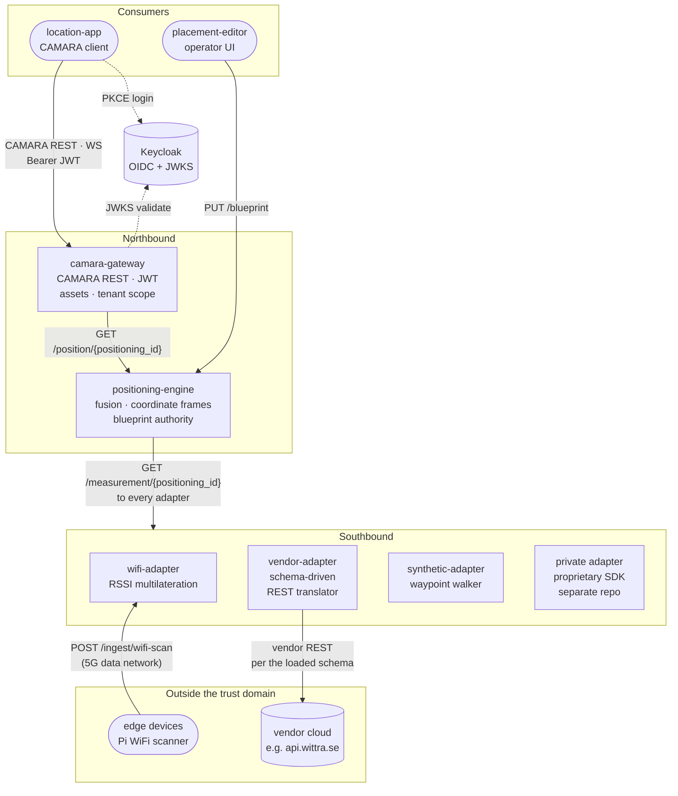
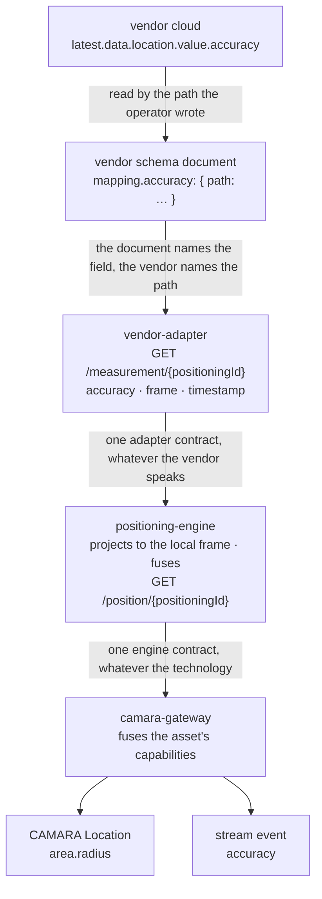
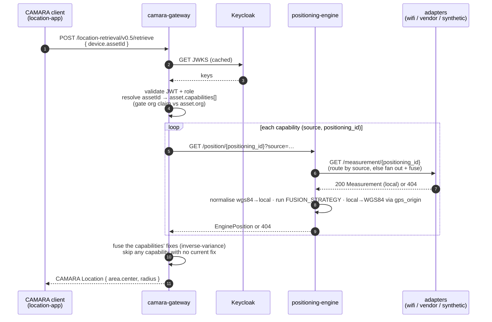
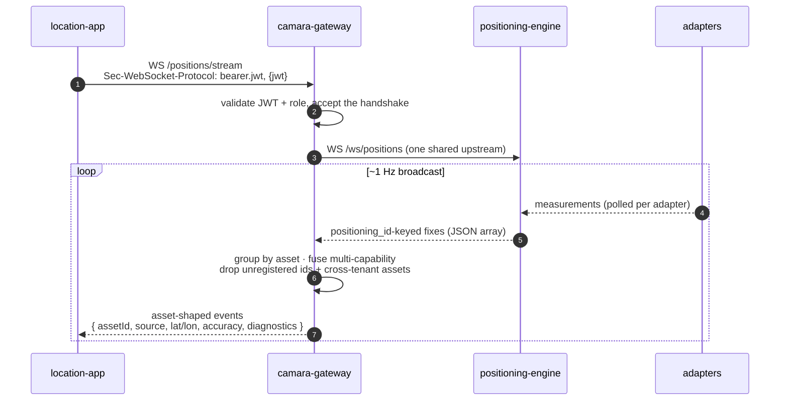

# Architecture

The 5G Northbound stack exposes device location to third-party applications over the CAMARA Device Location API while abstracting the underlying positioning technology. It is the northbound capability-exposure layer of a 5G research testbed built on [Open5GS](https://open5gs.org/) and Kubernetes (k3s).

## System overview

The stack is split along one line, and every other decision follows from it.
**Northbound** is the side that faces applications: it speaks CAMARA, owns
identity, and decides what a tenant is allowed to see. **Southbound** is the
side that faces sensing hardware: it speaks whatever a vendor speaks and
translates. The two never blur. A southbound component conforms to contracts it
does not define; a northbound component defines contracts it then has to keep.

That is why a new positioning technology costs one new adapter and nothing else.
The engine and the gateway have no vendor knowledge to update, because none was
ever placed in them.



Read the middle band as the contract surface. Above it, one identifier crosses:
the `assetId`. Below it, one contract repeats: `GET /measurement/{positioning_id}`.
Everything a vendor does differently is absorbed in the bottom band, and the
`vendor-adapter` absorbs a whole class of them without new code, because the
translation is a document an operator loads rather than a branch in the image.

`location-app` is the end-user consumer and never leaves the northbound
boundary: it talks to the gateway and to nothing else. `placement-editor` is its
operator-facing sibling and writes the venue geometry to the engine, which is
the blueprint authority. The two UIs never talk to each other, and nothing
mounts a shared file; the blueprint travels over HTTP (see
[blueprint vs bindings](blueprint-vs-bindings.md)).

The tracked entities are **assets**, each declaring one or more
**capabilities**; a capability pairs a `source` with the `positioning_id` that
source uses. The gateway resolves an `assetId` to those capabilities, asks the
engine once per capability, and fuses the answers. The engine is asset-agnostic:
it receives a `positioning_id` and a `source`, routes to the adapter registered
under that name, and knows nothing about who owns the thing. Adapters
self-register, so `ADAPTER_URLS` is only a cold-start seed. With no adapters
registered the engine produces no measurements; deploy at least one, and the
[`synthetic-adapter`](https://github.com/Jacobbista/5g-northbound/tree/main/services/synthetic-adapter/)
is the shortest path in development.

### Data flow: one number, from the vendor to the consumer

The request flow below shows which service calls which. This shows what happens
to a value along the way, which is the part that decides how a field is named
and where a name is allowed to change.



Three things travel differently, and the difference is the whole design.

**The value** is read once and never re-derived. The operator writes the vendor's
own path in the schema document; nothing downstream knows that path exists.

**The name** changes exactly twice, at the two boundaries where a different
authority takes over. The vendor's key becomes this project's `accuracy` when the
adapter maps it, and `accuracy` becomes CAMARA's `area.radius` when the gateway
answers a retrieval. It does not change at the adapter-to-engine or
engine-to-gateway hop: those are this project's own surfaces and they carry one
convention, so the gateway forwards rather than translates.

**The unit** never travels in the name. It is metres from the vendor onward,
declared in `x-unit` on every schema that describes the field, and CAMARA
documents `radius` in prose the same way.

What is *added* along the way is the part a single hop cannot know. The engine
adds the coordinate frame, because only it holds the venue georeference. The
gateway adds the asset identity and the tenant, because only it holds the Asset
Identity Map. Neither can be done earlier, which is why the pipeline has these
services and not fewer.

### Request flow: one CAMARA call, end to end



The engine fuses across **adapters** for one positioning id (its routing fallback); the gateway fuses across an asset's **capabilities** (a multi-technology asset, e.g. WiFi + UWB). A single-capability asset is the same path with one capability and a pass-through fuse.

### Adapter routing: how the engine picks who to call


### Live stream: the push path

Retrieve is request/response. Moving assets also get a push channel: the engine
broadcasts every fix, and the gateway forwards them to authenticated clients as
asset-shaped events over a WebSocket, applying the same asset resolution, fusion
and tenant scoping as the pull path.



The token rides the `Sec-WebSocket-Protocol` header, not the URL (see
[data contracts](data-contracts.md)). The stream contract is published as
[AsyncAPI](https://github.com/Jacobbista/5g-northbound/blob/main/spec/private-profile/asyncapi-stream.yaml).

## Services

| Service              | Role                                                                  | Repository path                          |
|----------------------|-----------------------------------------------------------------------|------------------------------------------|
| `camara-gateway`     | CAMARA Location Retrieval v0.5 and Location Verification v3 endpoints; JWT validation against Keycloak; Asset Identity Map authority (`assetId` → capabilities) and per-tenant authorization; fuses an asset's capabilities into one `Location` | [`services/camara-gateway/`](https://github.com/Jacobbista/5g-northbound/tree/main/services/camara-gateway/) |
| `positioning-engine` | Fuses measurements from configured adapters; runs the selected fusion strategy; converts local coordinates to WGS84; serves the northbound contract consumed by the gateway | [`services/positioning-engine/`](https://github.com/Jacobbista/5g-northbound/tree/main/services/positioning-engine/) |
| `wifi-adapter`   | Reference positioning adapter: WiFi RSSI multilateration over a fixed AP map; receives scans on the 5G data network                            | [`services/wifi-adapter/`](https://github.com/Jacobbista/5g-northbound/tree/main/services/wifi-adapter/) |
| `vendor-adapter`     | Generic translator from a vendor REST positioning cloud onto the adapter contract. One pod per vendor, bound to it by a schema document an operator loads at runtime rather than by code; it declares the variables that document needs at `GET /contract` and its own grammar at `GET /contract/schema`. See [integrating a vendor REST API](integrating-a-vendor-rest-api.md) | [`services/vendor-adapter/`](https://github.com/Jacobbista/5g-northbound/tree/main/services/vendor-adapter/) |
| `synthetic-adapter`   | Reference positioning adapter: a waypoint walker that respects the blueprint's walls and openings when one is available, and rectangles inside the configured bounds when it is not. Produces continuous motion without a real measurement source; the local demo uses it and a new adapter copies it | [`services/synthetic-adapter/`](https://github.com/Jacobbista/5g-northbound/tree/main/services/synthetic-adapter/) |
| `location-app`   | Browser MEC application. Authenticates with `keycloak-js` (PKCE) and presents the Bearer JWT to the CAMARA gateway (`/assets` for discovery, `/assets/{assetId}/details` per asset) and the live positions WebSocket, rendering them on a 3D floor plan. Read-only consumer; never mutates server state. See [Authentication](authentication.md) | [`services/location-app/`](https://github.com/Jacobbista/5g-northbound/tree/main/services/location-app/) |
| `placement-editor`   | Operator-facing service for authoring the venue. Serves the editing UI and proxies the blueprint at `GET/PUT /api/layout`; the engine remains the authority and holds the stored copy. Runs alongside (not inside) the demo and is the artefact pulled by the testbed dashboard. Gated by an `oauth2-proxy` sidecar (BFF pattern), so the app carries no auth code. See [Authentication](authentication.md) | [`services/placement-editor/`](https://github.com/Jacobbista/5g-northbound/tree/main/services/placement-editor/) |

Edge clients (for example, the Raspberry Pi WiFi scanner; see [`edge/wifi-scanner/README.md`](https://github.com/Jacobbista/5g-northbound/blob/main/edge/wifi-scanner/README.md) for the deploy flow) are not deployed by Kubernetes. They run on the device and reach the cluster over the 5G data network.

## Mapping to 3GPP and CAMARA reference architecture

The canonical 3GPP location-exposure chain is:

```
[Application] ──CAMARA──► [CAMARA Gateway] ──Nnef──► [NEF] ──Nlmf──► [LMF] ──► RAN / UE
```

This stack collapses that chain to fit a research testbed where Open5GS does not ship a full NEF or LMF:

| 3GPP / CAMARA role | This repository | Notes |
|---|---|---|
| Application (API consumer) | `location-app`, and any CAMARA client | PKCE login, polls `POST /location-retrieval/v0.5/retrieve` |
| CAMARA Gateway + NEF | `camara-gateway` | One service: CAMARA REST surface, JWT, Asset Identity Map, tenant authorization. It fuses an asset's capabilities into one circle by combining WGS84 answers. The venue geometry stays in the engine |
| LMF, method selection and hybrid combination | `positioning-engine` | Routes a request to the source named by the capability, falls back to fanning out, and fuses what comes back. The strategy is pluggable (see [`fusion-strategies.md`](fusion-strategies.md), baseline `weighted_avg`). Owns the venue georeference and normalises to WGS84 |
| LMF, one per positioning technology | the adapters: `wifi-adapter`, `vendor-adapter`\*, `synthetic-adapter` | Each occupies the LMF slot for one technology. The engine asks for a position and cannot tell how the answer was produced, which is the substitution the adapter contract exists to provide. `wifi-adapter` computes on site, multilaterating RSSI scans the device posts over the 5G data network |
| RAN / UE measurements | `POST /ingest/wifi-scan` into `wifi-adapter`, the one leg that carries raw measurements | The adapter contract itself carries a computed fix with an accuracy, not an observation. See [`adapters.md`](adapters.md) |
| AMF / SMF session state | out of scope | The profile addresses assets by `assetId`, not by subscriber or session identity, so the gateway resolves identity from the Asset Identity Map rather than from the SMF |

The internal decomposition is a deployment choice and can be re-split into
separate NEF and LMF services later without breaking northbound consumers.

\* `vendor-adapter` fills the slot without holding the solver. A vendor RTLS
computes in its own cloud, and the adapter is the REST bridge to it. The slot,
the contract and the engine's view are the same either way: moving that solver
on site changes what stands behind the box, not the architecture.

3GPP places one LMF per request, reaching several positioning methods. Here the
split is per technology, with selection and hybrid combination in the engine.

## Coordinate frame

All adapters, the engine, and the floor plan share a single right-handed local frame:

- **Origin:** lower-left corner of the room.
- **x:** east (along `width_m`).
- **z:** north (along `depth_m`).
- **y:** vertical (height).

Adapters may report measurements in this local frame (the default) or in WGS84 latitude/longitude. WGS84-native sources (typically commercial RTLS platforms anchored on a real map) are projected into the local frame by the engine using the floor plan's `gps_origin` before fusion. The engine then converts the fused result back to WGS84 at the northbound boundary so the gateway stays geometry-agnostic. The demo recovers room-local coordinates by inverting this conversion against the same `gps_origin`. If `gps_origin` is absent (production deployments may legitimately omit it until a real lab GPS reference has been measured), the engine returns `latitude: 0, longitude: 0` and logs a warning.


## Deployment model

This repository builds container images. A companion testbed repository (`kelt`) owns the Kubernetes manifests, ConfigMaps, and Secrets that compose them into a running cluster. See [`deployment.md`](deployment.md) for the image and configuration contract between the two.
