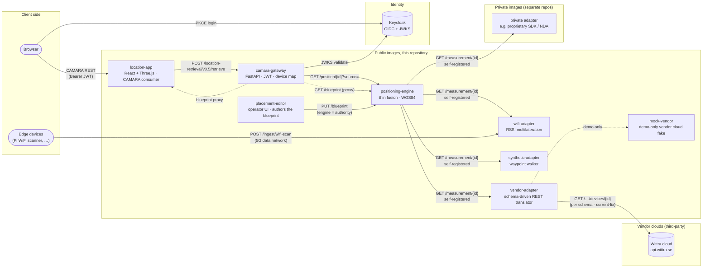
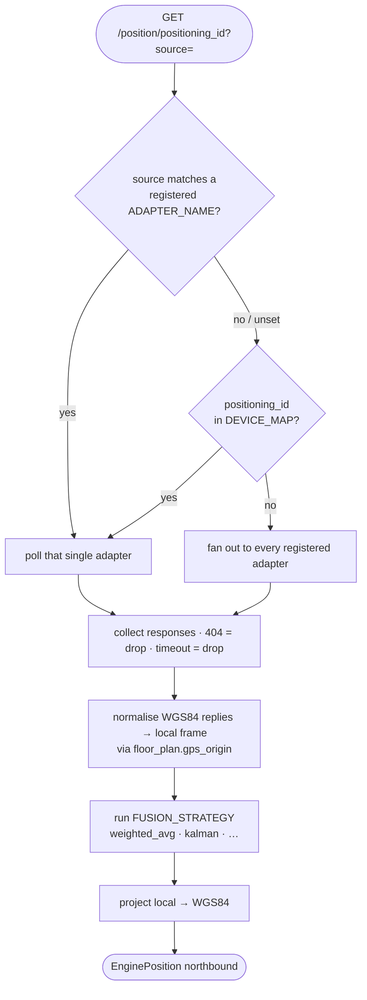
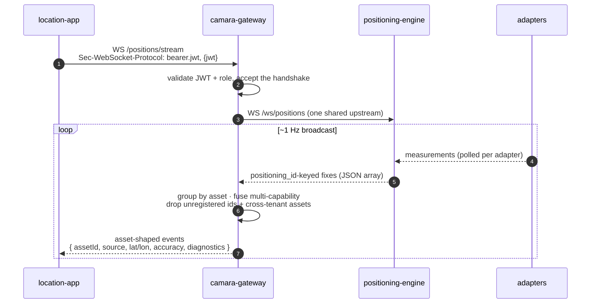
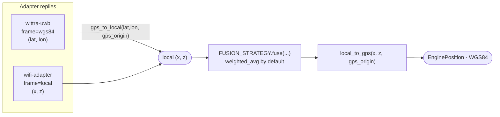

# Architecture

The 5G Northbound stack exposes device location to third-party applications over the CAMARA Device Location API while abstracting the underlying positioning technology. It is the northbound capability-exposure layer of a 5G research testbed built on [Open5GS](https://open5gs.org/) and Kubernetes (k3s).

## System overview



`location-app` is the **end-user / CAMARA consumer**. `placement-editor` is the **operator-facing** sibling that authors the blueprint. It writes over HTTP to the positioning-engine, the blueprint authority (`PUT /blueprint`); consumers read the blueprint back from the engine through the gateway proxy. The editor and the demo never talk directly, and nothing mounts a shared file: the blueprint is network-distributed (see [blueprint vs bindings](blueprint-vs-bindings.md)).

The tracked entities are **assets** (tools, tags, pallets, forklifts), each with a business `assetId` the gateway resolves to a `positioning_id` and a `source` via the Asset Identity Map. Each positioning *technology* is its own pod speaking a single HTTP contract; adapters self-register with the engine (`ADAPTER_URLS` is only a cold-start seed). The engine routes a request to the adapter whose `ADAPTER_NAME` equals the asset's `source`, falling back to the optional `DEVICE_MAP` pin and then to fan-out-and-fuse across all adapters. With no adapters configured the engine produces no measurements. Deploy at least one (the [`synthetic-adapter`](https://github.com/Jacobbista/5g-northbound/tree/main/services/synthetic-adapter/) reference is the simplest path for development).

### Request flow: one CAMARA call, end to end

```mermaid
sequenceDiagram
  autonumber
  participant App as CAMARA client<br/>(location-app)
  participant GW as camara-gateway
  participant KC as Keycloak
  participant ENG as positioning-engine
  participant AD as adapters<br/>(wifi / vendor / synthetic)

  App->>GW: POST /location-retrieval/v0.5/retrieve<br/>{ device.assetId }
  GW->>KC: GET JWKS (cached)
  KC-->>GW: keys
  GW->>GW: validate JWT + role<br/>resolve assetId → asset.capabilities[]<br/>(gate org claim vs asset.org)

  loop each capability (source, positioning_id)
    GW->>ENG: GET /position/{positioning_id}?source=…
    ENG->>AD: GET /measurement/{positioning_id}<br/>(route by source; else fan out + fuse)
    AD-->>ENG: 200 Measurement (local) or 404
    ENG->>ENG: normalise wgs84→local · run FUSION_STRATEGY · local→WGS84 via gps_origin
    ENG-->>GW: EnginePosition or 404
  end

  GW->>GW: fuse the capabilities' fixes (inverse-variance)<br/>skip any capability with no current fix
  GW-->>App: CAMARA Location { area.center, radius }
```

The engine fuses across **adapters** for one positioning id (its routing fallback); the gateway fuses across an asset's **capabilities** (a multi-technology asset, e.g. WiFi + UWB). A single-capability asset is the same path with one capability and a pass-through fuse.

### Adapter routing: how the engine picks who to call



### Live stream: the push path

Retrieve is request/response. Moving assets also get a push channel: the engine
broadcasts every fix, and the gateway forwards them to authenticated clients as
asset-shaped events over a WebSocket, applying the same asset resolution, fusion
and tenant scoping as the pull path.



The token rides the `Sec-WebSocket-Protocol` header, not the URL (see
[data contracts](data-contracts.md)). The stream contract is published as
[AsyncAPI](https://github.com/Jacobbista/5g-northbound/blob/main/spec/private-profile/asyncapi-stream.yaml).

## Services

| Service              | Role                                                                  | Repository path                          |
|----------------------|-----------------------------------------------------------------------|------------------------------------------|
| `camara-gateway`     | CAMARA Location Retrieval v0.5 and Location Verification v3 endpoints; JWT validation against Keycloak; Asset Identity Map authority (`assetId` → `positioning_id` + `source`) and per-tenant authorization | [`services/camara-gateway/`](https://github.com/Jacobbista/5g-northbound/tree/main/services/camara-gateway/) |
| `positioning-engine` | Fuses measurements from configured adapters; runs the selected fusion strategy; converts local coordinates to WGS84; serves the northbound contract consumed by the gateway | [`services/positioning-engine/`](https://github.com/Jacobbista/5g-northbound/tree/main/services/positioning-engine/) |
| `wifi-adapter`   | Reference positioning adapter: WiFi RSSI multilateration over a fixed AP map; receives scans on the 5G data network                            | [`services/wifi-adapter/`](https://github.com/Jacobbista/5g-northbound/tree/main/services/wifi-adapter/) |
| `synthetic-adapter`   | Reference positioning adapter: synthetic random walk inside the floor bounds. Produces continuous motion without a real measurement source, used by the local demo and as a generic adapter template | [`services/synthetic-adapter/`](https://github.com/Jacobbista/5g-northbound/tree/main/services/synthetic-adapter/) |
| `location-app`   | Browser MEC application. Authenticates with `keycloak-js` (PKCE) and presents the Bearer JWT to the CAMARA gateway (`/assets` for discovery, `/assets/{assetId}/details` per asset) and the live positions WebSocket, rendering them on a 3D floor plan. Read-only consumer; never mutates server state. See [Authentication](authentication.md) | [`services/location-app/`](https://github.com/Jacobbista/5g-northbound/tree/main/services/location-app/) |
| `placement-editor`   | Operator-facing service, reads/writes the floor-plan / AP layout JSON via `GET/PUT /api/layout`. Runs alongside (not inside) the demo and is the artefact pulled by the testbed dashboard. Gated by an `oauth2-proxy` sidecar (BFF pattern), so the app carries no auth code. See [Authentication](authentication.md) | [`services/placement-editor/`](https://github.com/Jacobbista/5g-northbound/tree/main/services/placement-editor/) |

Edge clients (for example, the Raspberry Pi WiFi scanner; see [`edge/wifi-scanner/README.md`](https://github.com/Jacobbista/5g-northbound/blob/main/edge/wifi-scanner/README.md) for the deploy flow) are not deployed by Kubernetes. They run on the device and reach the cluster over the 5G data network.

## Mapping to 3GPP and CAMARA reference architecture

The canonical 3GPP location-exposure chain is:

```
[Application] ──CAMARA──► [CAMARA Gateway] ──Nnef──► [NEF] ──Nlmf──► [LMF] ──► RAN / UE
```

This stack collapses that chain to fit a research testbed where Open5GS does not ship a full NEF or LMF:

| 3GPP / CAMARA role              | This repository                                            | Notes |
|---------------------------------|------------------------------------------------------------|-------|
| Application (API consumer)      | `location-app` (any CAMARA client also works)          | PKCE login, polls `POST /location-retrieval/v0.5/retrieve` |
| CAMARA Gateway + NEF            | `camara-gateway`                                           | Single service: CAMARA REST surface, JWT, Asset Identity Map + tenant authz. Geometry-agnostic |
| LMF                             | `positioning-engine`                                       | Thin fusion of 3GPP and non-3GPP sources via the HTTP adapter contract; fusion strategy is pluggable (see [`fusion-strategies.md`](fusion-strategies.md), baseline is `weighted_avg`); normalises to WGS84 |
| RAN / UE measurements           | Adapter pods (`wifi-adapter` in repo; vendor adapters as private images) | Each adapter is its own pod implementing `GET /measurement/{id}`: see [`adapters.md`](adapters.md) |
| AMF / SMF session state         | out of scope                                               | The private-asset profile addresses assets by `assetId`, not by subscriber/session identity, so the gateway resolves identity from the Asset Identity Map, not from SMF. 3GPP network-based positioning is a component-bound future direction (see the [profile](https://github.com/Jacobbista/5g-northbound/blob/main/spec/private-profile/README.md)) |

The external contracts (CAMARA REST) are standard; the internal decomposition is a deployment choice and can be re-split into separate NEF and LMF services later without breaking northbound consumers.

## Coordinate frame

All adapters, the engine, and the floor plan share a single right-handed local frame:

- **Origin:** lower-left corner of the room.
- **x:** east (along `width_m`).
- **z:** north (along `depth_m`).
- **y:** vertical (height).

Adapters may report measurements in this local frame (the default) or in WGS84 latitude/longitude. WGS84-native sources (typically commercial RTLS platforms anchored on a real map) are projected into the local frame by the engine using the floor plan's `gps_origin` before fusion. The engine then converts the fused result back to WGS84 at the northbound boundary so the gateway stays geometry-agnostic. The demo recovers room-local coordinates by inverting this conversion against the same `gps_origin`. If `gps_origin` is absent (production deployments may legitimately omit it until a real lab GPS reference has been measured), the engine returns `latitude: 0, longitude: 0` and logs a warning.



## Deployment model

This repository builds container images. A companion testbed repository (`kelt`) owns the Kubernetes manifests, ConfigMaps, and Secrets that compose them into a running cluster. See [`deployment.md`](deployment.md) for the image and configuration contract between the two.
