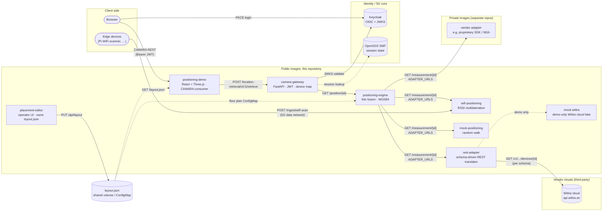
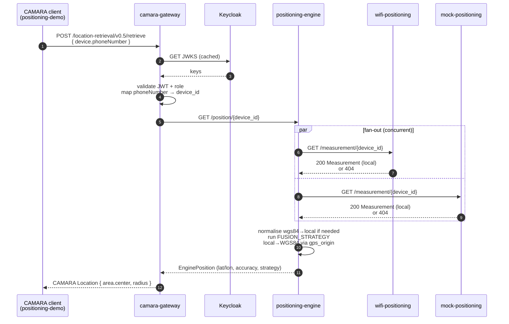
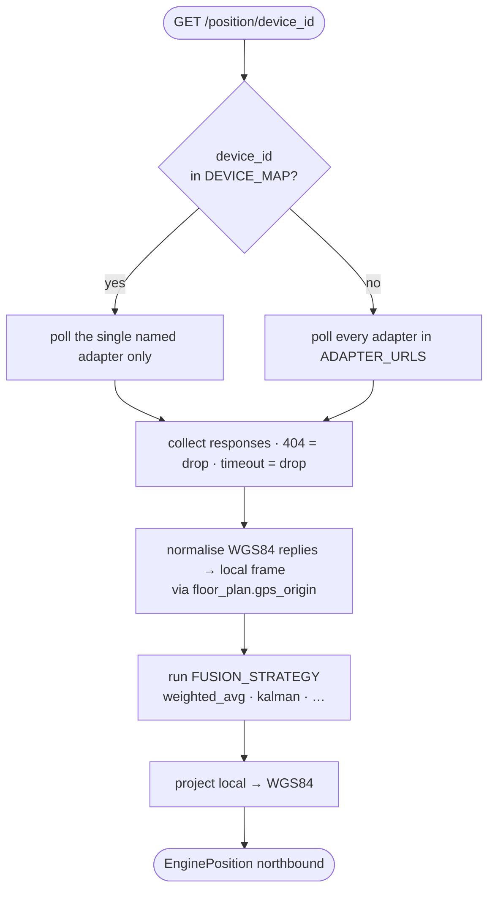
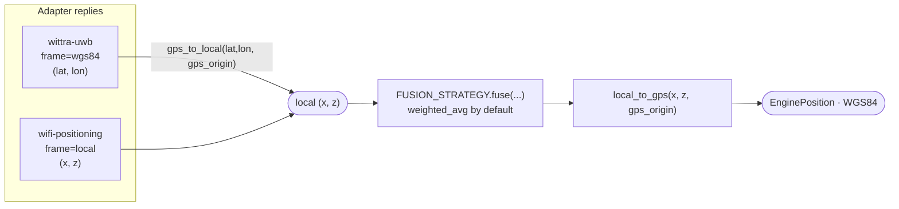

# Architecture

The 5G Northbound stack exposes device location to third-party applications over the CAMARA Device Location API while abstracting the underlying positioning technology. It is the northbound capability-exposure layer of a 5G research testbed built on [Open5GS](https://open5gs.org/) and Kubernetes (k3s).

## System overview



`positioning-demo` is the **end-user / CAMARA consumer**. `placement-editor` is the **operator-facing** sibling that writes the layout JSON those consumers read; the two never talk to each other directly, only through the shared file artefact.

Devices are generic assets: UWB tags, WiFi clients, 5G UEs, anything with a stable identifier. Each positioning *technology* is its own pod that speaks a single HTTP contract; the engine fuses whichever adapter URLs are listed in its configuration. `ADAPTER_URLS` is a comma-separated list of `name=url` entries; `DEVICE_MAP` optionally pins a device to one named adapter. With no adapters configured, the engine produces no measurements. Deploy at least one adapter (the [`mock-positioning`](../mocks/mock-positioning/) reference is the simplest path for development).

### Request flow: one CAMARA call, end to end



### Adapter routing: how the engine picks who to call



## Services

| Service              | Role                                                                  | Repository path                          |
|----------------------|-----------------------------------------------------------------------|------------------------------------------|
| `camara-gateway`     | CAMARA Location Retrieval v0.5 and Location Verification v3 endpoints; JWT validation against Keycloak; cross-technology device-identity mapping | [`services/camara-gateway/`](../services/camara-gateway/) |
| `positioning-engine` | Fuses measurements from configured adapters; runs the selected fusion strategy; converts local coordinates to WGS84; serves the northbound contract consumed by the gateway | [`services/positioning-engine/`](../services/positioning-engine/) |
| `wifi-positioning`   | Reference positioning adapter: WiFi RSSI multilateration over a fixed AP map; receives scans on the 5G data network                            | [`services/wifi-positioning/`](../services/wifi-positioning/) |
| `mock-positioning`   | Reference positioning adapter: synthetic random walk inside the floor bounds. Produces continuous motion without a real measurement source, used by the local demo and as a generic adapter template | [`mocks/mock-positioning/`](../mocks/mock-positioning/) |
| `positioning-demo`   | Browser MEC application. Keycloak PKCE login, polls the CAMARA gateway (`/devices` for discovery, `/devices/{id}/details` per device), renders them on a 3D floor plan. Read-only consumer; never mutates server state | [`services/positioning-demo/`](../services/positioning-demo/) |
| `placement-editor`   | Operator-facing service, reads/writes the floor-plan / AP layout JSON via `GET/PUT /api/layout`. Runs alongside (not inside) the demo and is the artefact pulled by the testbed dashboard. Distinct realm role (`placement-admin`) when auth is wired in | [`services/placement-editor/`](../services/placement-editor/) |

Edge clients (for example, the Raspberry Pi WiFi scanner; see [`edge/wifi-scanner/README.md`](../edge/wifi-scanner/README.md) for the deploy flow) are not deployed by Kubernetes. They run on the device and reach the cluster over the 5G data network.

## Mapping to 3GPP and CAMARA reference architecture

The canonical 3GPP location-exposure chain is:

```
[Application] ──CAMARA──► [CAMARA Gateway] ──Nnef──► [NEF] ──Nlmf──► [LMF] ──► RAN / UE
```

This stack collapses that chain to fit a research testbed where Open5GS does not ship a full NEF or LMF:

| 3GPP / CAMARA role              | This repository                                            | Notes |
|---------------------------------|------------------------------------------------------------|-------|
| Application (API consumer)      | `positioning-demo` (any CAMARA client also works)          | PKCE login, polls `POST /location-retrieval/v0.5/retrieve` |
| CAMARA Gateway + NEF            | `camara-gateway`                                           | Single service: CAMARA REST surface, JWT, device-identity mapping. Geometry-agnostic |
| LMF                             | `positioning-engine`                                       | Thin fusion of 3GPP and non-3GPP sources via the HTTP adapter contract; fusion strategy is pluggable (see [`fusion-strategies.md`](fusion-strategies.md), baseline is `weighted_avg`); normalises to WGS84 |
| RAN / UE measurements           | Adapter pods (`wifi-positioning` in repo; vendor adapters as private images) | Each adapter is its own pod implementing `GET /measurement/{id}`: see [`adapters.md`](adapters.md) |
| AMF / SMF session state         | Open5GS SMF (mocked locally by `dev/mock_smf.py`)          | Provides UE session info (IMSI, IPv4, `up_cnx_state`) for cross-tech identity resolution |

The external contracts (CAMARA REST) are standard; the internal decomposition is a deployment choice and can be re-split into separate NEF and LMF services later without breaking northbound consumers.

## Coordinate frame

All adapters, the engine, and the floor plan share a single right-handed local frame:

- **Origin:** lower-left corner of the room.
- **x:** east (along `width_m`).
- **z:** north (along `depth_m`).
- **y:** vertical (height).

Adapters may report measurements in this local frame (the default) or in WGS84 latitude/longitude. WGS84-native sources (typically commercial RTLS platforms anchored on a real map) are projected into the local frame by the engine using the floor plan's `gps_origin` before fusion. The engine then converts the fused result back to WGS84 at the northbound boundary so the gateway stays geometry-agnostic. The demo recovers room-local coordinates by inverting this conversion against the same `gps_origin`. If `gps_origin` is absent (production deployments may legitimately omit it until a real lab GPS reference has been measured), the engine returns `latitude: 0, longitude: 0` and logs a warning.



## Deployment model

This repository builds container images. A companion testbed repository (`kelt`) owns the Kubernetes manifests, ConfigMaps, and Secrets that compose them into a running cluster. See [`deployment.md`](deployment.md) for the image and configuration contract between the two.
