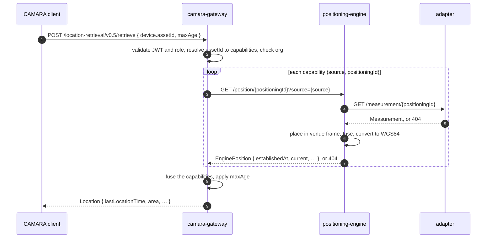

# Architecture

The stack is split in two. The **northbound** side faces applications: it
speaks CAMARA, holds the identity of assets and decides what each consumer may
see. The **southbound** side faces the sources: each adapter speaks its
source's language and translates it into one contract. A southbound component
conforms to contracts it does not define. Vendor knowledge exists only in the
adapters.

## Services

| Service | Responsibility | Holds |
|---------|----------------|-------|
| `camara-gateway` | CAMARA retrieval and verification, the position stream, the profile's extension endpoints. Validates the JWT, resolves an asset to its capabilities, fuses them, applies the tenant scope. | the asset map |
| `positioning-engine` | For one positioning id: routes to the adapter, places each measurement in the venue frame, fuses, converts to WGS84. Broadcasts positions over a WebSocket. | the blueprint, the adapter registry |
| `wifi-adapter` | Multilaterates WiFi RSSI scans posted by an edge scanner. | the WiFi bindings (BSSIDs, calibration) |
| `vendor-adapter` | Translates a vendor's REST positioning API, described by a schema document. | the vendor schema |
| `synthetic-adapter` | Generates devices that walk inside the first room of the blueprint. Used for demonstrations and tests. | nothing |
| `placement-editor` | Operator tool to author the blueprint. Behind `oauth2-proxy`. | nothing, it reads and writes the engine's blueprint |
| `location-app` | A CAMARA consumer. Talks to the gateway only. | nothing |

Each stored document has one service that holds it and serves it over HTTP. No
service mounts another's file. Keycloak issues the tokens. The edge WiFi
scanner runs outside the cluster and posts scans over the 5G data network.

## Retrieving a position


```mermaid
sequenceDiagram
  autonumber
  participant App as CAMARA client
  participant GW as camara-gateway
  participant ENG as positioning-engine
  participant AD as adapter

  App->>GW: POST /location-retrieval/v0.5/retrieve { device.assetId, maxAge }
  GW->>GW: validate JWT and role, resolve assetId to capabilities, check org
  loop each capability (source, positioningId)
    GW->>ENG: GET /position/{positioningId}?source={source}
    ENG->>AD: GET /measurement/{positioningId}
    AD-->>ENG: Measurement, or 404
    ENG->>ENG: place in venue frame, fuse, convert to WGS84
    ENG-->>GW: EnginePosition { establishedAt, current, … }, or 404
  end
  GW->>GW: fuse the capabilities, apply maxAge
  GW-->>App: Location { lastLocationTime, area, … }
```

**Routing in the engine.** The gateway passes the capability's `source`, and
the engine asks the adapter registered under that name. Without a matching
source it consults the optional `DEVICE_MAP` pins, and otherwise asks every
registered adapter and fuses the answers. An adapter answers `404` for a device
it does not serve. See [adapter registry](adapter-registry.md).

**Fusion at two levels.** The engine fuses the measurements of one positioning
id, weighting each by `confidence / accuracy`. The gateway fuses the positions
of an asset's capabilities by inverse variance. A capability without a position
is skipped, so an asset stays located while one of its sources answers. See
[fusion strategies](fusion-strategies.md).

**Failures.** The gateway retries the engine once after 200 ms on a `5xx` or a
network error. An engine `404` becomes `422 UNABLE_TO_LOCATE`, a persistent
`5xx` becomes `502`, an unreachable engine `503`. Positions are cached per
positioning id for `LOCATION_CACHE_TTL_S` (5 s by default).

## The position stream

The engine broadcasts the positions it knows every `WEBSOCKET_INTERVAL_MS`
(500 ms by default) on `/ws/positions`, keyed by positioning id. It learns the
ids to broadcast from the adapters that serve `GET /devices`. The gateway
accepts clients on `/positions/stream`, opens one engine connection per client,
and turns each batch into asset events: it groups the ids by asset, fuses
multi-capability assets, drops ids with no asset and assets outside the
client's organisation. The token travels in the `Sec-WebSocket-Protocol`
header. The message format is published as
[AsyncAPI](https://github.com/Jacobbista/5g-northbound/blob/main/spec/private-profile/asyncapi-stream.yaml).

## Coordinate frame

The blueprint places each level in its parent: the floor plan in the world,
each room in the floor plan, anchors and walls in the room. Every level uses
the local frame of [omlox](https://omlox.com/):

- origin at the lower-left corner of the parent level,
- x in metres along the width (`width_m`),
- y in metres along the depth (`depth_m`),
- z in metres up, the height above the floor.

A room sits in its floor plan at its lower-left corner (`x_m`, `y_m`), rotated
by `rotation_deg` clockwise about its centre. The floor plan sits in the world
through its georef: the WGS84 position of its origin, `azimuth_deg` for the
bearing of +y from true north, and `altitude_m` for the height of the origin
above the WGS84 ellipsoid.

An adapter reports in a room, in the venue (the floor plan) or in WGS84. The
engine places every measurement in the venue frame before fusion and converts
the result to WGS84, so the gateway handles no geometry. `altitude` is the
origin's `altitude_m` plus the fused height, present only when both exist.
Without a georef the engine returns latitude and longitude 0 and logs a
warning. The editor and the location-app draw in screen axes and convert at
their edge. See [georeferencing](georeferencing.md) for how the georef is
surveyed.

## Time

A position carries two times. The fix time is when the source computed it. The
established time is the latest moment the position is known to hold. The two
differ for a source that reports on motion: a still tag keeps an old fix, and
its later communications confirm it. Each adapter declares how its source
reports (`reporting`, `reportingInterval`), and the engine derives the
established time and whether the position is current from that declaration.
CAMARA `lastLocationTime` is the established time, and `maxAge` is judged on
it. See [adapters](adapters.md#reporting-and-reportinginterval) and the
[profile](https://github.com/Jacobbista/5g-northbound/blob/main/spec/private-profile/README.md#freshness-maxage).

## Relation to the 3GPP location architecture

In 3GPP an application reaches the network's location service through the NEF,
which asks an LMF, which uses the radio access network:

```
Application ──CAMARA──► CAMARA gateway ──Nnef──► NEF ──Nlmf──► LMF ──► RAN / UE
```

The testbed runs Open5GS, which has no NEF or LMF. The stack takes their
places:

| 3GPP role | Here | Note |
|-----------|------|------|
| Application | `location-app`, any CAMARA client | |
| CAMARA gateway and NEF | `camara-gateway` | CAMARA surface, identity, authorisation, fusion of an asset's capabilities |
| LMF, selection and hybrid combination | `positioning-engine` | routes to a source, fuses, owns the venue georeference |
| LMF, one positioning method | each adapter | the engine cannot tell how a fix was produced. `vendor-adapter` bridges a solver that runs in the vendor's cloud |
| RAN and UE measurements | `POST /ingest/wifi-scan` on `wifi-adapter` | the only path that carries raw measurements. The adapter contract carries computed fixes |
| AMF and SMF session state | not used | assets are addressed by `assetId`, not by subscriber or session |

The gateway and the engine can be split into separate NEF and LMF services
without changing what a consumer sees.

## Deployment

This repository builds the images. The companion repository
[`kelt`](https://github.com/Jacobbista/kelt) holds the Kubernetes manifests and
runs the testbed. See [deployment](deployment.md).
