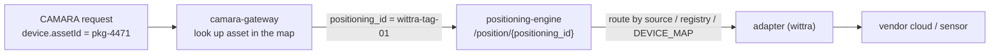

# Asset registry

The **Asset Identity Map** is the list of tracked things the platform knows
about — a UWB tag, a tool, a pallet, a forklift. It is the private-asset
equivalent of a subscriber directory, except an asset has no phone number: it
is identified by a business id the enterprise chooses (`pkg-4471`,
`forklift-7`).

The gateway is the authority for this registry, exactly as the engine is for
the blueprint. You read it with `GET /assets`, replace it with `PUT /assets`,
and it persists to a PVC-backed store. **At runtime it is never a mounted
file** — mounting one has shadowed live state before. The committed
`dev/assets.json` is a dev seed only.

## Structure

The contract is [`schema/asset.schema.json`](https://github.com/Jacobbista/5g-northbound/blob/main/schema/asset.schema.json)
(version `2`, pinned in `schema/VERSION`). One entry per asset:

| Field            | Req | Type / values                                        | Meaning |
|------------------|-----|------------------------------------------------------|---------|
| `asset_id`       | ✅  | `^[A-Za-z0-9._:-]{1,128}$`                            | First-class CAMARA id (`device.assetId`). A business id, **not** a phone number |
| `positioning_id` | ✅  | `^[A-Za-z0-9._:-]{1,128}$`                            | Internal id the engine routes on (`/position/{positioning_id}`) |
| `kind`           | ✅  | `uwb-tag` \| `tool` \| `pallet` \| `forklift` \| `asset` \| `ue` | Asset class, surfaced as profile `kind` |
| `source`         | ✅  | `wittra` \| `wifi` \| `fiveg` \| `gnss` \| `mock`    | Positioning modality / adapter, surfaced as profile `source` |
| `org`            | ✅  | `^[a-z0-9-]{1,64}$`                                   | Tenant. Joined against the token `org` claim — a consumer sees only its own |
| `label`          |     | string                                               | Human-readable name for UIs |
| `simulated`      |     | boolean (default `false`)                            | Wired to a synthetic source (mock). UIs show a `MOCK` badge |
| `metadata`       |     | free-form object                                     | Per-asset extras (e.g. `floor`, `bay`) |

The whole document is `{ "version": 2, "assets": [ … ] }`. Copy
[`dev/assets.json`](https://github.com/Jacobbista/5g-northbound/blob/main/dev/assets.json)
as your starting point:

```json
{
  "version": 2,
  "assets": [
    {
      "asset_id": "pkg-4471",
      "positioning_id": "wittra-tag-01",
      "kind": "pallet",
      "source": "wittra",
      "org": "fiskarheden",
      "label": "Wittra tag 01",
      "simulated": true,
      "metadata": { "floor": 0, "note": "Timber bundle" }
    }
  ]
}
```

## How an asset resolves to a position

`asset_id` is what a CAMARA consumer asks for; everything after it is internal.



`positioning_id` joins to an adapter through the engine's
[adapter registry / routing](adapter-registry.md); `source` names which
modality answers (and how much to trust the fix). Full chain down to a vendor
REST API: [integrating a vendor REST API](integrating-a-vendor-rest-api.md).

## Adding a device

Runtime is authoritative, so add through the gateway — do **not** edit a file on
the running pod.

`PUT /assets` **replaces the whole map**. Never blind-write: read, merge your
new entry, write back.

```bash
# 1. read the current map
curl -s -H "Authorization: Bearer $JWT" $GW/assets > assets.json

# 2. add your asset to assets.json (keep version: 2)

# 3. write it back
curl -s -X PUT -H "Authorization: Bearer $JWT" \
     -H "Content-Type: application/json" \
     --data @assets.json $GW/assets
```

The KELT dashboard does this for you (the editor proxies it at `/api/assets`);
onboarding discovered tags is the dashboard's job, not the editor's.

### Seeding a fresh deployment

On first boot the store is empty. The gateway seeds it **once** from
`ASSET_SEED_FILE` (default `/app/config/assets.seed.json`), then persists to
`ASSET_STORE_FILE` (default `/app/data/assets.json`, the PVC) and never seeds
again. Mount your `dev/assets.json` shape as the seed for a cold start; after
that, all changes go through `PUT /assets`.

## Discovering devices to onboard

Typing every asset by hand is mechanical when the source already knows which
devices exist. Each adapter that advertises the `devices` capability exposes
`GET /devices`; the engine aggregates them (`GET /devices`), and the gateway
surfaces the ones **not yet onboarded** at `GET /assets/discoverable`. KELT's
Assets tab lists those as candidates for one-click onboarding, with `source`
prefilled.


The candidate `id` becomes the new asset's `positioning_id`; the operator adds
`org`, `kind`, and a `label` at onboarding. Two flavours of discovery, from the
`origin` field:

| `origin`     | Source        | Meaning                                                                 | Onboarding |
|--------------|---------------|-------------------------------------------------------------------------|------------|
| `inventory`  | vendor (REST) | a **registry**: the vendor cloud maintains a stable, pre-named list, present whether or not the tag is moving | bulk-safe — the ids are the vendor's own |
| `observed`   | wifi          | **activity-seen**: an id appears once a scan tagged with it is ingested, and lapses when it stops | claim + label — a human confirms the id is asset X |

Both are discovery; the difference is that a vendor exports its inventory while
wifi only reveals what is currently emitting. Neither auto-creates an asset —
onboarding is always an explicit `PUT /assets`.

### Anchors are not assets

A vendor's device list mixes **anchors** (fixed positioning references — the
infrastructure) with **trackable** devices (the mobile things you onboard).
Onboarding an anchor as a tracked asset is wrong, so each candidate carries a
`role` (`anchor` | `trackable`) and its native `device_type`. The management UI
separates anchors into their own non-onboardable section and prefills the
wizard's kind from `device_type` for trackables. The classification is
schema-declared per vendor (`discover.anchor_types`), never guessed — a source
that doesn't classify leaves `role` off and every candidate stays onboardable.
wifi/mock only ever report `trackable` (their anchors live in the bindings /
blueprint, not the device list).

## Tenancy and sensitivity

`GET /assets` filters by the token's `org` claim — a consumer only ever sees
its own tenant's assets, and `GET /assets/{id}/details` returns `404` (not
`403`) for a cross-tenant id so existence never leaks.

The asset inventory is **sensitive** (Tier-1: org + asset list). It is
gitignored in dev and lives on a PVC in prod — never commit a real map. Only
the placeholder `dev/assets.json` is in the repo.
