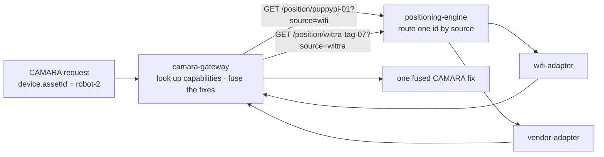
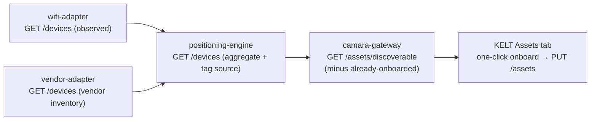

# Asset registry

The **Asset Identity Map** is the list of tracked things the platform knows
about - a UWB tag, a tool, a pallet, a forklift. It is the private-asset
equivalent of a subscriber directory, except an asset has no phone number: it
is identified by a business id the enterprise chooses (`pkg-4471`,
`forklift-7`).

The gateway is the authority for this registry, exactly as the engine is for
the blueprint. You read it with `GET /assets`, replace it with `PUT /assets`,
and it persists to a PVC-backed store. **At runtime it is never a mounted
file** - mounting one has shadowed live state before. The committed
`dev/assets.json` is a dev seed only.

## What an asset is

An asset is a physical thing with an enterprise-chosen identity and **one or
more positioning capabilities**. The identity is first-class and independent of
any technology; a capability is one way the thing is located - a `source` and
the id that source knows it by. A single-capability asset is positioned by one
technology; a multi-capability asset carries several (a robot with a WiFi radio
and a UWB tag), and the engine fuses their fixes into one. The same physical
thing is a different id to each source, so each capability names its own
`positioning_id`.

## Structure

The contract is [`schema/asset.schema.json`](https://github.com/Jacobbista/5g-northbound/blob/main/schema/asset.schema.json)
(version `3`, pinned in `schema/VERSION`). One entry per asset:

| Field          | Req | Type / values                                        | Meaning |
|----------------|-----|------------------------------------------------------|---------|
| `asset_id`     | ✅  | `^[A-Za-z0-9._:-]{1,128}$`                            | First-class CAMARA id (`device.assetId`). A business id, **not** a phone number |
| `kind`         | ✅  | `uwb-tag` \| `tool` \| `pallet` \| `forklift` \| `asset` \| `ue` | Asset class, surfaced as profile `kind` |
| `org`          | ✅  | `^[a-z0-9-]{1,64}$`                                   | Tenant. Joined against the token `org` claim - a consumer sees only its own |
| `capabilities` | ✅  | array, ≥1 `capability`                                | The ways the asset is positioned. Several entries fuse into one fix |
| `label`        |     | string                                               | Human-readable name for UIs |
| `metadata`     |     | free-form object                                     | Per-asset extras (e.g. `floor`, `bay`) |

A `capability`:

| Field            | Req | Type / values                                        | Meaning |
|------------------|-----|------------------------------------------------------|---------|
| `source`         | ✅  | `wittra` \| `wifi` \| `fiveg` \| `gnss` \| `synthetic`    | Positioning modality / adapter, surfaced as profile `source` |
| `positioning_id` | ✅  | `^[A-Za-z0-9._:-]{1,128}$`                            | The id this source routes on (the engine polls the `source` adapter with it) |

The whole document is `{ "version": 3, "assets": [ … ] }`. Copy
[`dev/assets.json`](https://github.com/Jacobbista/5g-northbound/blob/main/dev/assets.json)
as your starting point:

```json
{
  "version": 3,
  "assets": [
    {
      "asset_id": "pkg-4471",
      "kind": "pallet",
      "org": "acme",
      "capabilities": [
        { "source": "wittra", "positioning_id": "wittra-tag-01" }
      ],
      "label": "Wittra tag 01",
      "metadata": { "floor": 0, "note": "Timber bundle" }
    },
    {
      "asset_id": "robot-2",
      "kind": "forklift",
      "org": "acme",
      "capabilities": [
        { "source": "wifi", "positioning_id": "puppypi-01" },
        { "source": "wittra", "positioning_id": "wittra-tag-07" }
      ],
      "label": "Mobile robot 2"
    }
  ]
}
```

## How an asset resolves to a position

`asset_id` is what a CAMARA consumer asks for; everything after it is internal.
The gateway resolves the asset to its capabilities, asks the engine for each one,
and fuses the results into a single fix.



Each capability's `positioning_id` joins to an adapter through the engine's
[adapter registry / routing](adapter-registry.md); `source` names which modality
answers. The gateway calls the engine once per capability, weights each fix by its
accuracy, and reconciles them into one: a sharper source dominates, a source with
no current fix drops out, so an asset stays located as its coverage changes. The
engine stays capability-agnostic (it routes a single `positioning_id`); the
cross-capability fusion is the gateway's. A single-capability asset is the same
path with one capability. Full chain down to a vendor REST API:
[integrating a vendor REST API](integrating-a-vendor-rest-api.md).

## Adding a device

Runtime is authoritative, so add through the gateway - do **not** edit a file on
the running pod.

`PUT /assets` **replaces the whole map**. Never blind-write: read, merge your
new entry, write back.

```bash
# 1. read the current map
curl -s -H "Authorization: Bearer $JWT" $GW/assets > assets.json

# 2. add your asset to assets.json (keep version: 3)

# 3. write it back
curl -s -X PUT -H "Authorization: Bearer $JWT" \
     -H "Content-Type: application/json" \
     --data @assets.json $GW/assets
```

The KELT dashboard does this for you (the editor proxies it at `/api/assets`);
onboarding discovered tags is the dashboard's job, not the editor's.

### Seeding a fresh deployment

On first boot the store is empty. The gateway seeds it **once** from
`ASSET_SEED_FILE` (default `/app/config/assets.seed.json`), then persists to
`ASSET_STORE_FILE` (default `/app/data/assets.json`, the PVC) and never seeds
again. Mount your `dev/assets.json` shape as the seed for a cold start; after
that, all changes go through `PUT /assets`.

## Discovering devices to onboard

Typing every asset by hand is mechanical when the source already knows which
devices exist. Each adapter that advertises the `devices` capability exposes
`GET /devices`; the engine aggregates them (`GET /devices`), and the gateway
surfaces the ones **not yet onboarded** at `GET /assets/discoverable`. KELT's
Assets tab lists those as candidates for one-click onboarding, with `source`
prefilled.



The candidate `id` becomes a capability's `positioning_id` (a new asset with one
capability, or an added capability on an asset that already exists); the operator
adds `org`, `kind`, and a `label` at onboarding. Two flavours of discovery, from
the `origin` field:

| `origin`     | Source        | Meaning                                                                 | Onboarding |
|--------------|---------------|-------------------------------------------------------------------------|------------|
| `inventory`  | vendor (REST) | a **registry**: the vendor cloud maintains a stable, pre-named list, present whether or not the tag is moving | bulk-safe - the ids are the vendor's own |
| `observed`   | wifi          | **activity-seen**: an id appears once a scan tagged with it is ingested, and lapses when it stops | claim + label - a human confirms the id is asset X |

Both are discovery; the difference is that a vendor exports its inventory while
wifi only reveals what is currently emitting. Neither auto-creates an asset -
onboarding is always an explicit `PUT /assets`.

### Infrastructure is not an asset

A vendor's device list mixes **assets** (the mobile things you track - tools,
pallets, forklifts, workers) with **infrastructure** (fixed sensors - UWB
anchors, BLE gateways). The paper places infrastructure *outside* the 3GPP
trust domain: it feeds the fusion engine but is never a tracked asset.
Onboarding a sensor as an asset is wrong, so each candidate carries:

- **`role`** - `asset` vs `infrastructure`. The management UI separates
  infrastructure into its own non-onboardable section.
- **`source_class`** - the positioning technology (`uwb`/`ble`/`wifi`/`gnss`/
  `cellular`/`other`), surfaced as a badge and a hint for the asset's kind.

Classification is **schema-declared per vendor**, never guessed - a source that
doesn't classify leaves `role`/`source_class` off and every candidate stays
onboardable. wifi only ever reports `role: asset` (its APs live in the bindings,
not the device list); `synthetic-adapter` reports both tracked tags (asset) and
fixed anchors (infrastructure), like an on-premise RTLS. For a vendor, the
`vendor-adapter`'s `discover.classify` block maps structural predicates on the
vendor's own record to the two axes - see
[integrating a vendor REST API](integrating-a-vendor-rest-api.md#classifying-devices-for-asset-onboarding).

## Tenancy and sensitivity

`GET /assets` filters by the token's `org` claim - a consumer only ever sees
its own tenant's assets, and `GET /assets/{id}/details` returns `404` (not
`403`) for a cross-tenant id so existence never leaks.

The asset inventory is **sensitive** (Tier-1: org + asset list). It is
gitignored in dev and lives on a PVC in prod - never commit a real map. Only
the placeholder `dev/assets.json` is in the repo.
