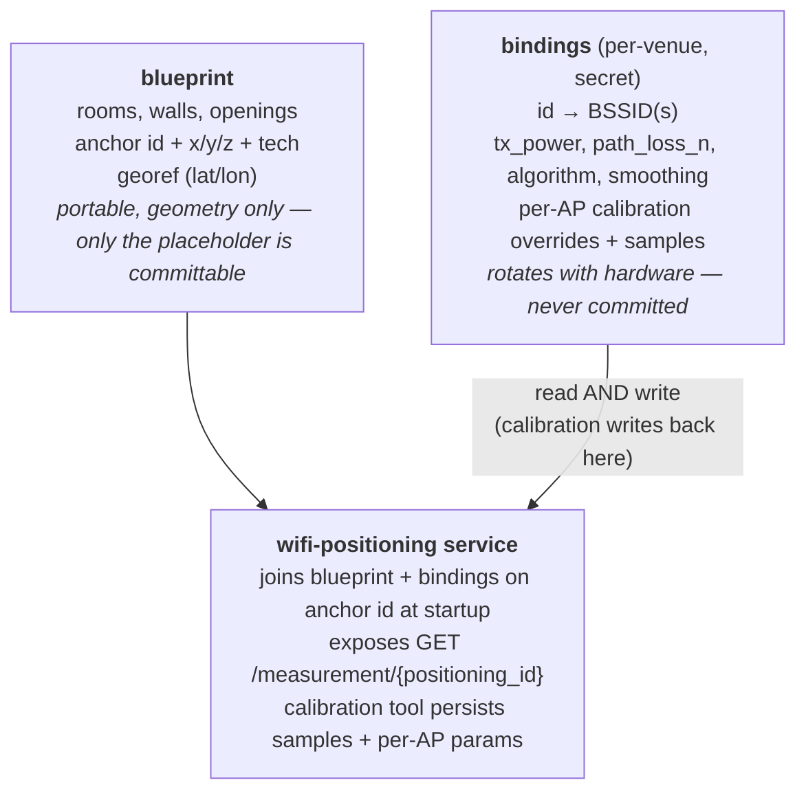
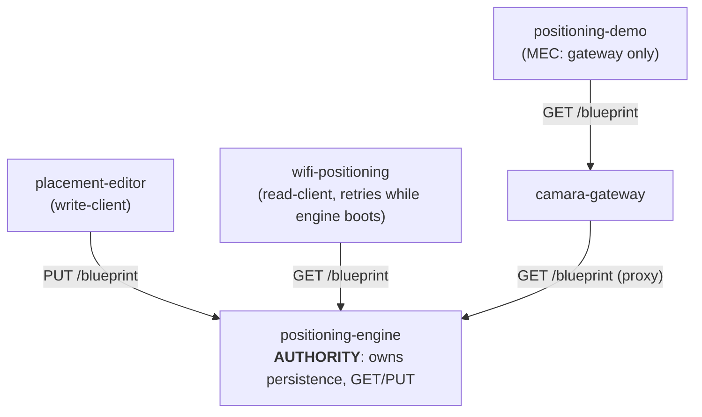
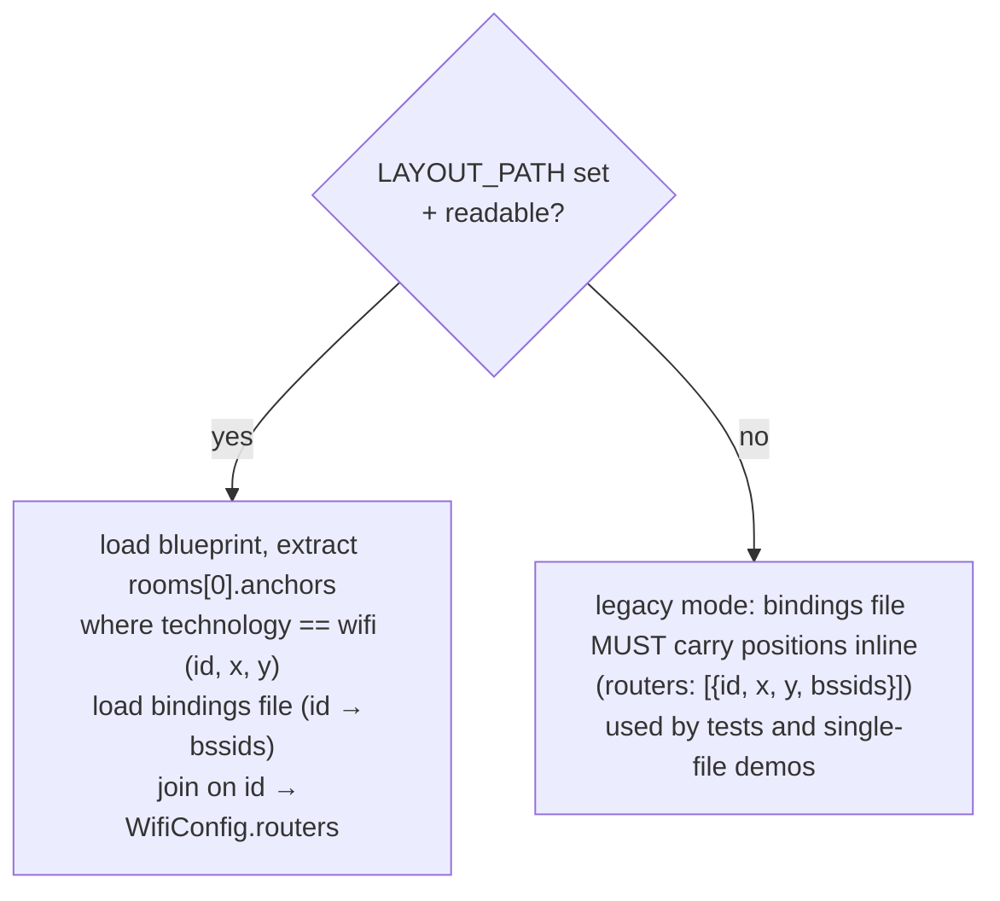

# Blueprint vs bindings, what lives where, and why

This project splits venue config into **two files** that travel separately.
Read this once before you deploy to a new site; nothing else in the docs
makes sense without the distinction.

## The two files



## Why the split

| Concern                       | Blueprint         | Bindings              |
| ----------------------------- | ----------------- | --------------------- |
| Stable per building?          | yes               | no, changes with AP swap |
| Sensitive (real MACs / SSIDs)?| no                | yes                   |
| Same across clusters?         | yes               | no (each cluster has its own APs) |
| Authored where?               | placement-editor  | hand-edited on the cluster |
| Committed to git?             | only placeholder  | **never** (always `*.local.json`) |

Keeping them together (the legacy `wifi-config.json` shape with positions
inline) means a real BSSID is one careless `git add` away from being
public, and that moving the blueprint between sites requires editing
positions twice. We don't.

## The blueprint is network-distributed; the engine is its authority

There is **one** canonical blueprint and it lives in the **positioning-engine**.
The engine persists it on its own writable volume and serves it over HTTP
(`GET /blueprint`, `PUT /blueprint`). Nobody mounts a shared blueprint file or
ConfigMap; everyone goes over the network. This is what makes adapters
edge-deployable (an edge pod fetches the blueprint over the data network, like
the WiFi scanner already does) and decouples the stack from node-local storage
and from the editor's uptime.



| Role          | Service            | How it touches the blueprint                                   |
|---------------|--------------------|----------------------------------------------------------------|
| Authority     | positioning-engine | Persists it (`BLUEPRINT_PATH`, a writable PVC); serves GET/PUT; derives `gps_origin` for the WGS84 conversion |
| Write-client  | placement-editor   | `GET/PUT` over HTTP (`POSITIONING_ENGINE_URL`); its `/api/layout` proxies the engine. No local blueprint file |
| Read-client   | wifi-positioning   | `GET /blueprint` from the engine at boot (retry + degraded), joins anchors to BSSIDs |
| Read-client   | positioning-demo   | `GET /blueprint` **via the gateway proxy** - the demo is a MEC app and must not call the engine directly (CLAUDE.md) |
| Proxy         | camara-gateway     | Read-only `GET /blueprint` proxy so the demo reaches it through its single allowed backend |
| Not a consumer| mock-positioning   | Synthetic walker; uses `WIDTH_M`/`DEPTH_M` env, no real geometry |
| Not a consumer| rest-adapter       | Vendor cloud returns positioned WGS84 fixes; pass-through. (The editor's `↻ sync vendor` imports those at authoring time only) |

Write authorisation is the **placement-editor's front-door gate**
(oauth2-proxy / admin), not the engine: the engine is `ClusterIP`, never
externally exposed, so an internal `PUT /blueprint` is consistent with its
existing no-auth internal-trust model (it already serves positions and polls
adapters unauthenticated in-cluster). This is a deliberate, declared choice.

### Files in the dev stack

| File                                        | Role                                                      |
| ------------------------------------------- | --------------------------------------------------------- |
| `services/positioning-demo/public/layout.example.json` (committed) | generic demo venue; `make demo` bootstraps `layout.json` from it |
| `services/positioning-demo/public/layout.json` (gitignored)        | **seed only**: mounted read-only into the engine as `BLUEPRINT_SEED_PATH`; the engine copies it into its volume on first boot, then owns it. Editor edits go to the engine, not back to this file |
| `dev/wifi-config.json` (placeholder)        | bindings, wifi-positioning (legacy / demo)                |
| `dev/wifi-config.local.json` (real venue)   | bindings, gitignored, auto-mounted by `make demo`         |

The bindings file (`wifi-config.json`) is **not** network-distributed: it is
read-write, mutated at runtime by the calibration tool, and local to
wifi-positioning. It stays a file / PVC. See "Deploying to Kubernetes" below.

## Authoring flow

### 1. Author the blueprint in the placement editor

Open the editor (`make demo`, then http://localhost:3003). Walk the three
steps:

1. **World**: pin the building on the map, calibrate scale + rotation.
2. **Plan**: draw the rooms inside the floor plan.
3. **Room**: drop anchors (`+ UWB`, `+ WiFi`, …), draw inner walls,
   set ceiling height + per-wall openings.

The editor auto-saves to `services/positioning-demo/public/layout.json` after
every committed action. No manual save needed in the dev stack.

### 2. Export the blueprint (when you need to move it)

Header → `↓ export`. Downloads `blueprint-<timestamp>.json`. This is the
**portable** file. It contains geometry only.

Move it onto the target cluster by:

- copying into the PVC the wifi-positioning ConfigMap reads from,
- or replacing `services/positioning-demo/public/layout.json` on the dev host,
- or sharing it with another operator (no BSSIDs in it).

### 3. Import a blueprint into a fresh editor

Header → `↑ import`. Pick the JSON. The current layout is pushed to undo
(so `Ctrl+Z` recovers it) and the imported blueprint replaces it.

### 4. Wire BSSIDs on the cluster

Once the blueprint is in place, the operator on the cluster edits the
**bindings file** (`dev/wifi-config.local.json` in the dev stack; a
mounted secret/ConfigMap in production) and lists the real BSSIDs per
anchor `id`. Example minimal bindings file:

```json
{
  "tx_power": -42,
  "path_loss_n": 2.7,
  "algorithm": "trilateration",
  "smoothing": true,
  "process_noise": 1.0,
  "bindings": [
    { "id": "AP07", "bssids": ["AA:BB:CC:01:02:03"] },
    { "id": "AP08", "bssids": ["AA:BB:CC:01:02:04"] },
    { "id": "AP09", "bssids": ["AA:BB:CC:01:02:05"] },
    { "id": "AP10", "bssids": ["AA:BB:CC:01:02:06"] }
  ]
}
```

The `id` here MUST match an anchor id in the blueprint with
`technology: "wifi"`. Mismatches are logged at startup and skipped:
unbound anchors don't position; unmatched bindings don't pollute the
adapter.

Restart `wifi-positioning` to pick up changes (or roll the deployment in
production). The calibration tool described below hot-reloads the live
config on apply, so an in-flight calibration session does not need a
restart.

### 5. Calibrate WiFi path-loss per AP

Generic `tx_power` and `path_loss_n` give RSSI multilateration accuracy
in the ten-metre range. Per-AP values fitted from a short survey bring
that down to three to five metres on a typical office floor. The
calibration tool lives in the placement editor (section 3, button `↹
calibrate`) and drives a guided survey:

1. Walk to a known point. Click on the canvas where you are standing.
2. The adapter collects ten raw scans from the device (no extra setup;
   the existing `/ingest/wifi-scan` stream is captured into the active
   session).
3. Repeat at 8 to 12 points distributed across the room. Each AP needs
   at least three points at different distances; one point under each
   AP plus a few mid-room points is usually enough.
4. Press `⚙ derive`. The tool fits the log-distance model per AP and
   shows `tx_power`, `path_loss_n`, R², and the sample count.
5. Press `✓ apply`. The derived parameters are written back to the
   bindings file under each binding, and the live config is reloaded in
   place. Next scan uses the new model.

Samples auto-persist after every capture (and after every delete or
clear), written to the same bindings file under `calibration_samples`.
They survive container restarts without needing apply. Apply itself
writes both the samples and the per-binding overrides; revisiting the
calibration tool later picks the survey back up from where you left it.

The bindings file goes from read-only to read-write because of this
flow. On a single-host docker compose the bind-mount must allow writes;
on Kubernetes the volume must be a writable PVC, not a ConfigMap or
Secret. See **Deploying to Kubernetes** below.

## What the wifi-positioning service does at startup



See [`services/wifi-positioning/app/assemble.py`](https://github.com/Jacobbista/5g-northbound/blob/main/services/wifi-positioning/app/assemble.py)
for the exact code.

## Deploying to Kubernetes

Two writable volumes, each mounted by exactly **one** pod, so both are plain
`ReadWriteOnce` - no `ReadWriteMany`, no co-scheduling constraints, because
nothing is shared across pods. Everything else moves over HTTP.

```
PVC: positioning-blueprint   (RWO, ~1 MB)  ── mounted ONLY by positioning-engine
  └─ /app/data/blueprint.json   (the canonical blueprint; engine owns it)

PVC: wifi-positioning-bindings (RWO, ~5 MB) ── mounted ONLY by wifi-positioning
  └─ /app/config/wifi-config.json  (BSSIDs, tunables, calibration data)
```

| Service             | Blueprint volume | How it gets the blueprint                          |
|---------------------|------------------|----------------------------------------------------|
| positioning-engine  | RW (authority)   | persists + serves it; `BLUEPRINT_PATH=/app/data/blueprint.json` |
| placement-editor    | none             | `GET/PUT` over HTTP, `POSITIONING_ENGINE_URL`       |
| wifi-positioning    | none             | `GET /blueprint` from the engine, `POSITIONING_ENGINE_URL` |
| positioning-demo    | none             | `GET /blueprint` via the gateway proxy (`CAMARA_API_BASE`) |
| mock-positioning    | none             | env dimensions only                                |

Only the engine and wifi-positioning carry a PVC. The engine's blueprint PVC
must be writable by its non-root `app` user (uid 1001) - `fsGroup: 1001`:

```yaml
apiVersion: apps/v1
kind: Deployment
metadata:
  name: positioning-engine
spec:
  replicas: 1
  template:
    spec:
      securityContext:
        fsGroup: 1001
      containers:
        - name: positioning-engine
          image: ghcr.io/jacobbista/5g-northbound/positioning-engine:<tag>
          env:
            - { name: BLUEPRINT_PATH, value: /app/data/blueprint.json }
          volumeMounts:
            - { name: blueprint, mountPath: /app/data }
      volumes:
        - name: blueprint
          persistentVolumeClaim:
            claimName: positioning-blueprint
```

wifi-positioning mounts only its bindings PVC (same `fsGroup: 1001` pattern),
with `WIFI_CONFIG_PATH=/app/config/wifi-config.json` and
`POSITIONING_ENGINE_URL` pointing at the engine Service. It fetches the
blueprint over HTTP at boot, retrying while the engine comes up, and serves
degraded (no anchors, readiness false) until it succeeds.

### Seeding the blueprint

The blueprint PVC starts empty. Two ways to put the first venue in:

- **PUT it through the editor** (normal path): open the placement editor, author
  or import the venue, save. The editor `PUT`s it to the engine, which persists
  it on the PVC. Nothing else to do.
- **`BLUEPRINT_SEED_PATH`** (GitOps / cold start): mount an exported blueprint
  read-only (ConfigMap or file) and point `BLUEPRINT_SEED_PATH` at it. On first
  boot, when the PVC is empty, the engine copies the seed into the PVC and then
  owns it; the seed mount can be removed afterwards.

The bindings PVC seeds the same way it did before (tunables + `id → BSSIDs`):
`kubectl cp` into the wifi-positioning pod, or an init container that copies a
seed payload from a Secret when the file is absent.

The placement editor can also write the blueprint PVC directly (its
`PUT /api/layout` endpoint persists to the same path). On the cluster,
mount the same PVC into both pods.

### What about the `HOST_UID` trick on docker compose?

The compose stack works around the same ownership problem in dev by
passing the host user's uid:gid into the wifi-positioning container
(`make demo` sets `HOST_UID` automatically). The Kubernetes equivalent
is `fsGroup` above. Same idea, different machinery.

## What the placeholder blueprint in the repo is for

`services/positioning-demo/public/layout.json` ships with a generic test layout
so `make demo` works on a fresh clone. **Do not commit your real venue
to that file.** Either:

- keep your real blueprint outside the repo (download via `↓ export`,
  store on a personal drive), or
- maintain it on the PVC and treat the repo's copy as a sample.

If a real BSSID ever ends up in `dev/wifi-config.json` (committed) or
in the blueprint, treat it as a leak and rotate the AP.

## UWB / vendor sync (alternative to manual placement)

WiFi APs are positioned by the operator inside the editor. For UWB and
other vendor-managed anchors the cloud usually already knows the
positions (the vendor's deployment app puts them on a map). The editor
can pull that list via the `↻ sync vendor` toolbar button in section 3:

1. The button drives the placement editor's `/api/vendor/discover`
   proxy, which calls the rest-adapter's `GET /discover`.
2. The active schema's optional `discover` block tells the rest-adapter
   how to walk the vendor's list endpoint (path, pagination, field
   mapping). No code change to support a new vendor; only a new schema.
3. The right-rail panel lists every device, projects its cloud lat/lon
   into the room frame using the blueprint's `gps_origin`, and shows
   ghost markers on the canvas at the proposed positions. Drift against
   any existing editor anchor with the same `vendor_device_id` is
   surfaced as a coloured pill.
4. `↓ import` (per device) or `↓ import all` upserts anchors with
   `technology` matching the vendor (e.g. `"wittra"`), keyed by
   `vendor_device_id`. Re-syncs update positions without creating
   duplicates.

The full schema + workflow is in [`integrating-a-vendor-rest-api.md`](./integrating-a-vendor-rest-api.md#optional-discover-block-vendor-sync-in-the-placement-editor).

## Cheat sheet

- **Move config to a new cluster** → export blueprint, copy to cluster,
  wire bindings there.
- **Demo on a laptop without the cluster** → blueprint is enough;
  bindings get the placeholder file; mock devices walk the room.
- **Swap an AP** → only the bindings file changes; blueprint stays.
- **Renovate the building** → blueprint changes; bindings only update
  if anchor IDs change.
- **Share the layout with a colleague** → send the exported blueprint;
  never the bindings.
- **Calibrate WiFi for better accuracy** → run the placement editor's
  `↹ calibrate` tool; samples and per-AP overrides land in the bindings
  file automatically.
- **Add UWB anchors from the vendor cloud** → run the placement editor's
  `↻ sync vendor` tool; cloud devices appear as purple ghost markers and
  one click drops them at the cloud-reported position.
- **Deploy to Kubernetes** → bindings on a writable PVC, not a
  ConfigMap; set `fsGroup: 1001` so the container can write. Seed via
  `kubectl cp` on first install.
