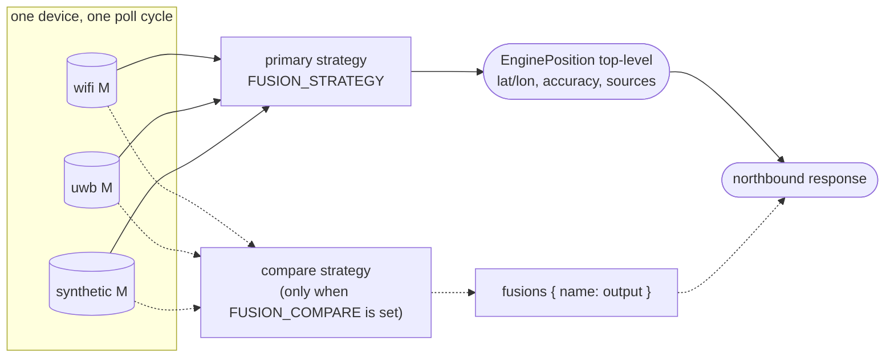

# Fusion Strategies

The positioning engine fuses the measurements it collects for one device into a single position estimate. Fusion is a plugin point kept deliberately separate from the adapter list, so the same set of adapters can be replayed under different strategies and compared on accuracy, smoothness, robustness to outliers, or behaviour when coverage is partial.

**One strategy is implemented: `weighted_avg`.** It is the only entry in `STRATEGIES` (`services/positioning-engine/app/fusion/registry.py`), and naming any other value for `FUSION_STRATEGY` or `FUSION_COMPARE` raises `unknown fusion strategy` at startup. The rest of this catalogue is design work: each entry records the shape a candidate would take and the conditions under which it would beat the baseline, so that implementing one is a matter of writing the class rather than re-deciding the approach. For the `Measurement` input shape and the adapter contract, see [`adapters.md`](adapters.md) and [`data-contracts.md`](data-contracts.md).

## Selection

The engine reads `FUSION_STRATEGY` at startup, defaulting to `weighted_avg`. `FUSION_COMPARE` takes a comma-separated list of additional strategies to run over the same measurements: the primary strategy's output stays at the top level and each comparison strategy appears under `fusions{}`, which lets the demo draw several tracks at once. It is a research feature and stays empty in production.

Both variables are validated at startup against the registry, so a name that is not implemented stops the engine rather than silently falling back. With only the baseline registered today, the only value either accepts is `weighted_avg`.

```
FUSION_STRATEGY=weighted_avg   # the implemented baseline
FUSION_COMPARE=               # empty until a second strategy lands
```



## Strategy catalogue

### 1. Weighted average (`weighted_avg`), baseline

The implemented strategy. Each measurement gets a weight `w = confidence / accuracy`, and the output is the weighted mean of `Measurement.{x, y, z}`. Output accuracy combines the inputs in quadrature, `1 / sqrt(Σ 1/accuracy²)`, which is the inverse-variance result: fusing two 3 m sources yields about 2.1 m, and a source contributes in proportion to how much it narrows the estimate. Adding a poor source can therefore only improve the reported radius, which is the property that makes a multi-capability asset worth declaring.

By the time a measurement reaches this strategy `accuracy` is always a real number, never `None` and never literally `0.0`: `PositionService` fills a missing accuracy with the nominal value for the source's declared `accuracy_class` before fusion runs (a vendor with no genuine per-fix radius, e.g. one that reports a `[0,1]` confidence score instead - see [integrating-a-vendor-rest-api.md](integrating-a-vendor-rest-api.md)), and `weighted_avg` itself floors any reported accuracy at 1 cm so a degenerate zero cannot divide the weight to infinity. Neither guard changes a genuine measurement; both only stop an absent or zero value from taking the request down.

- **Strengths:** stateless, O(N) per fusion cycle, robust to one bad adapter when several others agree.
- **Weaknesses:** no temporal smoothing: output jitters at the noise floor of the worst weighted source. One catastrophically wrong measurement with high confidence drags the result.
- **When to prefer:** static or slow-moving assets where N ≥ 2 adapters of comparable accuracy are usually online.

### 2. Kalman filter (`kalman`)

Maintain per-device state `(x, z, vx, vz)` with a constant-velocity process model. Each measurement is a noisy observation of `(x, z)`. Predict on every fusion cycle (using elapsed time since the last update); update with the weighted measurement (or per-source for sequential update).

- **Strengths:** smooth output, principled handling of measurement-rate variation, predicts forward when all adapters drop out for short intervals.
- **Weaknesses:** introduces lag at direction changes; tuning of process noise `Q` and measurement noise `R` is per-deployment; assumes Gaussian errors.
- **When to prefer:** moving assets (people, vehicles, mobile robots) where temporal continuity matters more than raw accuracy.

**Implementation note.** The `wifi-adapter` already runs a per-device Kalman filter internally, over WiFi measurements alone. Lifting that pattern to the engine, across heterogeneous adapters and with adapter-supplied `accuracy` driving `R`, is the obvious next step and the reason this entry is first in the queue.

### 3. Outlier-rejected weighted average (`outlier_reject`)

Before averaging, drop measurements whose distance from the median (or geometric median, if ≥ 3 adapters) exceeds `k × MAD` (median absolute deviation). Typically `k = 3`. Then run `weighted_avg` on the survivors.

- **Strengths:** robust to a single adapter going rogue (vendor SDK bug, clock skew, frame-of-reference mismatch). Cheap, stateless, no tuning beyond `k`.
- **Weaknesses:** degenerate when N ≤ 2 (no statistical basis for rejection); can mask a genuinely improving source if it disagrees with a consensus of older/stale ones.
- **When to prefer:** ≥ 3 heterogeneous adapters (WiFi + UWB + 5G) where one is known to occasionally hallucinate.

### 4. Confidence gating (`gated`)

Pick the single measurement with the highest `confidence x (1/accuracy)`. Optionally fall through a configured chain of source names instead (`gated_chain="wittra,wifi,synthetic"`), where the first source with a non-null measurement wins and no fusion happens. The chain names sources, the same values a capability carries and an adapter registers under.

- **Strengths:** trivial to reason about for operators. No "averaged into nowhere" surprises when one adapter is clearly better in a zone.
- **Weaknesses:** wastes information from other adapters; introduces step discontinuities when handoff between sources occurs.
- **When to prefer:** demos and audits where explainability matters more than accuracy; heterogeneous-coverage deployments (e.g. Wittra UWB in some zones, WiFi-only elsewhere).

## Roadmap candidates (future)

- **Particle filter**: handles multi-modal distributions, such as multi-floor ambiguity. Heavier CPU.
- **Bayesian sequential update**: prior from cheap continuous source (WiFi), update from sporadic high-accuracy source (Wittra) when available.
- **ML regressor**: input vector of all `Measurement` features, output `(lat, lon)`. Trained on Wittra ground truth where coverage overlaps; predicts in WiFi-only zones. Training pipeline and dataset live outside this repository.

## Testing

`services/positioning-engine/tests/test_fusion.py` covers the baseline. A strategy added later is expected to carry the same four cases, which is what makes two strategies comparable:

1. **Single measurement**: output equals input, modulo frame conversion.
2. **Two consistent measurements**: output lands between them and the reported accuracy improves on both.
3. **One outlier among three**: `outlier_reject` and `gated` would drop it, while `weighted_avg` is dragged toward it. This case is the argument for implementing the other two.
4. **Every source drops out**: a stateful strategy such as `kalman` keeps predicting, a stateless one returns `None`.

Comparing strategies on RMSE against ground truth needs a known trajectory, which the `synthetic-adapter` can generate; that harness is not built yet.

## Implementation shape

A strategy is any class satisfying this protocol, which the engine instantiates
once at startup and reuses for every request. State that a stateful strategy
needs, a per-device Kalman dictionary for instance, lives on the instance and
not in shared engine state.

```python
# services/positioning-engine/app/fusion/base.py
class FusionStrategy(Protocol):
    """Combines N adapter measurements (all in the local frame) into one position."""

    name: str

    def fuse(
        self,
        positioningId: str,
        measurements: list[Measurement],
        floor_plan: FloorPlan,
    ) -> Optional[FusedPosition]: ...
```

`positioningId` is passed so a stateful strategy can key its history without the
engine holding that state on its behalf. Registration is one line:

```python
# services/positioning-engine/app/fusion/registry.py
STRATEGIES: dict[str, type[FusionStrategy]] = {
    "weighted_avg": WeightedAvgFusion,
}
```

`FusedPosition` carries `x, y, z, accuracy, sources` and an optional
`timestamp`. Two fields on it are attached after fusion rather than computed by
a strategy: `lastSeen`, the most recent device last-communication across the
fused sources, which drives liveness downstream, and `diagnostics`, the vendor
fidelity carried from a single routed source. A new strategy neither reads nor
sets them.
