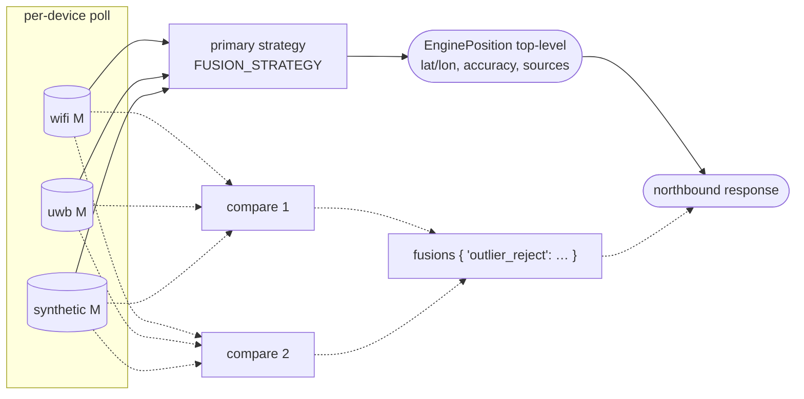

# Fusion Strategies

The positioning engine fuses measurements from one or more adapters into a single position estimate. The fusion strategy, the function `(measurements: list[Measurement]) -> EnginePosition`: is a plugin point separate from the adapter list. The same set of adapters can be evaluated under different strategies to compare accuracy, smoothness, robustness to outliers, or behaviour under partial coverage.

This document records candidate strategies for implementation and experimentation. The first is the current baseline; the others are open work items. For the `Measurement` input shape and the adapter contract, see [`adapters.md`](adapters.md) and [`data-contracts.md`](data-contracts.md).

## Selection

The engine reads `FUSION_STRATEGY` at startup (default `weighted_avg`). Optionally, `FUSION_COMPARE` (comma-separated strategy names) enables multi-strategy output for side-by-side comparison in the demo, the primary strategy is returned at the top level, the others appear under `fusions{}` for visualisation. `FUSION_COMPARE` is off by default; it is a research and demo feature, not a production one.

```
FUSION_STRATEGY=weighted_avg          # production
FUSION_COMPARE=kalman,outlier_reject  # demo: render extra tracks
```



## Strategy catalogue

### 1. Weighted average (`weighted_avg`), baseline

Current production strategy. For each measurement assign `w = confidence / accuracy_m` and compute the weighted mean over all `Measurement.{x, y, z}`. Output `accuracy_m` is the weighted RMS of input accuracies.

- **Strengths:** stateless, O(N) per fusion cycle, robust to one bad adapter when several others agree.
- **Weaknesses:** no temporal smoothing: output jitters at the noise floor of the worst weighted source. One catastrophically wrong measurement with high confidence drags the result.
- **When to prefer:** static or slow-moving assets where N ≥ 2 adapters of comparable accuracy are usually online.

### 2. Kalman filter (`kalman`)

Maintain per-device state `(x, z, vx, vz)` with a constant-velocity process model. Each measurement is a noisy observation of `(x, z)`. Predict on every fusion cycle (using elapsed time since the last update); update with the weighted measurement (or per-source for sequential update).

- **Strengths:** smooth output, principled handling of measurement-rate variation, predicts forward when all adapters drop out for short intervals.
- **Weaknesses:** introduces lag at direction changes; tuning of process noise `Q` and measurement noise `R` is per-deployment; assumes Gaussian errors.
- **When to prefer:** moving assets (people, vehicles, mobile robots) where temporal continuity matters more than raw accuracy.

**Implementation note:** the `wifi-adapter` service already runs a per-device Kalman filter internally over WiFi-only measurements. Lifting that pattern up to the engine, across heterogeneous adapters, with adapter-supplied `accuracy_m` driving `R`: is the obvious next step.

### 3. Outlier-rejected weighted average (`outlier_reject`)

Before averaging, drop measurements whose distance from the median (or geometric median, if ≥ 3 adapters) exceeds `k × MAD` (median absolute deviation). Typically `k = 3`. Then run `weighted_avg` on the survivors.

- **Strengths:** robust to a single adapter going rogue (vendor SDK bug, clock skew, frame-of-reference mismatch). Cheap, stateless, no tuning beyond `k`.
- **Weaknesses:** degenerate when N ≤ 2 (no statistical basis for rejection); can mask a genuinely improving source if it disagrees with a consensus of older/stale ones.
- **When to prefer:** ≥ 3 heterogeneous adapters (WiFi + UWB + 5G) where one is known to occasionally hallucinate.

### 4. Confidence gating (`gated`)

Pick the single highest-`confidence × (1/accuracy_m)` measurement. Optionally fall through to a configured fallback chain (`gated_chain="wittra-uwb,wifi-adapter,fiveg"`), first source whose measurement is non-null wins, no fusion.

- **Strengths:** trivial to reason about for operators. No "averaged into nowhere" surprises when one adapter is clearly better in a zone.
- **Weaknesses:** wastes information from other adapters; introduces step discontinuities when handoff between sources occurs.
- **When to prefer:** demos and audits where explainability matters more than accuracy; heterogeneous-coverage deployments (e.g. Wittra UWB in some zones, WiFi-only elsewhere).

## Roadmap candidates (future)

- **Particle filter**: handles multi-modal distributions (e.g, multi-floor ambiguity). Heavier CPU.
- **Bayesian sequential update**: prior from cheap continuous source (WiFi), update from sporadic high-accuracy source (Wittra) when available.
- **ML regressor**: input vector of all `Measurement` features, output `(lat, lon)`. Trained on Wittra ground truth where coverage overlaps; predicts in WiFi-only zones. Training pipeline and dataset live outside this repository.

## Testing

Each strategy under `services/positioning-engine/app/fusion/` has a unit test exercising:

1. **Single adapter**: output equals input (modulo frame conversion).
2. **Two consistent adapters**: output between the two, accuracy improves.
3. **One outlier among three**: `outlier_reject` and `gated` drop it; `weighted_avg` is dragged.
4. **All adapters drop**: `kalman` keeps predicting; stateless strategies return `None`.

Integration tests with the `synthetic-adapter` adapter generating a known trajectory let strategies be compared on RMSE against ground truth.

## Implementation shape

```python
# services/positioning-engine/app/fusion/base.py
class FusionStrategy(Protocol):
    name: ClassVar[str]
    def fuse(
        self,
        measurements: list[Measurement],
        floor_plan: FloorPlan,
        prev: EnginePosition | None = None,  # for stateful strategies
    ) -> EnginePosition | None: ...

STRATEGIES: dict[str, type[FusionStrategy]] = {
    "weighted_avg":   WeightedAvgFusion,
    "kalman":         KalmanFusion,
    "outlier_reject": OutlierRejectFusion,
    "gated":          GatedFusion,
}
```

The engine instantiates the selected strategy (and any in `FUSION_COMPARE`) at startup and routes every position request through them. State (the Kalman per-device dict, for example) lives on the strategy instance, not in shared engine state.
