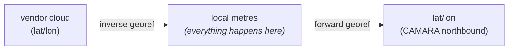

# Georeferencing: how the local frame anchors to the world

This page documents the coordinate-system design of the stack, why it is the
way it is, and the calibration workflow that makes it solid. Read it before
arguing that "the position is wrong by three metres" - the answer is usually
in here.

## The design in one paragraph

Everything inside the stack - anchors, walls, device fixes, fusion - lives in
a **local metric frame**: metres on the floor plan, origin at the floor-plan's
bottom-left corner, no curvature, no datum. Latitude/longitude exists only at
two edges: the **georef** of each floor plan (which pins the local frame onto
the Earth), and the **CAMARA northbound** (which converts a local fix to
WGS84 for API consumers). One transform in, one transform out.



This is the same pattern professional surveying uses. Stockholm has ST74
(EPSG:3152): a Transverse Mercator projection built *for one municipality* so
that engineering work happens in flat, undistorted metres. Sweden nationally
uses SWEREF 99 with twelve local projection zones for the same reason. A
local engineering frame with a documented tie to a global datum is not a
hack - it is the textbook approach. Ours is simply small enough (one
building) that an equirectangular approximation replaces a formal projection;
at room scale the error of that approximation is sub-millimetre.

## Why "WGS84" is fuzzier than it looks

Three facts that explain most "the map is shifted" mysteries:

1. **Datums move.** WGS84 is anchored to the Earth's centre of mass; the
   European plate drifts across it at ~2.5 cm/year. Sweden's official frame
   (SWEREF 99, a realization of ETRS89) is pinned to the *plate*, so in
   SWEREF 99 the country stands still. Today the two differ by ~0.8–0.9 m
   and the gap widens. "lat/lon" without a datum + epoch is ambiguous at the
   metre level.

2. **Satellite tiles are interpretations, not ground truth.** Each provider
   (Esri, Google, Mapbox) orthorectifies raw imagery against its own terrain
   model and ground control points. Registration errors of 1–5 m in urban
   areas are normal, and each provider errs differently. Two tile sets of
   the same street do not overlap exactly - verified empirically on our
   own building (Esri vs Google vs Mapbox all visibly shifted).

3. **Vendor clouds inherit their basemap's registration.** An RTLS vendor
   that lets you position anchors by clicking on *their* map (e.g. Wittra on
   Mapbox) produces lat/lon that is "correct" relative to that basemap. If
   you georeferenced your floor plan against a *different* basemap, you will
   disagree with the vendor by the inter-provider registration drift even
   though both of you are internally consistent.

Consequences for this stack:

- **Relative accuracy** (anchor-to-anchor, device-to-room) is what RTLS
  actually needs, and it is centimetre-level in the local frame regardless
  of any of the above.
- **Absolute accuracy** (this lat/lon = this physical spot on Earth) is
  bounded by whatever you calibrated against: a tile provider (1–5 m), a
  cadastral map (centimetres), or an RTK survey (centimetres, the gold
  standard - SWEPOS provides network RTK across Sweden).

## The anchoring decision, made explicit

The georef therefore records its provenance. When you apply a calibration,
the editor stamps three fields into the floor plan's `georef`:

```json
{
  "latitude": 59.404210,
  "longitude": 17.949278,
  "azimuth_deg": -36.445,
  "width_m": 118.8,
  "height_m": 110.9,
  "calibrated_against": "mapbox",
  "calibration_points": 4,
  "calibration_rms_m": 0.41
}
```

- `calibrated_against` - which basemap was active during calibration
  (`esri`, `google-satellite`, `google-hybrid`, `mapbox`, `osm-carto`).
  Comparing coordinates against a vendor cloud? Use the same provider the
  vendor uses, or expect inter-provider drift.
- `calibration_points` - how many correspondence pairs the fit used.
- `calibration_rms_m` - root-mean-square residual of the fit, in metres.
  This is your measured alignment quality, not a guess.

These fields are provenance, not behaviour: nothing downstream branches on
them. They exist so that six months later you can answer "what is this
georef actually anchored to, and how well?"

## The calibration chain, end to end

Three distinct quantities get fixed, in order. Don't conflate them.

### 1. Image scale (pixels → metres) - Plan section

An architectural drawing has an unknown pixel size. The **scale calibration**
tool (section 2, Plan) fixes it: click two points with a known physical
distance (a doorway, a corridor width, a dimension line printed on the
drawing), type the distance, apply. Persistent reference pairs can be saved
so the scale can be re-derived or audited later. After this step, distances
measured on the floor plan are metres.

This step uses **measurements of the building itself** - it is independent
of any map provider and is usually the most accurate link in the chain.
Prefer long references (a 20 m corridor beats a 90 cm door: the same click
error divides by a 20× longer baseline).

### 2. World alignment (local frame → Earth) - World section

The **N-point calibrate** tool fits the full 4-DOF similarity transform
(rotation + uniform scale + translation) between the floor-plan image and
the basemap:

1. Click a landmark on the floor-plan image (building corner, stairwell).
2. Click the same physical feature on the basemap.
3. Repeat. Two pairs give an exact fit. **Three or more pairs give a
   least-squares fit with residuals** - the fit panel shows the error of
   every pair in metres plus the RMS.

Guidance:

- **Use 3–4 pairs minimum** for anything you intend to keep. Two points
  always fit perfectly by construction, which means two points can hide an
  arbitrarily bad pick. The third point is the first one that can prove you
  wrong; treasure it.
- **Spread the pairs.** Corners of the building, far apart, not three points
  along one wall. Rotation error scales inversely with the spread of your
  points.
- A pair with a residual ≫ the others (the panel flags > 1.5 m) is a
  mis-click or a mis-identified feature. Step back (Ctrl/Cmd+Z), redo it.
- **Pick the basemap deliberately** (layer switcher, top right). Aligning
  for comparison with a vendor cloud → use the vendor's provider. Aligning
  for "best absolute truth" with no survey data → satellite imagery where
  your building's roof edge is sharp; avoid hybrid labels covering the
  corners.
- The image scale from step 1 and the world fit both constrain scale. If
  the calibrate fit proposes a scale factor far from ×1.000 after you've
  done a careful step-1 scale calibration, something is wrong - usually a
  mis-picked world point. The residuals will say so.

### 3. Anchor positions (metres in the room) - Room section

Anchors are placed in **room-local metres**, where your measurements are
tape-measure / laser-rangefinder quality. This is deliberate: anchor accuracy
should come from physical measurement of the room, not from clicking on a
satellite photo. The georef only ever converts those positions at the API
boundary.

When importing anchors from a vendor cloud (`sync vendor`), the cloud's
lat/lon is inverse-projected through the georef into room metres. The import
is therefore only as good as: vendor's own placement accuracy + agreement
between your `calibrated_against` provider and the vendor's basemap. The
ghost markers + drift readout in the sync panel exist to make that error
visible before you accept it.

## Upgrade path (when 1–5 m absolute is no longer enough)

The architecture does not change; only the quality of the correspondence
points used in step 2 improves:

1. **Cadastral corner**: Lantmäteriet's cadastral maps are SWEREF 99 with
   cm-level accuracy. Use a mapped building corner as a world point (enter
   its coordinates via a ref-point instead of clicking the tile).
2. **RTK survey**: one GNSS-RTK fix (SWEPOS network RTK, cm-level) at two
   or three physically marked points, used as world points. This is
   survey-grade and removes the tile provider from the chain entirely.

Either way it is the same N-point calibrate flow with better inputs, and
`calibrated_against` then records the genuinely authoritative source.

## What we deliberately did NOT do

- **No EPSG / proj4 / pyproj dependency.** At building scale the
  equirectangular approximation errs by far less than tile registration.
  Adding a projection library would add precision the inputs don't have.
- **No datum transformation handling.** CAMARA assumes WGS84 and that is
  what we emit. The WGS84/ETRS89 drift (<1 m) is below our absolute
  accuracy floor as long as tiles are the anchor. If RTK anchoring ever
  happens, revisit (RTK fixes are typically delivered in SWEREF 99 and would
  need the ~0.9 m shift applied).
- **No per-anchor lat/lon storage.** Anchors live in room metres; lat/lon is
  always derived. One source of truth for geometry, one transform.
