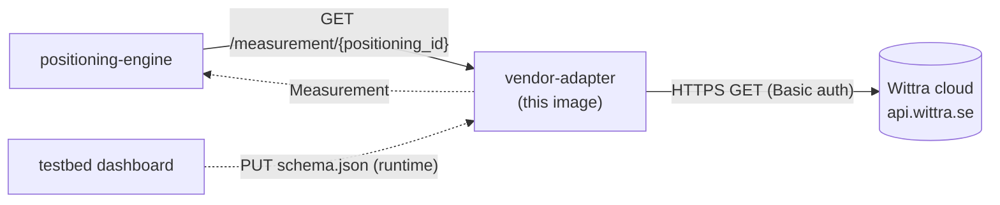
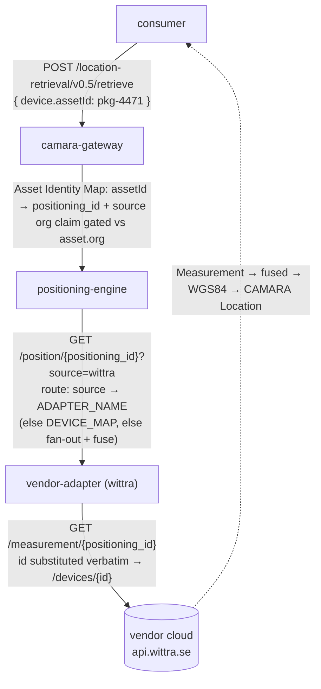

# Integrating a vendor's REST positioning API

This guide walks through plugging a third-party RTLS / positioning cloud into the stack via the [`vendor-adapter`](https://github.com/Jacobbista/5g-northbound/tree/main/services/vendor-adapter/) image. The worked example is Wittra; the same flow applies to any vendor whose public REST API returns a polished positioning fix per device.

## When this is the right pattern

| Vendor exposes …                                                                  | Path                                       |
|----------------------------------------------------------------------------------|--------------------------------------------|
| `GET` per-device position over REST, JSON body, simple auth (Basic / Bearer / API-Key) | **`vendor-adapter` + schema file**          |
| Live MQTT topic per device or organisation                                       | `vendor-adapter` + schema `transport: mqtt` (future transport) |
| HTTP webhook into our cluster                                                    | `vendor-adapter` + schema `transport: webhook` (future transport) |
| Proprietary SDK, NDA traffic, signed requests, OAuth refresh                     | Private per-vendor image; same engine contract |

The Wittra REST API recommends MQTT for sensor data, but REST is enough for a demo / MVP integration and proves the gateway is vendor-agnostic.

## Architecture in one picture



The engine sees the vendor-adapter as just another adapter URL in `ADAPTER_URLS`. Switching from `mock-vendor` (dev) to `api.wittra.se` (prod) is a single env-var change.

## Identity & resolution: from a CAMARA `assetId` to a vendor fix

One request crosses three identifier spaces. The full chain, with the owner of
each hop:



The two contracts an operator must get right (see step 5):

- **`positioning_id` == the vendor-native device id.** It is the live telemetry
  key, substituted verbatim. (`discover.vendor_device_id` is the same value but a
  separate code path, used only by the editor's vendor-sync.)
- **`asset.source` == the adapter's `ADAPTER_NAME`.** This is what routes the
  request to the right adapter.

| identifier | space | owner | authored at |
|------------|-------|-------|-------------|
| `assetId` | business / CAMARA `device` | gateway Asset Identity Map | `PUT /assets` (schema/asset.schema.json) |
| `positioning_id` | internal routing + vendor key | gateway map → engine → adapter | same `/assets` entry |
| `source` | modality / adapter selector | gateway map → engine routing | same `/assets` entry; must match `ADAPTER_NAME` |
| vendor device id | vendor cloud | the vendor | == `positioning_id` |

## Operator workflow

1. **Provision Secrets.** Create a Kubernetes `Secret` carrying the vendor credentials, for Wittra: `organisationId`, `apiKey`, `projectId`.

   ```bash
   kubectl -n positioning create secret generic wittra-credentials \
     --from-literal=org-id=<...> --from-literal=api-key=<...> --from-literal=project-id=<...>
   ```

2. **Deploy the adapter.** One `Deployment` per vendor, image `ghcr.io/jacobbista/5g-northbound/vendor-adapter:<tag>`, with the schema ConfigMap mounted at `SCHEMA_FILE` (read-only; step 4) and the Secret keys mapped to env:

   ```yaml
   env:
     - name: WITTRA_BASE_URL
       value: "https://api.wittra.se"
     - name: WITTRA_ORG_ID
       valueFrom: { secretKeyRef: { name: wittra-credentials, key: org-id } }
     - name: WITTRA_PROJECT_ID
       valueFrom: { secretKeyRef: { name: wittra-credentials, key: project-id } }
     - name: WITTRA_API_KEY
       valueFrom: { secretKeyRef: { name: wittra-credentials, key: api-key } }
   ```

3. **Build the schema from live data, don't hand-write it blind.** There is no cross-vendor standard - every cloud has its own field names - so the schema is authored per deployment by the operator, guided by the vendor's actual response. Point a bare adapter (auth + `path` + `discover.path` set, mapping/classify still empty) at the vendor and read the raw records:

   ```bash
   curl 'http://vendor-adapter-wittra:8080/discover?raw=1' | jq '.raw[0]'
   # -> { "deviceId": "...", "deviceType": "beacon", "fixedLocation": {...}, "name": "...", ... }
   ```

   `?raw=1` returns the vendor payload verbatim. The dashboard's guided builder renders these fields and lets the operator point `mapping` (which path is the id, the lat, the type) and `classify` (`assetWhen`, `sourceClassRules`) at them, then validates against the schema contract before saving.

   The dashboard reads three contracts, from two pods:

   - vendor-adapter `GET /contract/schema`: the form of the vendor document (paths, auth, `mapping`, `discover`, `diagnostics`).
   - vendor-adapter `GET /discover?raw=1`: a live vendor record to point paths at.
   - gateway `GET /contracts/device-diagnostics.schema.json`: the core mapping **targets** (`battery`, `lastSeen`, `accuracy`, `moving`). Any other mapping key is `vendorSpecific`.

   It then `PUT /schema` (preview) or writes the ConfigMap (production). The committed [`examples/wittra-schema.json`](https://github.com/Jacobbista/5g-northbound/tree/main/services/vendor-adapter/examples/wittra-schema.json), also published at [`/examples/wittra-schema.json`](https://jacobbista.github.io/5g-northbound/examples/wittra-schema.json), remains a worked **reference**, not a config to ship as-is.

4. **Persist the schema as a ConfigMap + rollout - this is the production path.** The schema is durable cluster config, versioned like any other ConfigMap:

   ```bash
   kubectl create configmap vendor-adapter-wittra-schema \
     --from-file=schema.json=wittra-schema.json --dry-run=client -o yaml \
     | kubectl apply -f -
   kubectl rollout restart deploy/vendor-adapter-wittra   # picks up the new schema
   ```

   Set `ADAPTER_NAME=wittra` on the adapter - the routing key (see step 5).

   `PUT /schema` exists for **dev / preview only** - a hot-patch to try a schema against a running pod without a rollout. On a ConfigMap (read-only) mount it applies live but returns `persisted:false` + a `warning`, and the **ConfigMap re-wins on the next restart**. Do not use it as the production write path; land the real change in the ConfigMap. (The read-only-mount footgun is shared with the wifi bindings and the asset map - see [blueprint vs bindings](blueprint-vs-bindings.md#deploying-to-kubernetes). The editor's Export/Import of a whole schema/bindings set is a **testbed-to-testbed** transfer, not part of normal operation.)

5. **Routing is capability-driven - no manual wiring.** The adapter self-registers with the engine (`POST /adapters` + heartbeat; see [adapter-registry.md](adapter-registry.md)), so `ADAPTER_URLS` is only a cold-start seed. The engine routes by source: the gateway passes `?source=<source>` for the capability it is resolving, and the engine polls the adapter whose `ADAPTER_NAME` equals it. So the only contract is **the capability's `source` == the adapter's `ADAPTER_NAME`** (both `wittra` here). `DEVICE_MAP` (engine env, `positioning_id=adapter` CSV) is an optional cold-start override and is normally unset.

6. **Register the asset.** PUT an entry into the gateway's Asset Identity Map (`GET/PUT /assets`; fixture `dev/assets.json`). The fields that matter:

   - `asset_id` - the business identifier the consumer queries (`device.assetId`). **Not** a phone number.
   - `positioning_id` - **must equal the vendor-native device id**: it is substituted verbatim into the vendor telemetry path (`?deviceId={device_id}`), so it is the key the vendor cloud knows. (The editor's vendor-sync reads `discover.vendor_device_id` separately - same value, different code path.)
   - `source` - **must equal the adapter's `ADAPTER_NAME`** (drives routing, step 4).
   - `org` - tenant; the gateway gates consumers by it.
   - `kind` - asset class (`uwb-tag`/`pallet`/…), descriptive.

   ```json
   {
     "asset_id": "pkg-4471",
     "positioning_id": "DEVTAG00000000001",
     "source": "wittra",
     "org": "acme",
     "kind": "pallet",
     "label": "Timber bundle 01"
   }
   ```

## Schema fields, briefly

```json
{
  "vendor": "wittra",
  "baseUrl": { "env": "WITTRA_BASE_URL" },
  "path": "/v4/organizations/{org_id}/projects/{project_id}/devices/{device_id}",
  "pathVars": {
    "org_id":     { "env": "WITTRA_ORG_ID" },
    "project_id": { "env": "WITTRA_PROJECT_ID" }
  },
  "auth": {
    "scheme": "basic",
    "username": { "env": "WITTRA_ORG_ID" },
    "password": { "env": "WITTRA_API_KEY" }
  },
  "cacheTtl": 5.0,
  "requestTimeout": 5.0,
  "mapping": {
    "frame":      { "const": "wgs84" },
    "latitude":   { "path": "latest.data.location.value.latitude" },
    "longitude":  { "path": "latest.data.location.value.longitude" },
    "confidence": { "path": "latest.data.location.value.accuracy" },
    "y":          { "path": "latest.data.location.value.height", "default": 0.0 },
    "timestamp":  { "path": "latest.data.location.timestamp", "format": "iso8601" },
    "lastSeen":   { "path": "lastSeen", "format": "iso8601" }
  },
  "discover": {
    "path": "/v4/organizations/{org_id}/projects/{project_id}/devices",
    "listPath": "data",
    "pathVars": {
      "org_id":     { "env": "WITTRA_ORG_ID" },
      "project_id": { "env": "WITTRA_PROJECT_ID" }
    },
    "pagination": {
      "type": "page",
      "pageParam": "page",
      "sizeParam": "size",
      "pageSize": 100,
      "totalPath": "total"
    },
    "mapping": {
      "vendorDeviceId": { "path": "id" },
      "label":            { "path": "name" },
      "latitude":         { "path": "location.value.latitude" },
      "longitude":        { "path": "location.value.longitude" },
      "height":         { "path": "location.value.height", "default": 0 }
    }
  }
}
```

- **Prefer the vendor's current-fix endpoint.** Point `path` at the resource that returns the device's current state (`GET /devices/{id}` for Wittra), whose `latest.data.location.value.*` carries the live WGS84 fix at full precision. A time-series/history endpoint may round coordinates for storage, so reading a "latest" element off it inherits that quantization; use history for audit or replay, not the live fix.
- **Array responses + "most recent" via path index.** When a vendor exposes only a time-series array, dotted paths support list indices including negatives: `-1.location.value.latitude` reads the last element (the latest fix when the array is ascending by time), `0.` the first if the vendor returns newest-first. No code change - the index is a mapper feature.
- **Credentials never live in the schema.** Only `{ "env": "VAR_NAME" }` references. The schema can be committed to a public repo or pasted into a UI without leaking anything.
- **`mapping.accuracy` is optional - verify the field before you trust its name.** A field called "accuracy" is not necessarily a metres radius. On this real Wittra account (v4 API), `latest.data.location.value.accuracy` is a `[0, 1]` confidence score (0.0 while a fix is still converging, close to 1.0 once settled) - not a distance. Mapping a score straight onto `accuracy` produced a fix that read as more precise than physically possible, and a reported `0.0` crashed fusion outright (division by an accuracy of zero). Read a raw sample (`GET /discover?raw=1`, or `PUT /schema` + `GET /measurement/{id}`) before mapping this field, the same way `lastSeen` below must be checked rather than assumed. If the value looks like `[0, 1]`, map it to `confidence`, not `accuracy`, and leave `accuracy` unmapped: the engine substitutes a nominal value for the adapter's declared `accuracy_class` (`coarse`/`metre`/`sub-metre` in `adapter.contract.yaml`) rather than fusing a fabricated radius. Map `accuracy` only when the vendor genuinely reports a metres radius.
- **`format: "iso8601"`** parses the timestamp string to a Unix epoch float so the engine can reason about staleness.
- **`mapping.lastSeen`** is when the *device* last communicated with the vendor, and it is what liveness is derived from. Map it whenever the vendor exposes such a field. Wittra declares a top-level `lastSeen`, and on the live cloud it is null on every device, so nothing arrives: a mapped path is not a guarantee that the source populates it. Read `GET /discover?raw=1` against the real cloud before relying on a field. It is not the fix time: a still asset freezes `timestamp` while it keeps reporting, so `timestamp` cannot separate a quiet device from a live one, and the stream's `observedAt` cannot either (it is fresh on every broadcast tick for as long as the vendor answers). The adapter carries it on the fast path, the gateway publishes it as `lastCommunicationTime`, and a consumer compares its age against the device's own observed cadence - vendors often report adaptively, sparse while still and frequent while moving. Omit the mapping when the vendor has no such field; consumers then have no liveness signal and must say so rather than assume the device is live.
- **`cacheTtl`** keeps us off the vendor's rate limit: the engine polls at ~1 Hz, the adapter caches each response for the TTL.
- **`diagnostics`** (optional) surfaces vendor fidelity as a profile extension, never mixed into the CAMARA payload. `stream` fields ride the current-fix record onto the position stream; `onDemand` entries are extra fetches served by `GET /diagnostics/{id}` (link quality, accuracy provenance). See [profile-extensions.md](profile-extensions.md).

  Mapping keys are routed by the [core vocabulary](profile-extensions.md#core-vocabulary): a key that names a core field (`battery`, `lastSeen`, `accuracy`, `moving`) surfaces at the top of the payload, coerced to the core unit through a `transform`; any other key surfaces under a `vendorSpecific` sub-object, carried as authored. `PUT /schema` returns `vendorSpecificKeys` listing every key it routed there, so a typo of a core name is visible. Map `battery` to a percent 0-100 value (add a `linear` transform with `scale` when the vendor reports 0-1). Populate `moving` either by mapping the omlox-standard `speed` (the adapter derives `moving = speed > 0.15` m/s) or by mapping a vendor's own moving/stationary state to `moving` with a `bool` transform (`{ "type": "bool", "truthy": ["MOVING"] }`).

### Optional `discover` block (vendor sync in the placement editor)

When a vendor exposes a "list all devices" endpoint, declaring a `discover` block lets the placement editor pull the device list and propose anchor positions instead of forcing manual placement. The block is independent from the per-device telemetry path: same auth + base URL, different endpoint + mapping.

| Field                | Meaning                                                                                                            |
|----------------------|--------------------------------------------------------------------------------------------------------------------|
| `path`               | List endpoint. Same `{var}` substitution as the top-level `path`.                                                  |
| `listPath`          | JSON dotted path to the array inside the response body. Empty (`""`) means the body itself is the array.           |
| `pathVars`          | Per-variable `{env: NAME}` resolution, same shape as the top-level.                                                |
| `pagination.type`    | `"none"` (one GET) or `"page"` (1-indexed page+size query params, walk until accumulated count reaches `totalPath`). |
| `mapping`            | Per-entry field map. `vendorDeviceId` is required; `label`, `latitude`, `longitude`, `height`, `deviceType` are optional.  |
| `filter`             | The editor's anchor-only include rule (`requirePath`). Applied to the editor sync only; asset onboarding reads the list **unfiltered**.  |
| `classify`           | Role + `sourceClass` classification for asset onboarding (below). Optional; omit to leave candidates unclassified.  |

Vendors that expose no positions omit `latitude`, `longitude` and `height`. The editor lists those devices with a "place manually" warning instead of dropping them somewhere arbitrary. Vendors with no list endpoint omit the `discover` block; the editor falls back to fully manual placement for that technology.

The full HTTP surface is `GET /discover` on the vendor-adapter, proxied by the placement editor at `GET /api/vendor/discover`. The editor's "↻ sync vendor" toolbar button drives the flow end to end.

### Classifying devices for asset onboarding

The same list also feeds **asset onboarding** through `GET /devices` (aggregated by the engine, served un-onboarded at the gateway's `/assets/discoverable` - see [asset registry](asset-registry.md#discovering-devices-to-onboard)). Two things differ from the editor sync:

1. **Onboarding reads the list unfiltered.** The editor's `filter` keeps only anchors; onboarding wants the *tags* that filter drops, so `/devices` bypasses it.
2. **Each candidate is classified** on two axes (from the private-asset paper): `role` (`asset` vs `infrastructure`) and `sourceClass` (the positioning technology). Onboarding must not treat a fixed sensor as a trackable asset.

Classification is a set of **predicates** the schema author writes against the vendor's own fields. The rule is honesty: **classify only what the vendor record actually states, never a guess.** Vendors differ in how they expose type - some give a clean string (Wittra's `deviceType` is `beacon` / `tag` / `meshrouter` / `gateway` - match with `path` + `equals`), others encode it only structurally, as a sub-object's presence (a MIOTY node has a `miotyConfig`, a border router has a `borderrouter` - match with `requirePath`). Both forms use the same predicate shape; the adapter stays vendor-agnostic and asserts nothing on its own - it applies the operator's schema. The Wittra example classifies role only:

```json
"discover": {
  "mapping": {
    "vendorDeviceId": { "path": "deviceId" },
    "label":            { "path": "name", "default": null },
    "deviceType":       { "path": "deviceType" }
  },
  "classify": {
    "assetWhen": { "path": "deviceType", "equals": "tag" }
  }
}
```

**Role - declare exactly one of two predicates; the choice sets the default for an *unknown* device:**

- **`assetWhen`** - match → `asset`, else `infrastructure`. Positively names the trackable type; an unknown future `deviceType` defaults to **infrastructure** and is **not** auto-onboarded. Prefer this when the vendor list is mostly fixed gear and only a small named type is trackable - the safe default. Wittra: only `deviceType == tag` is an asset; `beacon` / `meshrouter` / `gateway` are all infrastructure (note `meshrouter` and `gateway` carry **no** `fixedLocation`, so a "has a position" heuristic would wrongly onboard them - key off `deviceType`, not location).
- **`infrastructureWhen`** - match → `infrastructure`, else `asset`. The inverse: an unknown device defaults to `asset` (onboardable). Use when the trackable set is open-ended and infra is the small named set.

**`sourceClass`** (the positioning technology) - first matching `sourceClassRules` predicate wins its `value`, `sourceClassDefault` applies otherwise; recommended values `uwb` / `ble` / `wifi` / `gnss` / `cellular` / `mioty` / `other`. It is **optional and operator-authored - only add it when the vendor record carries a real per-unit signal.** The Wittra example omits it: `GET /devices` exposes `deviceType` (the role) but not the radio, and a UWB `beacon` and a non-UWB one are byte-identical there - Wittra's UWB module lives in `Config.tof` on a separate endpoint (`GET /devices/configs`). Asserting `sourceClass` from the device list alone would be a guess, so the schema leaves it out; a deployment that needs per-unit precision maps the field that genuinely encodes it (a structural rule like `{ "when": { "requirePath": "miotyConfig" }, "value": "mioty" }`, or the `Config.tof` join) rather than a blanket default.

A **predicate** matches when `requirePath` resolves to a non-null value *and* (optionally) `path` equals `equals`. Set only `requirePath` for a presence test, `path` + `equals` for a value test. Omit `classify` entirely and candidates carry no `role` / `sourceClass` (everything stays onboardable).

## Local dev: end-to-end with `mock-vendor`

`make demo` brings up [`mock-vendor`](https://github.com/Jacobbista/5g-northbound/tree/main/mocks/mock-vendor/), the vendor-adapter, and the rest of the stack. The compose file mounts the example schema into **both**: the adapter parses it, the mock serves responses that satisfy it. Swap the schema and the same demo runs against a different vendor's shape.

```bash
make demo

# Quick sanity check
curl http://localhost:8092/health
curl http://localhost:8092/measurement/wittra-tag-01 | jq .

# Full CAMARA chain (gateway → engine → vendor-adapter → mock-vendor)
curl -X POST http://localhost:8087/location-retrieval/v0.5/retrieve \
  -H "Authorization: Bearer dev-token" \
  -H "Content-Type: application/json" \
  -d '{"device":{"assetId":"pkg-4471"}}'
```

`mock-vendor` is **not** included in production deployments. It exists so a fresh clone of the repo can demonstrate the full chain without an internet round-trip.

## Failure modes worth knowing

| What happens                                                  | What the engine sees                                            |
|---------------------------------------------------------------|-----------------------------------------------------------------|
| Schema missing (operator forgot to load it)                   | `404` from `/measurement/...` → engine treats as "no fix"; no cooldown |
| Credentials env var unset on the pod                          | `404` from `/measurement/...` (logged); same as above           |
| Vendor returns `404` (no current fix)                         | `404`; no cooldown                                              |
| Vendor returns `5xx` repeatedly                               | `404` (from the adapter, after logging); engine `HttpAdapter` cooldown still applies one layer up |
| Vendor unreachable / TLS failure                              | `404`; engine cooldown after 3 fails                            |
| Cache hit within TTL                                          | Cached `Measurement`; no vendor call                            |
| `discover` block absent in schema                             | `GET /discover` returns `404`; editor's sync panel shows "vendor has no discover block" |
| `discover` block present but vendor list endpoint unreachable | `GET /discover` returns `503`; editor's sync panel surfaces the error and stays empty |

In every case the gateway downstream behaves correctly: a CAMARA `retrieve` for a device with no current fix returns a `422 LOCATION_RETRIEVAL.UNABLE_TO_LOCATE` envelope rather than a stale or made-up position.
