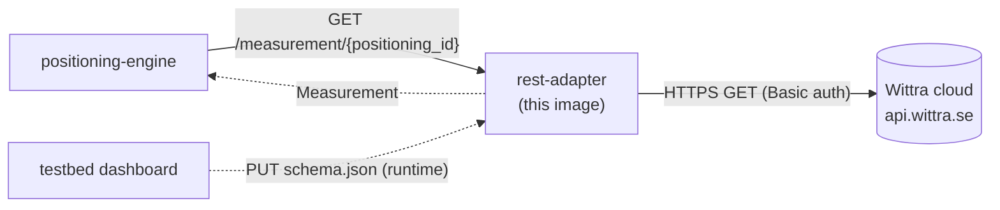
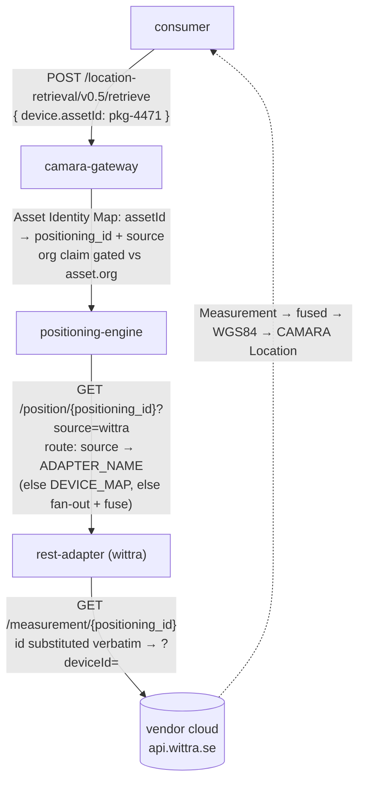

# Integrating a vendor's REST positioning API

This guide walks through plugging a third-party RTLS / positioning cloud into the stack via the [`rest-adapter`](https://github.com/Jacobbista/5g-northbound/tree/main/services/rest-adapter/) image. The worked example is Wittra; the same flow applies to any vendor whose public REST API returns a polished positioning fix per device.

## When this is the right pattern

| Vendor exposes …                                                                  | Path                                       |
|----------------------------------------------------------------------------------|--------------------------------------------|
| `GET` per-device position over REST, JSON body, simple auth (Basic / Bearer / API-Key) | **`rest-adapter` + schema file**          |
| Live MQTT topic per device or organisation                                       | Future `mqtt-adapter` (out of scope here)  |
| HTTP webhook into our cluster                                                    | Future `webhook-adapter` (out of scope)    |
| Proprietary SDK, NDA traffic, signed requests, OAuth refresh                     | Private per-vendor image; same engine contract |

The Wittra REST API recommends MQTT for sensor data, but REST is enough for a demo / MVP integration and proves the gateway is vendor-agnostic.

## Architecture in one picture



The engine sees the rest-adapter as just another adapter URL in `ADAPTER_URLS`. Switching from `mock-wittra` (dev) to `api.wittra.se` (prod) is a single env-var change.

## Identity & resolution: from a CAMARA `assetId` to a vendor fix

One request crosses three identifier spaces. The full chain, with the owner of
each hop:



The two contracts an operator must get right (see step 5):

- **`positioning_id` == the vendor-native device id.** It is the live telemetry
  key, substituted verbatim. (`discover.vendor_device_id` is the same value but a
  separate code path, used only by the editor's vendor-sync.)
- **`asset.source` == the adapter's `ADAPTER_NAME`.** This is what routes the
  request to the right adapter.

| identifier | space | owner | authored at |
|------------|-------|-------|-------------|
| `assetId` | business / CAMARA `device` | gateway Asset Identity Map | `PUT /assets` (schema/asset.schema.json) |
| `positioning_id` | internal routing + vendor key | gateway map → engine → adapter | same `/assets` entry |
| `source` | modality / adapter selector | gateway map → engine routing | same `/assets` entry; must match `ADAPTER_NAME` |
| vendor device id | vendor cloud | the vendor | == `positioning_id` |

## Operator workflow

1. **Provision Secrets.** Create a Kubernetes `Secret` carrying the vendor credentials, for Wittra: `organisationId`, `apiKey`, `projectId`.

   ```bash
   kubectl -n positioning create secret generic wittra-credentials \
     --from-literal=org-id=<...> --from-literal=api-key=<...> --from-literal=project-id=<...>
   ```

2. **Deploy the adapter.** One `Deployment` per vendor, image `ghcr.io/jacobbista/5g-northbound/rest-adapter:<tag>`, with the persistent schema PVC at `/app/data/` and the Secret keys mapped to env:

   ```yaml
   env:
     - name: WITTRA_BASE_URL
       value: "https://api.wittra.se"
     - name: WITTRA_ORG_ID
       valueFrom: { secretKeyRef: { name: wittra-credentials, key: org-id } }
     - name: WITTRA_PROJECT_ID
       valueFrom: { secretKeyRef: { name: wittra-credentials, key: project-id } }
     - name: WITTRA_API_KEY
       valueFrom: { secretKeyRef: { name: wittra-credentials, key: api-key } }
   ```

3. **Load the schema.** PUT the schema to the adapter (from the dashboard's adapter view, or a `curl` in dev). Set `ADAPTER_NAME=wittra` on the adapter — it is the routing key (see step 4):

   ```bash
   curl -X PUT http://rest-adapter-wittra:8080/schema \
     -H "Content-Type: application/json" \
     -d @wittra-schema.json
   ```

   The pod persists the schema to the PVC, so subsequent restarts boot configured.

4. **Routing is capability-driven — no manual wiring.** The adapter self-registers with the engine (`POST /adapters` + heartbeat; see [adapter-registry.md](adapter-registry.md)), so `ADAPTER_URLS` is only a cold-start seed. The engine routes by the asset's `source`: the gateway passes `?source=<source>`, and the engine polls the adapter whose `ADAPTER_NAME` equals it. So the only contract is **`asset.source` == the adapter's `ADAPTER_NAME`** (both `wittra` here). `DEVICE_MAP` (engine env, `positioning_id=adapter` CSV) is an optional cold-start override and is normally unset.

5. **Register the asset.** PUT an entry into the gateway's Asset Identity Map (`GET/PUT /assets`; fixture `dev/assets.json`). The fields that matter:

   - `asset_id` — the business identifier the consumer queries (`device.assetId`). **Not** a phone number.
   - `positioning_id` — **must equal the vendor-native device id**: it is substituted verbatim into the vendor telemetry path (`?deviceId={device_id}`), so it is the key the vendor cloud knows. (The editor's vendor-sync reads `discover.vendor_device_id` separately — same value, different code path.)
   - `source` — **must equal the adapter's `ADAPTER_NAME`** (drives routing, step 4).
   - `org` — tenant; the gateway gates consumers by it.
   - `kind` — asset class (`uwb-tag`/`pallet`/…), descriptive.

   ```json
   {
     "asset_id": "pkg-4471",
     "positioning_id": "D00124B00249ECBB2",
     "source": "wittra",
     "org": "fiskarheden",
     "kind": "pallet",
     "label": "Timber bundle 01"
   }
   ```

## Schema fields, briefly

```json
{
  "vendor": "wittra",
  "default_base_url": "https://api.wittra.se",
  "base_url_env": "WITTRA_BASE_URL",
  "path": "/v4/organizations/{org_id}/projects/{project_id}/data?deviceId={device_id}&dataType=location",
  "path_vars": {
    "org_id":     { "env": "WITTRA_ORG_ID" },
    "project_id": { "env": "WITTRA_PROJECT_ID" }
  },
  "auth": {
    "scheme": "basic",
    "username": { "env": "WITTRA_ORG_ID" },
    "password": { "env": "WITTRA_API_KEY" }
  },
  "cache_ttl_s": 5.0,
  "request_timeout_s": 5.0,
  "mapping": {
    "frame":      { "const": "wgs84" },
    "latitude":   { "path": "-1.location.value.latitude" },
    "longitude":  { "path": "-1.location.value.longitude" },
    "accuracy_m": { "path": "-1.location.value.accuracy", "default": 5.0 },
    "confidence": { "const": 0.5 },
    "y":          { "path": "-1.location.value.height", "default": 0.0 },
    "timestamp":  { "path": "-1.location.timestamp", "format": "iso8601" }
  },
  "discover": {
    "path": "/v4/organizations/{org_id}/projects/{project_id}/devices",
    "list_path": "data",
    "path_vars": {
      "org_id":     { "env": "WITTRA_ORG_ID" },
      "project_id": { "env": "WITTRA_PROJECT_ID" }
    },
    "pagination": {
      "type": "page",
      "page_param": "page",
      "size_param": "size",
      "page_size": 100,
      "total_path": "total"
    },
    "mapping": {
      "vendor_device_id": { "path": "id" },
      "label":            { "path": "name" },
      "latitude":         { "path": "location.value.latitude" },
      "longitude":        { "path": "location.value.longitude" },
      "height_m":         { "path": "location.value.height", "default": 0 }
    }
  }
}
```

- **Array responses + "most recent" via path index.** Wittra v4 `GET /data` returns an *array* of `DeviceDataPoint`. `?dataType=location` filters server-side to location points only, returned ascending by time, so the latest fix is the last element. Dotted paths support list indices including negatives, so `-1.location.value.latitude` reads the latest point's latitude. No code change - the negative index is a mapper feature. (If a vendor returned the array newest-first, use `0.` instead.)
- **Credentials never live in the schema.** Only `{ "env": "VAR_NAME" }` references. The schema can be committed to a public repo or pasted into a UI without leaking anything.
- **`mapping.accuracy_m`** pulls from `location.value.accuracy` in v4 (radius in metres), falling back to a 5.0 const when the vendor omits it. Older v1 Wittra responses used `payload.location.accuracy` as a `[0, 1]` score; if you point the schema at a v1 cloud, map that field to `confidence` instead.
- **`format: "iso8601"`** parses the timestamp string to a Unix epoch float so the engine can reason about staleness.
- **`cache_ttl_s`** keeps us off the vendor's rate limit: the engine polls at ~1 Hz, the adapter caches each response for the TTL.

### Optional `discover` block (vendor sync in the placement editor)

When a vendor exposes a "list all devices" endpoint, declaring a `discover` block lets the placement editor pull the device list and propose anchor positions instead of forcing manual placement. The block is independent from the per-device telemetry path: same auth + base URL, different endpoint + mapping.

| Field                | Meaning                                                                                                            |
|----------------------|--------------------------------------------------------------------------------------------------------------------|
| `path`               | List endpoint. Same `{var}` substitution as the top-level `path`.                                                  |
| `list_path`          | JSON dotted path to the array inside the response body. Empty (`""`) means the body itself is the array.           |
| `path_vars`          | Per-variable `{env: NAME}` resolution, same shape as the top-level.                                                |
| `pagination.type`    | `"none"` (one GET) or `"page"` (1-indexed page+size query params, walk until accumulated count reaches `total_path`). |
| `mapping`            | Per-entry field map. `vendor_device_id` is required; `label`, `latitude`, `longitude`, `height_m`, `device_type` are optional.  |
| `anchor_types`       | Native `device_type` values that are fixed anchors, not trackable assets. Drives the `role` on asset onboarding (below). Optional; empty means "don't classify".  |

Vendors with no positions exposed simply omit `latitude`/`longitude`/`height_m`. The editor lists those devices with a "place manually" warning instead of dropping them somewhere arbitrary. Vendors with no list endpoint omit the `discover` block; the editor falls back to fully manual placement for that technology.

The full HTTP surface is `GET /discover` on the rest-adapter, proxied by the placement editor at `GET /api/vendor/discover`. The editor's "↻ sync vendor" toolbar button drives the flow end to end.

### `device_type` + `anchor_types`: anchors vs trackables

The same list feeds **asset onboarding** through `GET /devices` (aggregated by the engine, served un-onboarded at the gateway's `/assets/discoverable` — see [asset registry](asset-registry.md#discovering-devices-to-onboard)). Onboarding must not treat a fixed anchor as a trackable asset, so map the vendor's native type field to `mapping.device_type` and list the anchor type values in `anchor_types`:

```json
"discover": {
  "mapping": { "vendor_device_id": { "path": "deviceId" },
               "device_type": { "path": "deviceType" } },
  "anchor_types": ["beacon"]
}
```

Each candidate then carries `device_type` (native, surfaced as a badge + kind hint) and a derived `role`: `anchor` when `device_type ∈ anchor_types`, else `trackable`. A vendor with a different structure maps its own field and lists its own anchor values — no adapter code changes. Omit both and candidates carry no `role` (everything stays onboardable).

## Local dev: end-to-end with `mock-wittra`

`make demo` brings up [`mock-wittra`](https://github.com/Jacobbista/5g-northbound/tree/main/mocks/mock-wittra/), the rest-adapter, and the rest of the stack. The compose file pre-loads the example schema and points the adapter at the mock:

```bash
make demo

# Quick sanity check
curl http://localhost:8092/health
curl http://localhost:8092/measurement/wittra-tag-01 | jq .

# Full CAMARA chain (gateway → engine → rest-adapter → mock-wittra)
curl -X POST http://localhost:8087/location-retrieval/v0.5/retrieve \
  -H "Authorization: Bearer dev-token" \
  -H "Content-Type: application/json" \
  -d '{"device":{"assetId":"pkg-4471"}}'
```

`mock-wittra` is **not** included in production deployments. It exists so a fresh clone of the repo can demonstrate the full chain without an internet round-trip.

## Failure modes worth knowing

| What happens                                                  | What the engine sees                                            |
|---------------------------------------------------------------|-----------------------------------------------------------------|
| Schema missing (operator forgot to load it)                   | `404` from `/measurement/...` → engine treats as "no fix"; no cooldown |
| Credentials env var unset on the pod                          | `404` from `/measurement/...` (logged); same as above           |
| Vendor returns `404` (no current fix)                         | `404`; no cooldown                                              |
| Vendor returns `5xx` repeatedly                               | `404` (from the adapter, after logging); engine `HttpAdapter` cooldown still applies one layer up |
| Vendor unreachable / TLS failure                              | `404`; engine cooldown after 3 fails                            |
| Cache hit within TTL                                          | Cached `Measurement`; no vendor call                            |
| `discover` block absent in schema                             | `GET /discover` returns `404`; editor's sync panel shows "vendor has no discover block" |
| `discover` block present but vendor list endpoint unreachable | `GET /discover` returns `503`; editor's sync panel surfaces the error and stays empty |

In every case the gateway downstream behaves correctly: a CAMARA `retrieve` for a device with no current fix returns a `NOT_FOUND` envelope rather than a stale or made-up position.
