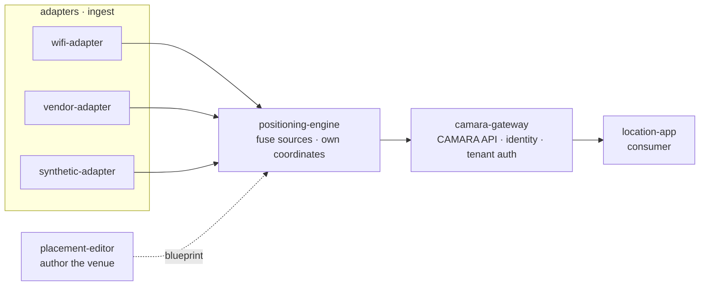

# Overview

What this system is, why it is built this way, and how the pieces fit. Read
this before the other documents.

## What this system does

It exposes **where things are** inside a private venue - tools, tags, pallets,
forklifts - to applications, over the standard
[CAMARA Device Location API](https://camaraproject.org/). The things it tracks
are **assets**, not phones: they are located by on-site sensing (WiFi, UWB, and
others), fused at the edge, and served through one familiar API.

It runs unchanged from a laptop (`docker compose`) to a Kubernetes cluster. New
positioning technologies plug in as new **adapters**; the engine and gateway
never change.

## The mental model: sense, fuse, expose

Three roles, left to right:

Names follow `<flavor>-<role>` (see
[naming and roles](https://github.com/Jacobbista/5g-northbound/blob/main/AGENTS.md#component-naming-and-roles)):
the suffix is the role in this flow (`-adapter` ingests, `-engine` fuses,
`-gateway` exposes, `-app` consumes, `-editor` authors).

- **Adapters sense.** Each positioning technology is its own service speaking
  one tiny HTTP contract (`GET /measurement/{id}`). WiFi RSSI, a vendor UWB
  cloud, a synthetic source - all look the same to the engine.
- **The engine fuses.** It merges the measurements, owns the coordinate frame,
  and converts to WGS84. It is the authority for the venue **blueprint**.
- **The gateway exposes.** It speaks CAMARA to consumers, resolves identity,
  and gates each consumer to its tenant.

That separation is the whole point: a new sensing technology is a new adapter,
nothing upstream changes.

## Assets, not subscribers

CAMARA was designed for public mobile networks, where a device is a phone
identified by a number. Here the tracked entity is an **asset** with a business
id (`assetId`, e.g. `pkg-4471`) - never a phone number. This is the
**private-asset profile**. See
[the profile](https://github.com/Jacobbista/5g-northbound/blob/main/spec/private-profile/README.md)
for the full rationale.

### The five words this system runs on

An asset is not bound to one sensor. A pallet may carry a UWB tag and be seen
by WiFi at the same time, and the point of the profile is that a consumer
should not have to know. Five terms carry that idea, and the rest of the
documentation uses them in exactly this sense:

**asset** - the tracked physical thing, named by an `assetId` the enterprise
chose. It is what a CAMARA client asks about, and the only identifier that
crosses the northbound boundary.

**capability** - one way of locating that asset. A capability names a
**source** and the **positioning_id** that source knows the thing by. An asset
declares at least one and may declare several.

**source** - the positioning technology behind a capability (`wifi`, `wittra`,
`synthetic`). It is also the name the serving adapter registers under, which is
what makes routing a name match rather than a lookup table.

**positioning_id** - the identifier internal to that source. It never leaves
the internal plane: the gateway resolves it and does not return it.

**adapter** - the service that speaks one source's language and answers
`GET /measurement/{positioning_id}`.

So the resolution chain is `assetId` → capabilities → for each, `(source,
positioning_id)` → the adapter registered under that source → a fix. The
gateway walks every capability an asset declares and fuses what comes back, so
a two-capability asset yields one CAMARA `Location` with a smaller radius than
either source alone. The engine never sees the asset: it is asked for a
`positioning_id` and told which source to route to, which is why adding an
asset never touches it.

## Key concepts

| Concept | In one line | Detail |
|---------|-------------|--------|
| **Adapter** | A positioning source behind one HTTP contract | [adapters.md](adapters.md) |
| **Adapter registry** | Adapters self-register with the engine; routing matches a capability's `source` to an adapter's registered name | [adapter-registry.md](adapter-registry.md) |
| **Blueprint vs bindings** | Portable venue geometry (committable) vs per-venue secrets like BSSIDs (never committed) | [blueprint-vs-bindings.md](blueprint-vs-bindings.md) |
| **Identity chain** | `assetId` → capability → `positioning_id` → adapter → vendor fix | [integrating-a-vendor-rest-api.md](integrating-a-vendor-rest-api.md#identity-resolution-from-a-camara-assetid-to-a-vendor-fix) |
| **Coordinate frames** | Room-local (editor) vs floor-plan north-up (engine) vs WGS84 (gateway) | [architecture.md](architecture.md) |

## Where to go next

| You want to… | Start at |
|--------------|----------|
| Run it on your laptop | the repo `README.md` quick start (`make demo`) |
| Understand the design in depth | [architecture.md](architecture.md) |
| Add a positioning source | [adapters.md](adapters.md) → [integrating-a-vendor-rest-api.md](integrating-a-vendor-rest-api.md) |
| Build a CAMARA client | [data-contracts.md](data-contracts.md) → [api-reference.md](api-reference.md) |
| Deploy to Kubernetes | [deployment.md](deployment.md) |
