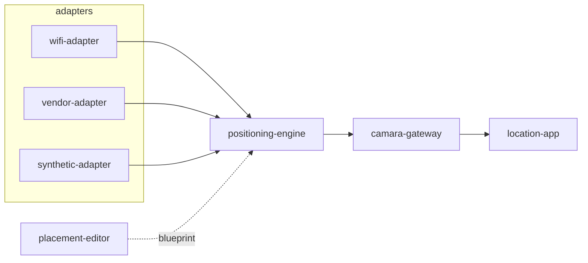

# Overview

The stack reports where assets are inside a private venue, such as tools,
pallets and forklifts, through the
[CAMARA Device Location API](https://camaraproject.org/). The positions come
from on-site sources such as WiFi, UWB or a vendor's positioning cloud, and are
fused at the edge.

CAMARA was designed for public mobile networks, where the tracked device is a
phone with a number and the operator computes its position. In a factory the
same organisation owns the network, the assets and the applications, and an
asset has no phone number. The stack keeps the CAMARA interface and changes
what sits behind it: the entity is an asset, the positions come from sources
the venue runs, and authorisation follows the organisation. These changes form
the [private-asset profile](https://github.com/Jacobbista/5g-northbound/blob/main/spec/private-profile/README.md).

## Components

```mermaid
flowchart LR
    subgraph sources["adapters"]
      W["wifi-adapter"]
      V["vendor-adapter"]
      S["synthetic-adapter"]
    end
    W --> E
    V --> E
    S --> E
    E["positioning-engine"] --> G["camara-gateway"]
    G --> C["location-app"]
    ED["placement-editor"] -. blueprint .-> E
```

| Component | Role |
|-----------|------|
| adapters | Each one speaks to one kind of source and answers `GET /measurement/{positioningId}` with a fix. |
| positioning-engine | Collects the fixes for a positioning id, fuses them, places them in the venue and converts them to WGS84. Stores the venue blueprint. |
| camara-gateway | Serves the CAMARA API. Resolves an asset to its positioning ids, fuses them, and restricts each consumer to its organisation. Stores the asset map. |
| placement-editor | Operator tool to draw the venue: floor plan, rooms, anchors, walls. |
| location-app | A CAMARA consumer: a browser application that shows the assets on the venue. |

Component names follow `<flavor>-<role>`: the suffix is the role in this flow,
the prefix qualifies it
([naming](https://github.com/Jacobbista/5g-northbound/blob/main/AGENTS.md#component-naming-and-roles)).

A new kind of source is a new adapter. For a vendor cloud with a REST API it is
a configuration document loaded into the generic `vendor-adapter`. The engine
and the gateway do not change.

## Terms

The rest of the documentation uses five terms in this sense.

| Term | Meaning |
|------|---------|
| **asset** | The tracked physical thing, named by an `assetId` the organisation chooses. A CAMARA client asks about assets. |
| **capability** | One way of locating an asset: a `source` and the `positioningId` that source knows the asset by. An asset has one or more. |
| **source** | The positioning technology behind a capability, such as `wifi`, `wittra` or `synthetic`. It is also the name under which the serving adapter registers. |
| **positioningId** | The identifier of the asset inside one source. |
| **adapter** | The service that translates one source into the adapter contract. |

A request resolves as follows. The gateway looks up the asset's capabilities.
For each one it asks the engine for the position of that `positioningId`,
naming the `source`. The engine asks the adapter registered under that source.
The gateway then fuses the answers into one CAMARA `Location`. The engine never
sees the asset, so adding an asset changes nothing in the engine.

A CAMARA request names only the `assetId`. The management surfaces of the
profile (`GET /assets`, asset details, the position stream) also carry the
`positioningId` of the primary capability, so an operator can relate an asset
to its source.

## Further reading

| Goal | Page |
|------|------|
| Run it on a laptop | the repository [README](https://github.com/Jacobbista/5g-northbound/blob/main/README.md) |
| Understand the services and the request flow | [Architecture](architecture.md) |
| Add a positioning source | [Adapters](adapters.md), then [Integrating a vendor REST API](integrating-a-vendor-rest-api.md) |
| Build a CAMARA client | [Private-asset profile](https://github.com/Jacobbista/5g-northbound/blob/main/spec/private-profile/README.md), then [Data contracts](data-contracts.md) |
| Deploy on Kubernetes | [Deployment](deployment.md) |
