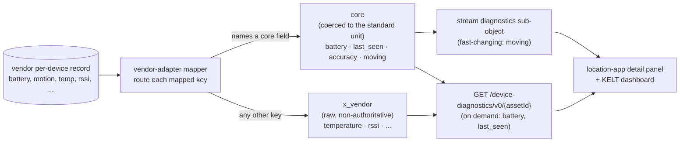

# Profile extensions

The stack extends the CAMARA Device Location profile without altering it. The
CAMARA retrieve and verify surfaces stay byte-identical to the profiled specs
(base + overlay), proven by the CI freshness gate. Everything beyond that -
vendor fidelity, engine fusion metadata, anchor calibration - lives on separate,
namespaced extension surfaces.

## The convention

Extension data is grouped under a **named container**, never a field prefix
sprinkled into a CAMARA payload:

- On a shared surface (the position stream), it sits in a named sub-object
  (`diagnostics`).
- Otherwise it is a **dedicated resource** at its own path, declared in its own
  contract.

Each surface has a published, versioned contract, and this page indexes them. A
consumer that ignores the extension containers sees a conformant CAMARA payload.

## Extension surfaces

| Surface | Kind | Contract | Carries |
|---------|------|----------|---------|
| `GET /device-diagnostics/v0/{assetId}` | resource | `spec/private-profile/device-diagnostics.yaml`, `schema/device-diagnostics.schema.json` | On-demand vendor fidelity: link quality, accuracy provenance, motion |
| Position stream `diagnostics` sub-object | stream field | `spec/private-profile/asyncapi-stream.yaml` | Stream-tier motion, carried from the routed source |
| `GET/PUT /assets` | resource | `spec/private-profile/extensions.yaml`, `schema/asset.schema.json` | Asset Identity Map: an asset binds ≥1 positioning capability, fused into one fix |
| `GET /assets/discoverable` | resource | `spec/private-profile/extensions.yaml` | Onboarding candidates not yet mapped to a capability |
| `GET /assets/{assetId}/details` | resource | `spec/private-profile/extensions.yaml` | Fusion metadata (strategy, sources, accuracy), fused across capabilities by the gateway |
| `GET /anchors/calibration` | resource | `spec/private-profile/extensions.yaml` | Per-anchor RF calibration (wifi) |

See [Machine-readable contracts](contracts.md) for the fetch URLs (Pages CDN +
pinned tag).

## Core vocabulary

Diagnostics fields are split into a normative core and a vendor bag. A consumer
codes against the core once and reads the same names for every vendor.

A field is core only when an external standard already names it, so the profile
adopts that name and unit rather than inventing one, and a consumer of ours
renders it. Anything a schema maps that is not core is routed into an `x_vendor`
sub-object, raw and non-authoritative. A vendor field either maps to a core name
or lands in `x_vendor` whole; there is no case in between. This mirrors the
free-form `properties` bag the omlox RTLS standard uses for everything outside
its own core.

| Core field | Standard | Type / unit |
|------------|----------|-------------|
| `battery` | OMA LwM2M `3/0/9` | number, percent 0-100 |
| `last_seen` | omlox `timestamp_generated` | number, epoch seconds |
| `accuracy` | omlox `accuracy` | number, metres |
| `moving` | derived | boolean |

This table is the human view of a machine-readable contract: the gateway serves
the normative vocabulary at `GET /contracts/diagnostics-vocabulary.json` (field
names, units, adopted standards, default delivery tier, and the `x_vendor` rule).
The vendor-adapter imports the same artifact to route mapped fields, so a
consumer wiring a vendor reads the targets from the contract rather than from
prose. The artifact is the single source of truth; the adapter never hardcodes
the vocabulary.

`moving` is derived from the omlox-standard `speed`: `moving = speed >
MOVING_SPEED_THRESHOLD_MPS`, a normative constant of `0.15` m/s fixed once here,
not a per-vendor knob. A vendor that exposes its own moving/stationary state maps
it to `moving` directly instead. A vendor exposing neither omits `moving`; an
absent core field stays core and never becomes an `x_vendor` entry.

A field lives in `x_vendor` until it recurs across vendors and a consumer needs
it, at which point promoting it into the core is a deliberate revision of this
vocabulary. The core stays small and grows by evidence, the way CAMARA absorbs
proven extensions. Identity (`name`) is not a diagnostics field: it flows on the
onboarding path, where the vendor `name` binds to the asset and anchor `label`.

## Why this is compliant

CAMARA Commonalities admits additive extensions; the discipline is separation
and clear identification. Separation here is by resource and namespace, never by
a field mixed into the core. The CAMARA APIs remain independently valid against
the upstream specs, and the freshness gate is scoped to them so drift is caught.
